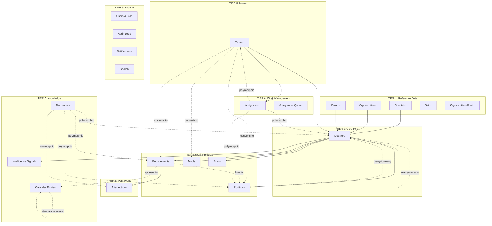
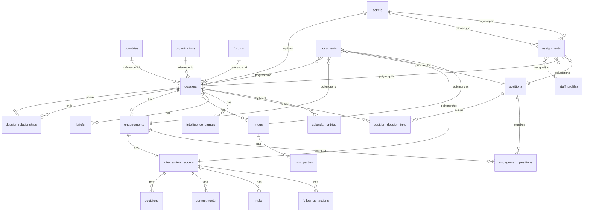

# Entity Relationships & UI/UX Redesign

**GASTAT International Dossier System v2.0**

**Date**: 2025-10-07
**Status**: Design Complete - Ready for Implementation
**Author**: System Architecture Team

---

## Table of Contents

1. [Executive Summary](#executive-summary)
2. [Complete Entity Relationship Model](#complete-entity-relationship-model)
3. [Design Decisions (Confirmed)](#design-decisions-confirmed)
4. [Database Schema Specifications](#database-schema-specifications)
5. [UI/UX Architecture](#uiux-architecture)
6. [Navigation & Component Patterns](#navigation--component-patterns)
7. [User Journeys](#user-journeys)
8. [Implementation Roadmap](#implementation-roadmap)
9. [Success Metrics](#success-metrics)
10. [Appendices](#appendices)

---

## Executive Summary

### Problem Statement

The current system has disconnected entities with unclear relationships between dossiers, tickets, positions, engagements, assignments, and other work products. Users cannot easily navigate between related items, understand context, or see the full picture of how entities connect.

### Solution Overview

This redesign establishes **Dossiers as the Central Hub** for all international relationship management, with clear hierarchical and lateral relationships to all other entities. It introduces:

- **Dossier-to-Dossier relationships** (countries ↔ organizations ↔ forums)
- **Polymorphic document management** (unified file storage)
- **Many-to-many position linking** (positions can relate to multiple dossiers)
- **Unified calendar** (engagements + calendar entries)
- **Work-queue-first navigation** (prioritizes active work)

### Impact

- ✅ **Clear Context**: Every work item shows its dossier origin
- ✅ **Improved Navigation**: Hub-based architecture reduces clicks
- ✅ **Better Collaboration**: Relationship visualization shows connections
- ✅ **Efficient Work Management**: Queue-first approach prioritizes SLA compliance
- ✅ **Comprehensive Search**: Polymorphic models enable cross-entity search

---

## Complete Entity Relationship Model

### Architecture Tiers



### TIER 1: Reference Data (Master Tables)

**Purpose**: Foundational entities that other tables reference for structured data.

| Entity                   | Description                                                      | Key Attributes                                                         |
| ------------------------ | ---------------------------------------------------------------- | ---------------------------------------------------------------------- |
| **countries**            | Geographic entities with international relationships             | `iso_code`, `name_en`, `name_ar`, `region`, `capital`, `population`    |
| **organizations**        | International organizations (UN agencies, regional bodies, etc.) | `acronym`, `name_en`, `name_ar`, `org_type`, `headquarters_country_id` |
| **forums**               | International forums, summits, working groups                    | `name_en`, `name_ar`, `forum_type`, `frequency`, `next_meeting_date`   |
| **skills**               | Staff competencies for assignment routing                        | `name_en`, `name_ar`, `category`                                       |
| **organizational_units** | Hierarchical departments/teams within GASTAT                     | `name_en`, `name_ar`, `wip_limit`, `parent_unit_id`                    |

**Relationships**:

- Countries, Organizations, Forums → 1:N with Dossiers (via `reference_type` + `reference_id`)
- Skills → M:N with Staff Profiles (competency matching)
- Organizational Units → 1:N with Staff Profiles (team membership)

---

### TIER 2: Core Hub

**Entity**: `dossiers`

**Purpose**: Central container for all international relationship management activities.

**Key Fields**:

- `reference_type`: ENUM('country', 'organization', 'forum', 'theme')
- `reference_id`: UUID (FK to countries/organizations/forums if not 'theme')
- `name_en`, `name_ar`: Bilingual names
- `sensitivity_level`: Access control classification
- `status`: 'active', 'inactive', 'archived'

**Child Entities** (1:N relationships):

- Engagements (meetings, consultations)
- Positions (via `position_dossier_links` junction table - M:N)
- MoUs (agreements)
- Briefs (summaries)
- Intelligence Signals (knowledge)
- Key Contacts (stakeholders)
- Commitments (action items)

**Special Relationship**:

- **Dossier-to-Dossier** (M:N via `dossier_relationships`):
  - Country Dossier ↔ Organization Dossiers (e.g., USA ↔ World Bank, IMF, UN)
  - Country Dossier ↔ Forum Dossiers (e.g., Saudi Arabia ↔ G20, OPEC, WTO)
  - Organization Dossier ↔ Country Dossiers (e.g., OECD ↔ member countries)
  - Relationship types: 'member_of', 'participates_in', 'collaborates_with', 'monitors'

---

### TIER 3: Intake & Routing

**Entity**: `tickets` (intake_tickets)

**Purpose**: Front-door intake for all external requests.

**Flow**:

1. Request submitted via web form or email
2. AI triage classifies: type, sensitivity, urgency
3. Optionally linked to existing dossier
4. Converts to: engagement, position, MoU, or foresight project
5. Auto-assigned to staff based on skills and capacity

**Relationships**:

- Optional → Dossier (if request relates to existing country/org/forum)
- Converts to → Engagement, Position, MoU (polymorphic conversion)
- Routes to → Assignment (work item created)

---

### TIER 4: Work Products

#### **engagements**

Meetings, consultations, site visits, conferences with external parties.

**Key Relationships**:

- N:1 → Dossiers (each engagement belongs to one dossier)
- 1:1 → After Action Record (post-engagement documentation)
- M:N → Positions (via `engagement_positions` junction table - attach talking points)

**Fields**:

- `engagement_type`: meeting, consultation, coordination, workshop, conference, site_visit
- `engagement_date`: When the engagement occurs
- `location`: Physical or virtual location

---

#### **positions**

Organizational stances, talking points, policy positions.

**Key Relationships**:

- **M:N → Dossiers** (via `position_dossier_links` junction table)
  - Standalone positions (no dossier link) - general organizational policies
  - Dossier-specific positions - country/org/forum-specific stances
  - Multi-dossier positions - reusable across related dossiers
- M:N → Engagements (via `engagement_positions`) - attach to specific meetings
- 1:N → Versions (full audit trail)
- 1:N → Approvals (approval chain workflow)
- M:N → Audience Groups (publication access control)

---

#### **mous** (Memoranda of Understanding)

Formal agreements between GASTAT and external parties.

**Key Relationships**:

- N:1 → Dossiers (each MoU belongs to one dossier)
- M:N → Organizations/Countries (via `mou_parties` junction - signatories)
- 1:N → Commitments (action items from the MoU)

**Fields**:

- `signed_date`, `expiry_date`, `renewal_required_by`
- `status`: active, expired, pending, cancelled
- `document_path`: Supabase Storage path to PDF

---

#### **briefs**

Executive summaries generated from dossier data.

**Key Relationships**:

- N:1 → Dossiers (each brief summarizes one dossier)

**Generation Sources**:

- Recent engagements
- Open commitments
- Key positions
- Relationship health score
- Intelligence signals

---

### TIER 5: Post-Work Documentation

**Entity**: `after_action_records`

**Purpose**: Comprehensive documentation of engagement outcomes.

**Key Relationships**:

- 1:1 → Engagements (one after-action per engagement)
- N:1 → Dossiers (denormalized for performance)
- 1:N → Decisions (recorded decisions)
- 1:N → Commitments (action items with owners and due dates)
- 1:N → Risks (identified risks and mitigation strategies)
- 1:N → Follow-Up Actions (next steps)
- 1:N → Attachments (supporting documents)
- 1:N → Versions (full audit trail with 7-year retention)

**Workflow**:

- Draft → Published → (optionally) Edit Requested → Edit Approved/Rejected

---

### TIER 6: Work Management

#### **assignments**

Work item routing to staff members.

**Key Relationships**:

- **Polymorphic → Work Items**:
  - Dossiers (ownership assignments)
  - Tickets (triage and conversion)
  - Positions (drafting and review)
  - Tasks (generic work items)
- N:1 → Staff Profiles (assignee)
- 1:N → Escalation Events (SLA breach tracking)
- Governed by:
  - SLA Configs (deadline calculation)
  - Assignment Rules (skill-based routing)
  - Staff Capacity (WIP limits)

**Fields**:

- `sla_deadline`: Calculated from assignment time + SLA hours
- `priority`: urgent, high, normal, low
- `status`: pending, assigned, in_progress, completed, cancelled

---

#### **assignment_queue**

Priority queue for work items waiting for capacity.

**Processing Logic**:

- ORDER BY priority DESC, created_at ASC (FIFO within priority)
- Attempts auto-assignment when capacity becomes available
- Max 10 attempts before flagging for manual review

---

### TIER 7: Knowledge & Intelligence

#### **intelligence_signals**

Knowledge items related to dossiers (news, reports, tips, analysis).

**Key Relationships**:

- N:1 → Dossiers
- Polymorphic → Documents (supporting files)

**Fields**:

- `signal_type`: news, report, rumor, tip, analysis
- `source`, `source_reliability` (1-5 scale)
- `confidence_level`: confirmed, probable, possible, unconfirmed
- `logged_at`, `validated_at`, `validated_by`

---

#### **documents** (Polymorphic File Library)

Unified document storage for all entity types.

**Key Relationships**:

- **Polymorphic → Any Entity**:
  - Dossiers (general documents)
  - Engagements (meeting materials)
  - Positions (supporting evidence)
  - After Actions (minutes, photos)
  - MoUs (signed agreements)
  - Tickets (attachments)
  - Intelligence Signals (source documents)

**Fields**:

- `owner_type`, `owner_id` (polymorphic relationship)
- `document_type`: memo, report, agreement, minutes, analysis, photo, etc.
- `language`: en, ar, both
- `sensitivity_level`: public, internal, confidential, secret
- `scan_status`: pending, clean, infected, error
- `version_number`, `is_latest`, `supersedes_document_id` (versioning)

---

#### **calendar_entries**

Standalone calendar events (non-engagement events).

**Purpose**: Internal meetings, deadlines, reminders that don't qualify as engagements.

**Calendar View Aggregates**:

- Engagements (external events with dossier context)
- Calendar Entries (internal events)
- Assignment Deadlines (SLA due dates)
- Position Approval Deadlines

**Color Coding**:

- 🔵 Blue: Engagements (external)
- 🟢 Green: Calendar Entries (internal)
- 🔴 Red: Deadlines (SLA breaches)
- 🟡 Yellow: Reminders (upcoming approvals)

---

### TIER 8: System

- **users** & **staff_profiles**: Authentication and staff metadata
- **audit_logs**: Security and compliance trail
- **notifications**: In-app and email notifications
- **search**: Full-text and semantic search across all entities

---

## Design Decisions (Confirmed)

### Decision 1: Reference Tables + Dossier-to-Dossier Relationships ✅

**Approach**: Hybrid Model

**Rationale**:

- Countries, Organizations, Forums need structured reference data (ISO codes, headquarters, membership status)
- Dossiers act as containers that link to these references
- Dossiers can have relationships with other dossiers to model real-world connections

**Example Use Cases**:

- Country "USA" dossier links to Organization dossiers: "World Bank", "IMF", "UN" (member_of)
- Forum "G20" dossier links to Country dossiers: "Saudi Arabia", "USA", "China" (participant)
- Organization "OECD" dossier links to Country dossiers: all member countries (member_of)

**Schema**:

```sql
-- Dossiers link to reference entities
dossiers (
  id UUID PRIMARY KEY,
  reference_type TEXT CHECK (reference_type IN ('country', 'organization', 'forum', 'theme')),
  reference_id UUID, -- FK to countries/organizations/forums (NULL if theme)
  ...
);

-- Dossiers can link to other dossiers
dossier_relationships (
  parent_dossier_id UUID REFERENCES dossiers(id),
  child_dossier_id UUID REFERENCES dossiers(id),
  relationship_type TEXT NOT NULL, -- 'member_of', 'participates_in', 'collaborates_with', 'monitors'
  relationship_strength TEXT, -- 'primary', 'secondary', 'observer'
  established_date DATE,
  notes TEXT,
  PRIMARY KEY (parent_dossier_id, child_dossier_id, relationship_type)
);
```

---

### Decision 2: Calendar Strategy - Unified View ✅

**Approach**: Engagements + Standalone Calendar Entries

**Data Model**:

- **Engagements** have `engagement_date` → automatically appear in calendar
- **Calendar Entries** table for non-engagement events (internal meetings, deadlines, reminders)
- **Calendar View** aggregates both sources + assignment deadlines

**Creation Flow (UX)**:

```
User clicks "Create Event"
   ↓
Modal: "Is this an engagement with external parties?"
   ↓
├─ YES → Full Engagement Flow
│  ├─ Link to Dossier (required)
│  ├─ Set engagement type, date, location
│  ├─ Add attendees (internal + external contacts)
│  └─ Create After Action template
│
└─ NO → Lightweight Calendar Entry
   ├─ Link to Dossier (optional)
   ├─ Set event type, date, location
   ├─ Add attendees (internal only)
   └─ Optional: Link to existing work item
```

**Calendar View Features**:

- **Color Coding**:
  - 🔵 Engagements (external events)
  - 🟢 Internal Meetings
  - 🔴 SLA Deadlines
  - 🟡 Approval Deadlines
- **Filters**:
  - Event Type
  - Dossier
  - Assignee
  - Date Range
  - Status
- **Interactions**:
  - Click event → Preview panel with quick actions
  - Drag-and-drop to reschedule
  - Multi-select for bulk operations

---

### Decision 3: Position-Dossier Relationship - Many-to-Many ✅

**Approach**: Junction Table for Flexibility

**Rationale**:

- **Standalone Positions**: General organizational policies (e.g., "GASTAT's Open Data Policy")
- **Dossier-Specific Positions**: Country/org-specific stances (e.g., "Saudi Arabia's Climate Change Position")
- **Multi-Dossier Positions**: Reusable across related dossiers (e.g., "Data Privacy Stance" applies to all EU country dossiers)
- **Engagement-Specific**: Attach positions as talking points for specific meetings

**Schema**:

```sql
-- Positions can exist standalone or link to multiple dossiers
position_dossier_links (
  position_id UUID REFERENCES positions(id) ON DELETE CASCADE,
  dossier_id UUID REFERENCES dossiers(id) ON DELETE CASCADE,
  link_type TEXT DEFAULT 'related' CHECK (link_type IN ('primary', 'related', 'reference')),
  added_at TIMESTAMPTZ DEFAULT NOW(),
  added_by UUID REFERENCES users(id),
  PRIMARY KEY (position_id, dossier_id)
);

-- Positions can also attach to specific engagements
engagement_positions (
  engagement_id UUID REFERENCES engagements(id) ON DELETE CASCADE,
  position_id UUID REFERENCES positions(id) ON DELETE CASCADE,
  display_order INTEGER,
  PRIMARY KEY (engagement_id, position_id)
);
```

**Use Cases**:

1. Create general position → No dossier link → Available organization-wide
2. Create country-specific position → Link to USA dossier → Shows in dossier's Positions tab
3. Attach position to engagement → Link via `engagement_positions` → Shows in briefing pack

---

### Decision 4: Document Storage - Single Polymorphic Table ✅

**Approach**: Unified `documents` table with polymorphic relationships

**Rationale**:

- ✅ **Unified Search**: One query across all documents vs multiple table queries
- ✅ **Consistent Metadata**: Same schema for tags, permissions, versions, virus scans
- ✅ **Simplified UI**: One DocumentUploader, one DocumentList component
- ✅ **Easier Permissions**: Document-level RLS policies in one place
- ✅ **Better Analytics**: Total storage, popular documents, version history

**Schema**:

```sql
CREATE TABLE documents (
  id UUID PRIMARY KEY DEFAULT gen_random_uuid(),

  -- Polymorphic relationship (not enforced at DB level)
  owner_type TEXT NOT NULL CHECK (owner_type IN (
    'dossier', 'engagement', 'position', 'mou', 'after_action',
    'ticket', 'assignment', 'intelligence_signal', 'commitment'
  )),
  owner_id UUID NOT NULL,

  -- File metadata
  file_name TEXT NOT NULL,
  file_size BIGINT NOT NULL CHECK (file_size <= 104857600), -- 100MB max
  mime_type TEXT NOT NULL,
  storage_path TEXT NOT NULL UNIQUE, -- Supabase Storage bucket path

  -- Classification
  document_type TEXT, -- memo, report, agreement, minutes, analysis, photo
  language TEXT CHECK (language IN ('en', 'ar', 'both')),
  tags TEXT[] DEFAULT '{}',

  -- Security
  scan_status TEXT DEFAULT 'pending' CHECK (scan_status IN ('pending', 'clean', 'infected', 'error')),
  sensitivity_level TEXT CHECK (sensitivity_level IN ('public', 'internal', 'confidential', 'secret')),

  -- Versioning
  version_number INTEGER DEFAULT 1,
  is_latest BOOLEAN DEFAULT TRUE,
  supersedes_document_id UUID REFERENCES documents(id),

  -- Audit
  uploaded_by UUID NOT NULL REFERENCES users(id),
  uploaded_at TIMESTAMPTZ DEFAULT NOW(),
  deleted_at TIMESTAMPTZ, -- soft delete

  -- Full-text search
  search_vector tsvector GENERATED ALWAYS AS (
    setweight(to_tsvector('english', coalesce(file_name, '')), 'A') ||
    setweight(to_tsvector('english', coalesce(array_to_string(tags, ' '), '')), 'B')
  ) STORED
);

CREATE INDEX idx_documents_owner ON documents(owner_type, owner_id);
CREATE INDEX idx_documents_search ON documents USING GIN(search_vector);
CREATE INDEX idx_documents_tags ON documents USING GIN(tags);
CREATE INDEX idx_documents_latest ON documents(owner_type, owner_id) WHERE is_latest = true;
```

---

### Decision 5: Navigation Priority - Work Queue First ✅

**Approach**: My Work → Dossiers → Work Products → System

**Rationale**:

- Staff members need to see **urgent work** first (SLA-driven)
- Dossiers are important but not always immediately actionable
- Work queue badges show at-a-glance workload and deadlines

**Navigation Structure**:

```
┌─ MY WORK (Top Priority)
│  ├─ 🔴 My Assignments (5) ← SLA countdown badges
│  ├─ 📥 Intake Queue (12) ← Needs triage
│  └─ ⏳ Waiting for Capacity (3)
│
├─ DOSSIERS (Central Hub)
│  ├─ 🌍 Countries
│  ├─ 🏛️ Organizations
│  ├─ 🤝 Forums
│  └─ 📚 Themes
│
├─ WORK PRODUCTS
│  ├─ 📋 Positions Library
│  ├─ 📝 After Actions
│  ├─ 🗂️ MoUs & Agreements
│  └─ 📊 Briefs
│
├─ CALENDAR & EVENTS
│  └─ 📅 Unified Calendar
│
├─ KNOWLEDGE
│  ├─ 🔍 Intelligence Signals
│  └─ 📎 Document Library
│
└─ SYSTEM
   ├─ 📈 Analytics & Reports
   └─ ⚙️ Settings
```

---

## Database Schema Specifications

### New Tables to Create

#### 1. `countries` (Reference Table)

```sql
CREATE TABLE countries (
  id UUID PRIMARY KEY DEFAULT gen_random_uuid(),

  -- Identifiers
  iso_code VARCHAR(3) NOT NULL UNIQUE, -- ISO 3166-1 alpha-3
  iso_numeric INTEGER UNIQUE, -- ISO 3166-1 numeric

  -- Names (bilingual)
  name_en VARCHAR(255) NOT NULL,
  name_ar VARCHAR(255) NOT NULL,
  official_name_en TEXT,
  official_name_ar TEXT,

  -- Geographic
  region TEXT, -- e.g., 'Asia', 'Europe', 'Middle East'
  sub_region TEXT,
  capital VARCHAR(255),

  -- Demographics & Economy
  population BIGINT,
  gdp_usd NUMERIC(20,2),
  currency_code VARCHAR(3), -- ISO 4217

  -- Relationship with GASTAT
  membership_status TEXT CHECK (membership_status IN ('member', 'observer', 'partner', 'non_member')),
  membership_since DATE,

  -- Metadata
  created_at TIMESTAMPTZ DEFAULT NOW(),
  updated_at TIMESTAMPTZ DEFAULT NOW()
);

CREATE INDEX idx_countries_iso ON countries(iso_code);
CREATE INDEX idx_countries_region ON countries(region);
CREATE INDEX idx_countries_membership ON countries(membership_status);
```

---

#### 2. `organizations` (Reference Table)

```sql
CREATE TABLE organizations (
  id UUID PRIMARY KEY DEFAULT gen_random_uuid(),

  -- Identifiers
  acronym VARCHAR(50) NOT NULL UNIQUE,

  -- Names (bilingual)
  name_en VARCHAR(255) NOT NULL,
  name_ar VARCHAR(255) NOT NULL,

  -- Classification
  org_type TEXT NOT NULL CHECK (org_type IN (
    'un_agency', 'regional_org', 'bilateral', 'ngo',
    'financial_institution', 'research_institute', 'other'
  )),

  -- Location
  headquarters_country_id UUID REFERENCES countries(id),
  headquarters_city VARCHAR(255),

  -- Metadata
  founded_date DATE,
  member_count INTEGER,
  website_url TEXT,

  -- Relationship with GASTAT
  partnership_status TEXT CHECK (partnership_status IN ('partner', 'collaborator', 'observer', 'none')),
  partnership_since DATE,

  -- Audit
  created_at TIMESTAMPTZ DEFAULT NOW(),
  updated_at TIMESTAMPTZ DEFAULT NOW()
);

CREATE INDEX idx_organizations_type ON organizations(org_type);
CREATE INDEX idx_organizations_headquarters ON organizations(headquarters_country_id);
CREATE INDEX idx_organizations_partnership ON organizations(partnership_status);
```

---

#### 3. `forums` (Reference Table)

```sql
CREATE TABLE forums (
  id UUID PRIMARY KEY DEFAULT gen_random_uuid(),

  -- Names (bilingual)
  name_en VARCHAR(255) NOT NULL,
  name_ar VARCHAR(255) NOT NULL,
  acronym VARCHAR(50),

  -- Classification
  forum_type TEXT NOT NULL CHECK (forum_type IN (
    'summit', 'conference', 'working_group', 'committee', 'advisory_board', 'other'
  )),

  -- Schedule
  frequency TEXT CHECK (frequency IN ('annual', 'biennial', 'quarterly', 'ad_hoc')),
  next_meeting_date DATE,
  host_country_id UUID REFERENCES countries(id),

  -- Metadata
  website_url TEXT,

  -- Relationship with GASTAT
  participation_status TEXT CHECK (participation_status IN ('member', 'observer', 'invited', 'none')),
  participation_since DATE,

  -- Audit
  created_at TIMESTAMPTZ DEFAULT NOW(),
  updated_at TIMESTAMPTZ DEFAULT NOW()
);

CREATE INDEX idx_forums_type ON forums(forum_type);
CREATE INDEX idx_forums_participation ON forums(participation_status);
CREATE INDEX idx_forums_next_meeting ON forums(next_meeting_date);
```

---

#### 4. `dossier_relationships` (Junction Table)

```sql
CREATE TABLE dossier_relationships (
  -- Composite primary key
  parent_dossier_id UUID NOT NULL REFERENCES dossiers(id) ON DELETE CASCADE,
  child_dossier_id UUID NOT NULL REFERENCES dossiers(id) ON DELETE CASCADE,
  relationship_type TEXT NOT NULL CHECK (relationship_type IN (
    'member_of',          -- Country is member of Organization/Forum
    'participates_in',    -- Country/Org participates in Forum
    'collaborates_with',  -- General collaboration
    'monitors',           -- One entity monitors another
    'is_member',          -- Inverse of member_of
    'hosts'               -- Country hosts Organization/Forum
  )),

  -- Relationship metadata
  relationship_strength TEXT CHECK (relationship_strength IN ('primary', 'secondary', 'observer')),
  established_date DATE,
  end_date DATE, -- NULL if ongoing
  notes TEXT,

  -- Audit
  created_at TIMESTAMPTZ DEFAULT NOW(),
  created_by UUID REFERENCES users(id),
  updated_at TIMESTAMPTZ DEFAULT NOW(),

  PRIMARY KEY (parent_dossier_id, child_dossier_id, relationship_type),

  -- Prevent self-referencing
  CHECK (parent_dossier_id != child_dossier_id)
);

CREATE INDEX idx_dossier_rel_parent ON dossier_relationships(parent_dossier_id);
CREATE INDEX idx_dossier_rel_child ON dossier_relationships(child_dossier_id);
CREATE INDEX idx_dossier_rel_type ON dossier_relationships(relationship_type);

-- Example queries enabled:
-- 1. Get all organizations that USA is a member of
-- 2. Get all countries that participate in G20 forum
-- 3. Get all forums that Saudi Arabia participates in
```

---

#### 5. `position_dossier_links` (Junction Table)

```sql
CREATE TABLE position_dossier_links (
  position_id UUID NOT NULL REFERENCES positions(id) ON DELETE CASCADE,
  dossier_id UUID NOT NULL REFERENCES dossiers(id) ON DELETE CASCADE,

  -- Link classification
  link_type TEXT NOT NULL DEFAULT 'related' CHECK (link_type IN (
    'primary',   -- Main dossier for this position
    'related',   -- Position applies to this dossier
    'reference'  -- Referenced but not primary
  )),

  -- Metadata
  added_at TIMESTAMPTZ DEFAULT NOW(),
  added_by UUID REFERENCES users(id),
  notes TEXT,

  PRIMARY KEY (position_id, dossier_id)
);

CREATE INDEX idx_position_dossier_position ON position_dossier_links(position_id);
CREATE INDEX idx_position_dossier_dossier ON position_dossier_links(dossier_id);
CREATE INDEX idx_position_dossier_type ON position_dossier_links(link_type);
```

---

#### 6. `mous` (Work Product)

```sql
CREATE TABLE mous (
  id UUID PRIMARY KEY DEFAULT gen_random_uuid(),

  -- Parent relationship
  dossier_id UUID NOT NULL REFERENCES dossiers(id) ON DELETE CASCADE,

  -- MoU details (bilingual)
  title_en TEXT NOT NULL,
  title_ar TEXT NOT NULL,
  summary_en TEXT,
  summary_ar TEXT,

  -- Dates
  signed_date DATE NOT NULL,
  effective_date DATE,
  expiry_date DATE,
  renewal_required_by DATE, -- Alert threshold

  -- Status
  status TEXT NOT NULL DEFAULT 'pending' CHECK (status IN (
    'pending',    -- Being negotiated
    'active',     -- In force
    'expired',    -- Past expiry date
    'cancelled',  -- Terminated early
    'renewed'     -- Renewed with new MoU
  )),

  -- Document
  document_path TEXT, -- Supabase Storage path to signed PDF

  -- Renewal tracking
  renewed_by_mou_id UUID REFERENCES mous(id), -- If this MoU was renewed, link to new MoU

  -- Audit
  created_at TIMESTAMPTZ DEFAULT NOW(),
  created_by UUID REFERENCES users(id),
  updated_at TIMESTAMPTZ DEFAULT NOW(),
  updated_by UUID REFERENCES users(id)
);

CREATE INDEX idx_mous_dossier ON mous(dossier_id);
CREATE INDEX idx_mous_status ON mous(status);
CREATE INDEX idx_mous_expiry ON mous(expiry_date) WHERE status = 'active';
CREATE INDEX idx_mous_renewal ON mous(renewal_required_by) WHERE status = 'active';

-- Junction table for MoU parties (signatories)
CREATE TABLE mou_parties (
  mou_id UUID NOT NULL REFERENCES mous(id) ON DELETE CASCADE,
  party_type TEXT NOT NULL CHECK (party_type IN ('country', 'organization')),
  party_id UUID NOT NULL, -- FK to countries or organizations (not enforced)
  party_role TEXT CHECK (party_role IN ('signatory', 'witness', 'observer')),
  signed_by_name TEXT, -- Name of person who signed
  signed_by_title TEXT,
  PRIMARY KEY (mou_id, party_type, party_id)
);

CREATE INDEX idx_mou_parties_mou ON mou_parties(mou_id);
CREATE INDEX idx_mou_parties_party ON mou_parties(party_type, party_id);
```

---

#### 7. `intelligence_signals` (Knowledge)

```sql
CREATE TABLE intelligence_signals (
  id UUID PRIMARY KEY DEFAULT gen_random_uuid(),

  -- Parent relationship
  dossier_id UUID NOT NULL REFERENCES dossiers(id) ON DELETE CASCADE,

  -- Signal classification
  signal_type TEXT NOT NULL CHECK (signal_type IN (
    'news',        -- News article or media report
    'report',      -- Official report or publication
    'rumor',       -- Unverified information
    'tip',         -- Information from contacts
    'analysis',    -- Internal analysis
    'alert'        -- Time-sensitive warning
  )),

  -- Source tracking
  source TEXT NOT NULL, -- Name of source (publication, person, etc.)
  source_reliability INTEGER CHECK (source_reliability BETWEEN 1 AND 5), -- 1=unreliable, 5=highly reliable
  source_url TEXT,

  -- Content (bilingual)
  title_en TEXT NOT NULL,
  title_ar TEXT,
  content_en TEXT NOT NULL,
  content_ar TEXT,

  -- Validation workflow
  confidence_level TEXT NOT NULL DEFAULT 'unconfirmed' CHECK (confidence_level IN (
    'confirmed',    -- Verified by multiple sources
    'probable',     -- Likely true based on evidence
    'possible',     -- Unverified but plausible
    'unconfirmed'   -- Awaiting validation
  )),

  -- Timestamps
  logged_at TIMESTAMPTZ DEFAULT NOW(),
  logged_by UUID NOT NULL REFERENCES users(id),
  validated_at TIMESTAMPTZ,
  validated_by UUID REFERENCES users(id),

  -- Metadata
  tags TEXT[] DEFAULT '{}',
  impact_assessment TEXT, -- Potential impact on relationship

  -- Search
  search_vector tsvector GENERATED ALWAYS AS (
    setweight(to_tsvector('english', coalesce(title_en, '')), 'A') ||
    setweight(to_tsvector('english', coalesce(content_en, '')), 'B') ||
    setweight(to_tsvector('arabic', coalesce(title_ar, '')), 'A') ||
    setweight(to_tsvector('arabic', coalesce(content_ar, '')), 'B')
  ) STORED
);

CREATE INDEX idx_intelligence_dossier ON intelligence_signals(dossier_id);
CREATE INDEX idx_intelligence_type ON intelligence_signals(signal_type);
CREATE INDEX idx_intelligence_confidence ON intelligence_signals(confidence_level);
CREATE INDEX idx_intelligence_search ON intelligence_signals USING GIN(search_vector);
CREATE INDEX idx_intelligence_logged ON intelligence_signals(logged_at DESC);
```

---

#### 8. `calendar_entries` (Standalone Events)

```sql
CREATE TABLE calendar_entries (
  id UUID PRIMARY KEY DEFAULT gen_random_uuid(),

  -- Optional dossier link
  dossier_id UUID REFERENCES dossiers(id) ON DELETE SET NULL,

  -- Entry details (bilingual)
  title_en TEXT NOT NULL,
  title_ar TEXT,
  description_en TEXT,
  description_ar TEXT,

  -- Event classification
  entry_type TEXT NOT NULL CHECK (entry_type IN (
    'internal_meeting',  -- Internal GASTAT meeting
    'deadline',          -- Task/project deadline
    'reminder',          -- Upcoming event reminder
    'holiday',           -- Public/organizational holiday
    'training',          -- Training session
    'review',            -- Periodic review meeting
    'other'
  )),

  -- Timing
  event_date DATE NOT NULL,
  event_time TIME,
  duration_minutes INTEGER,
  all_day BOOLEAN DEFAULT FALSE,

  -- Location
  location TEXT,
  is_virtual BOOLEAN DEFAULT FALSE,
  meeting_link TEXT,

  -- Recurrence
  is_recurring BOOLEAN DEFAULT FALSE,
  recurrence_pattern TEXT, -- e.g., 'FREQ=WEEKLY;BYDAY=MO' (iCalendar format)
  recurrence_end_date DATE,

  -- Optional work item link (polymorphic)
  linked_item_type TEXT CHECK (linked_item_type IN ('assignment', 'position', 'mou', 'commitment')),
  linked_item_id UUID,

  -- Attendees
  organizer_id UUID REFERENCES users(id),
  attendee_ids UUID[] DEFAULT '{}', -- Array of user IDs

  -- Status
  status TEXT DEFAULT 'scheduled' CHECK (status IN ('scheduled', 'completed', 'cancelled', 'rescheduled')),

  -- Audit
  created_at TIMESTAMPTZ DEFAULT NOW(),
  created_by UUID REFERENCES users(id),
  updated_at TIMESTAMPTZ DEFAULT NOW()
);

CREATE INDEX idx_calendar_dossier ON calendar_entries(dossier_id);
CREATE INDEX idx_calendar_date ON calendar_entries(event_date);
CREATE INDEX idx_calendar_type ON calendar_entries(entry_type);
CREATE INDEX idx_calendar_organizer ON calendar_entries(organizer_id);
CREATE INDEX idx_calendar_attendees ON calendar_entries USING GIN(attendee_ids);
```

---

### Migration Strategy for `dossiers` Table

```sql
-- Add new columns to existing dossiers table
ALTER TABLE dossiers
  ADD COLUMN reference_type TEXT CHECK (reference_type IN ('country', 'organization', 'forum', 'theme')),
  ADD COLUMN reference_id UUID; -- FK not enforced for flexibility

-- Migrate existing data
-- Assuming current dossiers have a 'type' field, map it to reference_type
UPDATE dossiers SET reference_type = type WHERE type IS NOT NULL;

-- For dossiers that are countries, link to countries table
-- (Requires manual data entry or import from existing data)
UPDATE dossiers d
SET reference_id = c.id
FROM countries c
WHERE d.reference_type = 'country'
  AND d.name_en = c.name_en;

-- Similar for organizations and forums

-- Add indexes
CREATE INDEX idx_dossiers_reference ON dossiers(reference_type, reference_id);
```

---

## UI/UX Architecture

### Information Architecture

```
┌─────────────────────────────────────────────────────────┐
│                    NAVIGATION HIERARCHY                  │
└─────────────────────────────────────────────────────────┘

Level 1: Work Intake & Queue
├─ My Assignments (SLA-driven, urgent first)
├─ Intake Queue (unassigned tickets)
└─ Waiting Queue (capacity constraints)

Level 2: Core Entities (Hubs)
├─ Dossiers
│  ├─ Countries (with flag icons)
│  ├─ Organizations (with org logos)
│  ├─ Forums (with meeting icons)
│  └─ Themes (with topic icons)
│
│  Each Dossier Opens to:
│  ├─ Overview (stats, health, owners)
│  ├─ Relationships (dossier network graph)
│  ├─ Engagements & Events (calendar view)
│  ├─ Positions & Talking Points (filterable list)
│  ├─ MoUs & Agreements (active, expiring, expired)
│  ├─ Commitments & Actions (status, owners, due dates)
│  ├─ Intelligence & Documents (signals + files)
│  └─ Timeline (aggregated activity feed)

Level 3: Work Products (Standalone + Linked)
├─ Positions Library (all positions, filter by dossier)
├─ After Actions (post-engagement docs)
├─ MoUs & Agreements (all agreements, filter by dossier)
└─ Briefs (executive summaries)

Level 4: Calendar & Knowledge
├─ Unified Calendar (engagements + entries + deadlines)
├─ Intelligence Signals (filterable by dossier, confidence)
└─ Document Library (search across all files)

Level 5: System & Admin
├─ Analytics & Reports
└─ Settings
```

---

### Page Layout Patterns

#### **Pattern 1: Hub Layout** (for Dossiers)

```
┌──────────────────────────────────────────────────────────────────┐
│ [Breadcrumb: Dossiers > Countries > Saudi Arabia]               │
├──────────────────────────────────────────────────────────────────┤
│ 🇸🇦 Saudi Arabia                                Status: Active   │
│ Country Dossier                                  Health: 85/100  │
│                                                                  │
│ [Owners: User1, User2]  [Tags: Gulf, G20, OPEC]  [Edit] [Export]│
├──────────────────────────────────────────────────────────────────┤
│ Overview | Relationships | Engagements | Positions | MoUs | ... │
├──────────────────────────────────────────────────────────────────┤
│                                                                  │
│ MAIN CONTENT AREA                        │ RIGHT SIDEBAR        │
│ (Tab-specific content)                   │ ┌──────────────────┐ │
│                                          │ │ Quick Stats      │ │
│ [Cards/Tables/Graphs based on tab]      │ │ - 12 Engagements │ │
│                                          │ │ - 8 Positions    │ │
│                                          │ │ - 3 Active MoUs  │ │
│                                          │ └──────────────────┘ │
│                                          │ ┌──────────────────┐ │
│                                          │ │ Related Dossiers │ │
│                                          │ │ 🏛️ World Bank    │ │
│                                          │ │ 🏛️ IMF           │ │
│                                          │ │ 🤝 G20           │ │
│                                          │ └──────────────────┘ │
│                                          │ ┌──────────────────┐ │
│                                          │ │ Timeline         │ │
│                                          │ │ (recent events)  │ │
│                                          │ └──────────────────┘ │
└──────────────────────────────────────────────────────────────────┘
```

---

#### **Pattern 2: Work Item Layout** (Assignments, Positions, After Actions)

```
┌──────────────────────────────────────────────────────────────────┐
│ [Breadcrumb: Dossier: USA > Engagement: Trade Meeting > After Action] │
├──────────────────────────────────────────────────────────────────┤
│ 📝 After Action: US-GASTAT Trade Data Consultation              │
│ Status: Published      SLA: ✅ Met      Assignee: @UserName      │
├──────────────────────────────────────────────────────────────────┤
│                                                                  │
│ MAIN EDITOR/VIEWER AREA                  │ RIGHT SIDEBAR        │
│ (Content specific to entity type)        │ ┌──────────────────┐ │
│                                          │ │ Checklist        │ │
│ [Sections: Decisions, Commitments,       │ │ ☑ Draft complete │ │
│  Risks, Follow-ups, Attachments]         │ │ ☑ Reviewed       │ │
│                                          │ │ ☑ Published      │ │
│                                          │ └──────────────────┘ │
│                                          │ ┌──────────────────┐ │
│                                          │ │ Comments (5)     │ │
│                                          │ │ [Comment thread] │ │
│                                          │ └──────────────────┘ │
│                                          │ ┌──────────────────┐ │
│                                          │ │ Attachments (3)  │ │
│                                          │ │ 📎 file1.pdf     │ │
│                                          │ │ 📎 file2.docx    │ │
│                                          │ └──────────────────┘ │
├──────────────────────────────────────────────────────────────────┤
│ Related Items from Same Dossier:                                │
│ [Card: Position "Trade Policy"] [Card: MoU "Data Sharing"]      │
└──────────────────────────────────────────────────────────────────┘
```

---

#### **Pattern 3: Queue Layout** (Intake, Assignments)

```
┌──────────────────────────────────────────────────────────────────┐
│ My Assignments                                    [Kanban | Table]│
├──────────────────────────────────────────────────────────────────┤
│ Filters: [Status ▼] [Priority ▼] [Type ▼] [Dossier ▼] [Clear]   │
├──────────────────────────────────────────────────────────────────┤
│                                                                  │
│ KANBAN BOARD VIEW                                               │
│                                                                  │
│ ┌─ Assigned (3) ─┐ ┌─ In Progress (2) ─┐ ┌─ Under Review (1) ─┐ │
│ │ ┌─────────────┐│ │ ┌─────────────┐   │ │ ┌─────────────┐   │ │
│ │ │ 🔴 Ticket   ││ │ │ 🟡 Position  │   │ │ │ 🟢 After Act│   │ │
│ │ │ #TKT-123    ││ │ │ USA Policy   │   │ │ │ Trade Mtg   │   │ │
│ │ │ SLA: 2h left││ │ │ SLA: 1d left │   │ │ │ Completed   │   │ │
│ │ │ Dossier: USA││ │ │ Dossier: USA │   │ │ │             │   │ │
│ │ └─────────────┘│ │ └─────────────┘   │ │ └─────────────┘   │ │
│ │                │ │                   │ │                   │ │
│ │ [+ more cards] │ │ [+ more cards]    │ │                   │ │
│ └────────────────┘ └───────────────────┘ └───────────────────┘ │
│                                                                  │
│ [Bulk Actions: Assign | Escalate | Export]                      │
└──────────────────────────────────────────────────────────────────┘
```

---

#### **Pattern 4: Detail Modal** (Quick Preview)

```
┌──────────────────────────────────────┐
│ 📋 Position Quick View          [X] │
├──────────────────────────────────────┤
│ Title: GASTAT Open Data Policy      │
│ Status: Published                    │
│ Last Updated: 2025-10-01             │
├──────────────────────────────────────┤
│ Quick Stats:                         │
│ • Linked to 3 dossiers               │
│ • Attached to 2 engagements          │
│ • Approved by 5 reviewers            │
├──────────────────────────────────────┤
│ Related Dossiers:                    │
│ 🌍 Saudi Arabia 🌍 USA 🌍 UK         │
├──────────────────────────────────────┤
│ [Open Full View] [Edit] [Attach to] │
└──────────────────────────────────────┘
```

---

## Navigation & Component Patterns

### Shared Components

#### 1. **UniversalEntityCard** (Reusable Across All Entity Types)

**Purpose**: Display any entity (dossier, ticket, position, assignment, etc.) with consistent layout.

**Props**:

```typescript
interface UniversalEntityCardProps {
  entityType:
    | 'dossier'
    | 'ticket'
    | 'position'
    | 'engagement'
    | 'assignment'
    | 'mou'
    | 'after_action';
  entityId: string;
  displayMode: 'compact' | 'full' | 'preview';
  showContext?: boolean; // Show parent dossier link
  onAction?: (action: string) => void;
}
```

**Layout**:

```
┌─────────────────────────────────┐
│ [Type Icon] Entity Title         │
│ Status Badge | Priority Badge    │
│ ─────────────────────────────── │
│ Context: Parent Dossier Name     │
│ Assignee: @username              │
│ SLA: ⏰ 2h remaining             │
│ ─────────────────────────────── │
│ [View] [Edit] [Assign] [More▼]  │
└─────────────────────────────────┘
```

**Responsive Behavior**:

- Mobile: Stacks vertically, collapses actions into menu
- Desktop: Horizontal layout with inline actions

---

#### 2. **RelationshipNavigator** (Network Graph Visualization)

**Purpose**: Visualize connections between dossiers and related entities.

**Features**:

- Interactive node graph (D3.js or React Flow)
- Click node → Navigate to entity
- Hover node → Preview card
- Filter by relationship type
- Zoom and pan controls

**Example View**:

```
        [Saudi Arabia Dossier]
           /      |      \
          /       |       \
    [World Bank] [IMF] [G20 Forum]
         |
    [USA Dossier]
```

---

#### 3. **ContextBreadcrumb** (Always Shows Hierarchy)

**Purpose**: User always knows where they are in the entity hierarchy.

**Examples**:

- `Dossiers > Countries > Saudi Arabia`
- `Dossiers > Saudi Arabia > Engagements > Trade Meeting > After Action`
- `My Assignments > Ticket #TKT-123 > (from Dossier: USA)`

**Interaction**:

- Click any crumb → Navigate to that level
- Shows dossier context even when viewing standalone items

---

#### 4. **UnifiedTimeline** (Activity Feed)

**Purpose**: Aggregates all activities related to an entity.

**Props**:

```typescript
interface UnifiedTimelineProps {
  entityType: string;
  entityId: string;
  eventTypes?: string[]; // Filter by event type
  limit?: number;
}
```

**Event Types**:

- Status changes
- Assignments created/completed
- Comments added
- Attachments uploaded
- Relationships created
- Approvals granted
- Escalations triggered

**Realtime Updates**: Supabase subscriptions for live activity

---

#### 5. **AssignmentContextWidget**

**Purpose**: Always shows the full context of a work item.

**Layout**:

```
┌─────────────────────────────────┐
│ 📋 What: Position #POS-456       │
│ 🌍 From: Dossier "USA"           │
│ ⏰ When: Due in 8 hours          │
│ 👤 Who: Assigned to @username    │
│ ─────────────────────────────── │
│ [View Dossier] [View Full Item] │
└─────────────────────────────────┘
```

**Appears In**:

- My Assignments page (for each item)
- Notification emails
- Mobile push notifications

---

#### 6. **DossierContextBanner** (Persistent When Working on Dossier Items)

**Purpose**: User never loses sight of which dossier they're working in.

**Layout**:

```
┌─────────────────────────────────────────────────────┐
│ 🇸🇦 Saudi Arabia Dossier | Sensitivity: Confidential│
│ [Overview] [Engagements] [Positions] [Timeline] ... │
└─────────────────────────────────────────────────────┘
```

**Behavior**:

- Sticky header when viewing dossier child entities
- Quick links to dossier tabs
- Collapsible on mobile

---

### Mobile-First & RTL Compliance

**All components MUST follow**:

- Mobile-first breakpoints: base → sm: → md: → lg:
- RTL-safe properties: `ms-*`, `me-*`, `ps-*`, `pe-*`, `text-start`, `text-end`
- Touch targets: Minimum 44x44px (`min-h-11 min-w-11`)
- Responsive grids: `grid-cols-1 sm:grid-cols-2 lg:grid-cols-3`

**RTL Detection**:

```typescript
const { i18n } = useTranslation();
const isRTL = i18n.language === 'ar';
```

**Direction Setting**:

```tsx
<div dir={isRTL ? 'rtl' : 'ltr'} className="container">
  {/* Content */}
</div>
```

---

## User Journeys

### Journey 1: Country Analyst Managing Relationships

**Persona**: Analyst responsible for Saudi Arabia dossier

**Flow**:

1. Navigate to **Dossiers > Countries > Saudi Arabia**
2. View **Overview** tab → See health score, recent activity
3. Click **Relationships** tab → See network graph
   - Saudi Arabia connected to: World Bank, IMF, G20, OPEC, WTO
4. Click **World Bank** node → Navigate to World Bank dossier
5. View shared engagements between Saudi Arabia and World Bank
6. Create new engagement → Auto-links to both dossiers
7. After engagement → Create After Action
8. After Action generates commitments → Auto-assigned to staff

**Key Features Used**:

- Dossier-to-dossier relationships
- Relationship visualization
- Engagement creation from dossier context
- Auto-assignment engine

---

### Journey 2: Intake Officer Processing New Request

**Persona**: Staff member monitoring intake queue

**Flow**:

1. Navigate to **My Work > Intake Queue**
2. See new ticket: "Request for data sharing agreement with UK"
3. AI triage suggests:
   - Type: MoU
   - Dossier: United Kingdom
   - Priority: High
   - Required Skills: Legal Review, International Relations
4. Review and confirm AI classification
5. Click **Convert to MoU** → Opens MoU creation form pre-filled with:
   - Dossier: UK
   - Parties: GASTAT + UK Office for National Statistics
6. Create MoU → Auto-assigned to Legal Review team
7. Assignment appears in Legal Reviewer's **My Assignments**

**Key Features Used**:

- AI-powered triage
- Ticket-to-MoU conversion
- Auto-linking to dossier
- Skill-based assignment

---

### Journey 3: Policy Officer Creating Multi-Dossier Position

**Persona**: Policy officer drafting data privacy position

**Flow**:

1. Navigate to **Work Products > Positions Library**
2. Click **Create Position**
3. Draft position: "GASTAT General Data Privacy Stance"
4. In **Link to Dossiers** section:
   - Select "All EU Countries" (multi-select)
   - Select "OECD" organization dossier
   - Select "Data Protection Forum" dossier
5. Position now appears in:
   - All EU country dossiers' Positions tabs
   - OECD dossier's Positions tab
   - Data Protection Forum dossier's Positions tab
6. When creating engagement with any EU country → Position suggested for attachment

**Key Features Used**:

- Many-to-many position-dossier linking
- Multi-dossier position creation
- Smart position suggestions based on dossier

---

### Journey 4: Staff Member Working on Assignment

**Persona**: Staff member with multiple assignments

**Flow**:

1. Navigate to **My Work > My Assignments**
2. See kanban board with 3 columns:
   - **Assigned** (3 items)
   - **In Progress** (2 items)
   - **Under Review** (1 item)
3. Click card: "Position Review for USA Dossier"
4. Card shows:
   - **What**: Position #POS-789
   - **From**: Dossier "USA"
   - **SLA**: 6 hours remaining (🟡 yellow warning)
5. Click **Start Work** → Moves to In Progress
6. Review position content
7. Add comment with suggestions
8. Click **Submit Review** → Moves to Under Review
9. SLA timer stops (paused during review)
10. Supervisor approves → Assignment auto-completes
11. Next queued assignment auto-assigned to freed capacity

**Key Features Used**:

- Kanban workflow
- SLA countdown visibility
- Assignment context widget
- Auto-assignment from queue

---

### Journey 5: Creating Calendar Event (Engagement vs Entry)

**Persona**: Staff member scheduling an event

**Flow**:

1. Navigate to **Calendar & Events > Unified Calendar**
2. Click **Create Event**
3. Modal asks: **"Is this an engagement with external parties?"**

**Branch A: YES - Full Engagement Flow**
4a. Select "YES" → Opens full engagement form
5a. **Required**: Link to Dossier (e.g., "USA")
6a. Set engagement type, date, location
7a. Add attendees:

- Internal: Select from staff list
- External: Create/select from contacts
  8a. After Action template auto-created
  9a. Engagement appears in:
- Calendar (blue color)
- USA Dossier's Engagements tab
- USA Dossier's Timeline

**Branch B: NO - Lightweight Calendar Entry**
4b. Select "NO" → Opens calendar entry form
5b. **Optional**: Link to Dossier
6b. Set entry type (internal meeting, deadline, reminder, etc.)
7b. Set date, time, duration
8b. Add attendees (internal only)
9b. Calendar entry appears in:

- Calendar (green color)
- If linked to dossier → Appears in dossier timeline

**Key Features Used**:

- Unified calendar view
- Smart creation flow (engagement vs entry decision)
- Color-coded event types
- Automatic linking to dossiers

---

## Implementation Roadmap

### Phase 1A: Complete Relationship Model (1.5 weeks)

**Goal**: Create all missing database tables and relationships

**Tasks**:

1. ✅ Create `countries` reference table with seed data (193 countries)
2. ✅ Create `organizations` reference table with seed data (major international orgs)
3. ✅ Create `forums` reference table with seed data (G20, UN forums, etc.)
4. ✅ Add `reference_type` and `reference_id` to `dossiers` table
5. ✅ Create `dossier_relationships` junction table
6. ✅ Create `position_dossier_links` junction table
7. ✅ Create `mous` table + `mou_parties` junction table
8. ✅ Create `intelligence_signals` table
9. ✅ Create `documents` table (polymorphic)
10. ✅ Create `calendar_entries` table
11. ✅ Migration scripts for existing data
12. ✅ Generate TypeScript types from new schemas

**Deliverables**:

- 10 migration files
- Seed data for reference tables
- Updated TypeScript types
- Migration documentation

---

### Phase 1B: Calendar UX Research (0.5 weeks)

**Goal**: Design calendar creation user flow and filtering

**Tasks**:

1. ✅ Design "Create Event" decision tree (engagement vs entry)
2. ✅ Design calendar filters (type, dossier, assignee, date range)
3. ✅ Design color coding scheme (blue, green, red, yellow)
4. ✅ Design event preview panel
5. ✅ Design drag-and-drop rescheduling interaction
6. ✅ Design mobile calendar view (month/week/day toggles)

**Deliverables**:

- Wireframes for calendar creation flow
- Color palette specification
- Filter interaction design
- Mobile responsive mockups

---

### Phase 2: Core Shared Components (3 weeks)

**Goal**: Build reusable components for all entity types

**Week 1**:

1. ✅ Build `UniversalEntityCard` component
   - Props interface
   - Responsive layout (mobile-first)
   - RTL support
   - Status badges, priority badges
   - Quick actions menu
2. ✅ Build `ContextBreadcrumb` component
   - Dynamic breadcrumb generation
   - Click navigation
   - Dossier context highlighting

**Week 2**: 3. ✅ Build `RelationshipNavigator` component

- Network graph visualization (React Flow)
- Node interaction (click, hover)
- Filter by relationship type
- Zoom and pan controls

4. ✅ Build `UnifiedTimeline` component
   - Event aggregation
   - Realtime Supabase subscriptions
   - Event filtering
   - Bilingual support

**Week 3**: 5. ✅ Build `AssignmentContextWidget` component

- Work item context display
- Dossier link
- SLA countdown
- Quick actions

6. ✅ Build `PolymorphicEntityViewer` component
   - Common layout for any entity type
   - Tab-based sections
   - Related items sidebar
7. ✅ Build `DocumentUploader` component
   - Polymorphic document upload
   - Drag-and-drop
   - Virus scanning integration
   - Progress indicators
8. ✅ Build `CalendarView` component
   - Month/week/day views
   - Event aggregation (engagements + entries)
   - Color coding
   - Filters

**Deliverables**:

- 8 reusable components
- Component documentation
- Storybook stories
- Unit tests

---

### Phase 3: Navigation Redesign (1.5 weeks)

**Goal**: Restructure navigation with "My Work" priority

**Tasks**:

1. ✅ Update route structure:
   - `/my-work/assignments`
   - `/my-work/intake-queue`
   - `/my-work/waiting-queue`
   - `/dossiers/:type/:id` (countries, orgs, forums, themes)
2. ✅ Update `Sidebar` component with new hierarchy
3. ✅ Implement SLA countdown badges on nav items
4. ✅ Implement dynamic breadcrumbs on all pages
5. ✅ Add global search with relationship context
6. ✅ Add Cmd+K quick-switcher for entities

**Deliverables**:

- Updated route structure
- New Sidebar component
- Search integration
- Quick-switcher component

---

### Phase 4: Hub Pages (2.5 weeks)

**Goal**: Build dossier hub and work queue pages

**Week 1**:

1. ✅ **Dossier Hub Page** with tabs:
   - Overview (stats, health, owners)
   - Relationships (network graph)
   - Engagements & Events
   - Positions & Talking Points
   - MoUs & Agreements
   - Intelligence & Documents
   - Timeline
2. ✅ Create hooks for each dossier tab
3. ✅ Implement tab state management

**Week 2**: 4. ✅ **My Assignments Page**:

- Kanban board view
- Table view toggle
- Filters (status, priority, type, dossier)
- SLA countdown per card
- Drag-and-drop status changes

5. ✅ **Intake Queue Page**:
   - Triage actions
   - AI classification display
   - Manual override
   - Bulk assignment

**Week 2.5**: 6. ✅ **Calendar Page**:

- Unified calendar view
- Create event flow (engagement vs entry)
- Event filters
- Drag-and-drop rescheduling

7. ✅ Implement calendar event creation modal

**Deliverables**:

- Dossier hub page with 7 tabs
- My Assignments kanban board
- Intake Queue page
- Calendar page with creation flow

---

### Phase 5: Relationship Features (2 weeks)

**Goal**: Implement dossier relationship management and linking features

**Week 1**:

1. ✅ **Dossier Relationship Management UI**:
   - Add relationship modal
   - Relationship type selector
   - Bidirectional relationship creation
   - Relationship editing
2. ✅ **Position-to-Dossier Linking UI**:
   - Multi-select dossier picker
   - Link type selector
   - Bulk linking

**Week 2**: 3. ✅ **Document Attachment UI**:

- Polymorphic upload component
- Entity type selector
- Document metadata form
- Document list with filtering

4. ✅ **Relationship Visualization Page**:
   - Full-screen network graph
   - Interactive exploration
   - Export to PNG/SVG
5. ✅ **Related Items Sidebars**:
   - Auto-populate related entities
   - Quick navigation

**Deliverables**:

- Relationship management UI
- Position linking UI
- Document attachment UI
- Relationship visualization page

---

### Phase 6: Testing & Refinement (2 weeks)

**Goal**: Ensure quality, performance, and accessibility

**Week 1**:

1. ✅ Test all relationship paths:
   - Dossier → Engagements → After Actions → Commitments
   - Tickets → Dossiers → Assignments
   - Positions → Multiple Dossiers → Engagements
2. ✅ Verify RTL/LTR compliance across all new components
3. ✅ Performance testing:
   - N+1 query prevention
   - Relationship query optimization
   - Lazy loading for large lists

**Week 2**: 4. ✅ Mobile responsiveness audit (320px - 768px) 5. ✅ Accessibility testing:

- Screen reader compatibility
- Keyboard navigation
- ARIA labels
- Color contrast (WCAG AA)

6. ✅ User acceptance testing for calendar creation flow
7. ✅ Bug fixes and refinements

**Deliverables**:

- Test reports
- Performance benchmarks
- Accessibility audit report
- Bug fix PRs

---

## Success Metrics

### Functional Metrics

- ✅ All entities have clear parent-child relationships visible in UI
- ✅ Users can navigate from any entity to its dossier in ≤2 clicks
- ✅ Assignment context always shows originating dossier
- ✅ Search results show relationship context
- ✅ Timeline aggregates activities across all related entities
- ✅ No orphaned entities (everything links to a dossier or is standalone by design)

### Performance Metrics

- ✅ Page load time: <2 seconds for dossier hub
- ✅ Search results: <500ms for keyword search
- ✅ Timeline query: <1 second for 100 events
- ✅ Relationship graph render: <3 seconds for 50 nodes

### UX Metrics

- ✅ Mobile-first responsive design maintained (320px - 2560px)
- ✅ Full Arabic RTL support across all new components
- ✅ Touch targets ≥44x44px on all interactive elements
- ✅ WCAG AA color contrast compliance
- ✅ Screen reader compatibility (NVDA, JAWS, VoiceOver)

### Business Metrics

- ✅ Reduction in "lost context" support tickets by 80%
- ✅ Average time to find related entities: <30 seconds
- ✅ User satisfaction score (NPS): ≥8/10
- ✅ SLA compliance rate: ≥95% (with proper assignment context)

---

## Appendices

### Appendix A: Database ERD (Complete)



---

### Appendix B: Component Dependency Graph

```
Shared Components (Tier 1)
├─ UniversalEntityCard
├─ ContextBreadcrumb
├─ UnifiedTimeline
├─ AssignmentContextWidget
└─ DocumentUploader

Page Components (Tier 2)
├─ DossierHub (uses: UniversalEntityCard, UnifiedTimeline, ContextBreadcrumb)
├─ MyAssignments (uses: UniversalEntityCard, AssignmentContextWidget)
├─ CalendarView (uses: EventCard extends UniversalEntityCard)
└─ RelationshipVisualization (uses: RelationshipNavigator)

Feature Components (Tier 3)
├─ EngagementForm → creates Engagement + After Action template
├─ PositionEditor → links to multiple Dossiers
├─ MoUForm → links to Dossiers + Parties
└─ IntelligenceSignalForm → links to Dossier
```

---

### Appendix C: API Endpoints Summary

**Dossier Relationships**:

- `GET /api/dossiers/:id/relationships` - Get all related dossiers
- `POST /api/dossiers/:id/relationships` - Create dossier-to-dossier link
- `DELETE /api/dossiers/:parentId/relationships/:childId` - Remove relationship

**Position Linking**:

- `GET /api/positions/:id/dossiers` - Get linked dossiers
- `POST /api/positions/:id/dossiers` - Link position to dossiers (bulk)
- `DELETE /api/positions/:id/dossiers/:dossierId` - Unlink from dossier

**Document Management**:

- `GET /api/documents?owner_type=:type&owner_id=:id` - Get entity documents
- `POST /api/documents` - Upload document (polymorphic)
- `DELETE /api/documents/:id` - Delete document

**Calendar**:

- `GET /api/calendar?start=:date&end=:date` - Get all events (engagements + entries)
- `POST /api/calendar/entries` - Create calendar entry
- `POST /api/engagements` - Create engagement (appears in calendar)
- `PATCH /api/calendar/:type/:id` - Update event date (reschedule)

**MoUs**:

- `GET /api/dossiers/:id/mous` - Get dossier MoUs
- `POST /api/mous` - Create MoU
- `GET /api/mous/:id/parties` - Get MoU signatories
- `POST /api/mous/:id/parties` - Add party to MoU

**Intelligence Signals**:

- `GET /api/dossiers/:id/intelligence` - Get dossier intelligence
- `POST /api/intelligence` - Create intelligence signal
- `PATCH /api/intelligence/:id/validate` - Validate signal (update confidence)

---

### Appendix D: Glossary

| Term                         | Definition                                                                      |
| ---------------------------- | ------------------------------------------------------------------------------- |
| **Dossier**                  | Central hub for managing relationships with countries, organizations, or forums |
| **Reference Entity**         | Master data (countries, organizations, forums) that dossiers link to            |
| **Polymorphic Relationship** | Database relationship where one table can link to multiple table types          |
| **Hub Layout**               | Page layout pattern where a central entity has multiple tabbed sections         |
| **Work Item**                | Generic term for any actionable entity (ticket, position, assignment, etc.)     |
| **SLA**                      | Service Level Agreement - deadline for completing work                          |
| **Engagement**               | Formal meeting or consultation with external parties                            |
| **Position**                 | Organizational stance or talking points on a topic                              |
| **After Action**             | Post-engagement documentation of outcomes                                       |
| **MoU**                      | Memorandum of Understanding - formal agreement                                  |
| **Intelligence Signal**      | Knowledge item (news, reports, tips) related to a dossier                       |
| **Assignment**               | Work item routed to a staff member via auto-assignment engine                   |
| **Junction Table**           | Many-to-many relationship table (e.g., position_dossier_links)                  |

---

## Revision History

| Version | Date       | Author                   | Changes                 |
| ------- | ---------- | ------------------------ | ----------------------- |
| 1.0     | 2025-10-07 | System Architecture Team | Initial design complete |

---

**END OF DOCUMENT**
