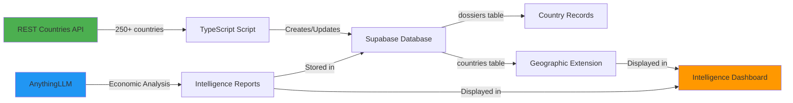

# Geographic Data Population Solution

## Problem
You need to populate geographic context data (ISO codes, capitals, population, area, etc.) for all countries but don't have this information manually.

## Solution
✅ **Automated data fetching from REST Countries API** - A free, reliable API with official data for 250+ countries.

---

## Why Use REST Countries API Instead of LLM?

| Aspect | REST Countries API ✅ | LLM ❌ |
|--------|---------------------|--------|
| **Accuracy** | 100% accurate official data | Risk of hallucination |
| **Cost** | Free, unlimited | Costs tokens for every request |
| **Speed** | Fast HTTP request | Slower LLM inference |
| **ISO Codes** | Official ISO 3166-1 codes | Might generate invalid codes |
| **Updates** | Regularly updated from UN | Static training data |
| **Token Usage** | None | Wastes 100s of tokens per country |

### Key Point: Geographic Data = Reference Data, Not Analysis
- **LLMs are great for**: Analysis, insights, trends, synthesis
- **APIs are great for**: Facts, reference data, official codes

---

## What Gets Populated

For each country (250+ total):

```typescript
{
  iso_code_2: "CN",                      // 2-letter ISO code
  iso_code_3: "CHN",                     // 3-letter ISO code  
  capital_en: "Beijing",                 // Capital (English)
  capital_ar: "بكين",                    // Capital (Arabic)
  region: "Asia",                        // Geographic region
  subregion: "Eastern Asia",             // Subregion
  population: 1400000000,                // Current population
  area_sq_km: 9596961,                   // Area in km²
  flag_url: "https://flagcdn.com/cn.svg" // Flag image
}
```

---

## How to Use

### Quick Start (Recommended)

1. **Get your Supabase Service Role Key**
   - Go to Supabase Dashboard
   - Settings > API
   - Copy the **Service Role Key** (⚠️ not the anon key!)

2. **Run the script**
   ```bash
   export SUPABASE_SERVICE_KEY="your-service-key-here"
   npm run countries:populate
   ```

3. **Done!** 🎉
   - Script fetches data for 250+ countries
   - Creates dossiers for new countries
   - Updates geographic data for existing countries
   - Takes ~2-3 minutes to complete

### Alternative: SQL Script

If you prefer SQL or don't want to expose your service key:

1. Enable the `http` extension in Supabase Dashboard
2. Copy contents of `scripts/populate-countries.sql`
3. Run in Supabase Dashboard > SQL Editor

Full instructions: See `scripts/README-populate-countries.md`

---

## Hybrid Approach: Best of Both Worlds

```
📊 System Design:

┌─────────────────────────────────────────────────────────────┐
│  COUNTRY DOSSIER                                            │
├─────────────────────────────────────────────────────────────┤
│                                                             │
│  Geographic Context (Static Reference Data)                │
│  ✅ REST Countries API ← Factual, accurate, free          │
│     - ISO codes                                            │
│     - Capitals                                             │
│     - Population                                           │
│     - Area                                                 │
│                                                             │
│  ─────────────────────────────────────────────────────────│
│                                                             │
│  Intelligence Analysis (Dynamic Insights)                  │
│  ✅ AnythingLLM ← Context, analysis, trends              │
│     - Economic indicators                                  │
│     - Political analysis                                   │
│     - Security assessment                                  │
│     - Bilateral opportunities                              │
│                                                             │
└─────────────────────────────────────────────────────────────┘
```

**Result**: You get accurate reference data + intelligent analysis! 🚀

---

## Data Flow



---

## Benefits

1. ✅ **No Manual Entry**: All 250+ countries populated automatically
2. ✅ **Always Current**: Re-run anytime to get latest data
3. ✅ **100% Accurate**: Official ISO codes and UN data
4. ✅ **Multilingual**: Includes Arabic translations
5. ✅ **Free**: No API keys or costs
6. ✅ **Fast**: Populates all countries in 2-3 minutes
7. ✅ **Updates Existing**: Safe to re-run, won't duplicate

---

## Example Output

After running the script, your Intelligence Dashboard will show:

```
┌─────────────────────────────────────────────────────────┐
│  INTELLIGENCE DASHBOARD - China                         │
├─────────────────────────────────────────────────────────┤
│                                                         │
│  📍 ISO Code:   CN     🌍 Region:   Asia               │
│  🏛️  Capital:   Beijing 👥 Population: 1,400,000,000   │
│  📏 Area:      9,596,961 km²                            │
│                                                         │
│  [Economic Dashboard] [Political Analysis] [Security]  │
│                                                         │
└─────────────────────────────────────────────────────────┘
```

---

## Maintenance

### When to Re-run
- **Yearly**: Population and area statistics get updated
- **When adding countries**: If new countries are recognized by UN
- **After database reset**: To repopulate from scratch

### How to Update
```bash
# Same command, it will update existing countries
export SUPABASE_SERVICE_KEY="your-key"
npm run countries:populate
```

The script is **idempotent** - safe to run multiple times!

---

## Troubleshooting

See `scripts/README-populate-countries.md` for:
- Common errors and fixes
- Alternative methods
- Environment variable setup
- SQL examples

---

## Files Created

- ✅ `scripts/populate-countries.ts` - TypeScript automation script
- ✅ `scripts/populate-countries.sql` - SQL alternative (requires http extension)
- ✅ `scripts/README-populate-countries.md` - Detailed instructions
- ✅ `package.json` - Added `countries:populate` npm script

---

## Next Steps

1. **Run the script** to populate all countries
2. **Test the Intelligence Dashboard** - Geographic context should display
3. **Use LLM for analysis** - Let AnythingLLM focus on insights, not facts
4. **Set up periodic updates** - Optional: Create a cron job to update yearly

---

## Summary

🎯 **Best Practice**: Use the right tool for the job
- **APIs** for reference data (facts, codes, statistics)
- **LLMs** for analysis (insights, trends, context)

This gives you the **accuracy of structured data** + the **intelligence of AI** = Perfect! 🌟

---

Need help? See `scripts/README-populate-countries.md` for detailed instructions.

