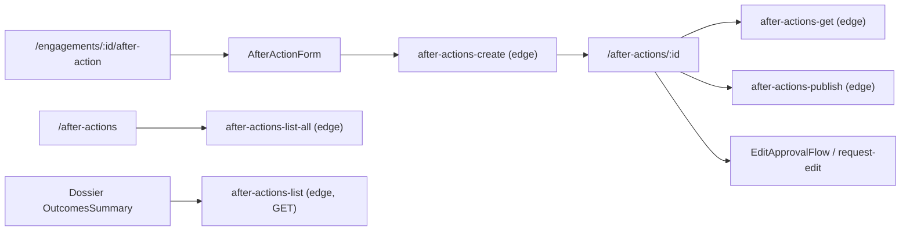

# After-Action Workflow Inspection

**Date:** 2026-06-09  
**Scope:** End-to-end after-action workflow (capture → detail → publish/approve → list → dossier outcomes)  
**Mode:** Read-only code inspection (no source edits)

## Workflow map

**Verified carve-outs (not bugs):** `aa_commitments` uses `due_date` / `owner_*` columns; `after-actions-list` is GET-only and reads `dossierId` from the URL path (not the POST body).

---

## Findings

### 1. CRITICAL — `after-actions-get` rejects all `supabase.functions.invoke` calls

**Location:** `frontend/src/hooks/useAfterAction.ts` lines 194–199; `supabase/functions/after-actions-get/index.ts` lines 18–27, 25–27

**Why it is a bug:** The hook calls `supabase.functions.invoke('after-actions-get', { body: { id } })`, which always issues **POST** to `/functions/v1/after-actions-get`. The edge function accepts **GET only** and parses the record id from the **URL path** (`pathSegments[pathSegments.length - 1]`), not the JSON body. The handler returns **405 Method not allowed** for POST. The after-action detail route (`/after-actions/$afterActionId`) depends entirely on this hook, so viewing a record cannot work through the current frontend.

**Recommended fix:** Align transport with `after-actions-list-all` (accept POST + read `id` from body, or accept both GET and POST). Alternatively, fetch via PostgREST `from('after_action_records').select(...)` with the same embed used in the edge function, or proxy through the Express `GET /api/after-action/:id` route.

---

### 2. CRITICAL — `after-actions-create` selects nonexistent `engagements.dossier_id`

**Location:** `supabase/functions/after-actions-create/index.ts` lines 79–84, 119–121

**Why it is a bug:** After unified dossier migration, `engagements` is an extension table whose **primary key is `dossiers.id`** and has **no `dossier_id` column** (confirmed in `frontend/src/types/database.types.ts` `engagements.Row`). The create function runs `.from('engagements').select('dossier_id')`, which PostgREST rejects or returns no row. Creation then fails with 404 “Engagement not found” even when the engagement dossier exists. The frontend correctly passes the dossier/engagement UUID from `/engagements/$engagementId/after-action` (`useEngagement` loads `dossiers` where `type = 'engagement'`).

**Recommended fix:** Resolve dossier as `engagement.id` (same UUID in unified model), or join `dossiers` on `engagements.id`. Set both `engagement_id` and `dossier_id` to that id when inserting `after_action_records`.

---

### 3. CRITICAL — `after-actions-update` rejects `supabase.functions.invoke` (PATCH vs POST)

**Location:** `frontend/src/hooks/useAfterAction.ts` lines 274–276; `supabase/functions/after-actions-update/index.ts` lines 26–31, 33–35

**Why it is a bug:** `useUpdateAfterAction` invokes the edge function via POST with `{ id, ...request }` in the body. The edge function requires **PATCH** and reads the record id from the URL path, not the body. Every update attempt returns **405**. There is also **no edit route** in `frontend/src/routes` that uses this hook—only create and read-only detail exist—so draft editing after save is blocked even if the transport were fixed.

**Recommended fix:** Add POST body support (mirror `after-actions-list-all`), or switch the hook to `fetch` with PATCH and id in the path. Add `/after-actions/$afterActionId/edit` wired to `AfterActionForm` + `useUpdateAfterAction`.

---

### 4. CRITICAL — `after-actions-publish` ignores body id; path id is wrong under `invoke`

**Location:** `frontend/src/hooks/usePublishAfterAction.ts` lines 19–22; `supabase/functions/after-actions-publish/index.ts` lines 29–31, 40

**Why it is a bug:** The hook sends `{ after_action_id, is_confidential }` in the POST body. The edge function **never reads the body for the id**; it parses `afterActionId` from URL segments after `'after-actions'`. Under `supabase.functions.invoke('after-actions-publish', ...)`, the path is `/functions/v1/after-actions-publish`, so the parsed id is the literal segment `after-actions-publish`, not the UUID. Publish always fails (404/400). Confidential MFA (`mfa_token` in body) is also never sent from the hook.

**Recommended fix:** Read `after_action_id` (or `id`) from the JSON body when the path segment is not a UUID; align with `StepUpMFA` / `PDFGeneratorButton` to pass `mfa_token` when `is_confidential`.

---

### 5. CRITICAL — Dossier widgets call `after-actions-list` via POST body (edge is GET + URL dossier id)

**Location:**

- `frontend/src/components/dossier/sections/OutcomesSummary.tsx` lines 58–60
- `frontend/src/components/dossier/sections/FollowUpActions.tsx` lines 90–92
- `frontend/src/components/dossier/sections/ParticipantsList.tsx` line 90
- `supabase/functions/after-actions-list/index.ts` lines 18–23, 25–27

**Why it is a bug:** These components invoke `after-actions-list` with `supabase.functions.invoke(..., { body: { dossier_id, ... } })` (POST). The edge function allows **GET only** and extracts `dossierId` from a path like `.../dossiers/{dossierId}/after-actions` (lines 26–27). The POST body is ignored and `dossierId` from the invoke URL is undefined, yielding 400 or empty data. `OutcomesSummary` and `FollowUpActions` **swallow errors** and return empty arrays (lines 62–63, 94–95), so dossier outcome/follow-up panels show **no data with no error UI**.

**Recommended fix:** Either (a) add POST+body handling to the edge function (as done for `after-actions-list-all`), or (b) call GET with dossier id in the URL via `fetch`/`supabase.functions.invoke` without a body. Stop silently returning empty arrays on error—surface query failure.

---

### 6. HIGH — Create payload sends `follow_ups`; API expects `follow_up_actions`

**Location:**

- `frontend/src/components/after-action-form/AfterActionForm.tsx` lines 38, 80, 384–385
- `frontend/src/routes/_protected/engagements/$engagementId/after-action.tsx` lines 57–61 (`...data` spread)
- `supabase/functions/after-actions-create/index.ts` lines 33–37, 258–259

**Why it is a bug:** The form stores nested actions in `follow_ups`. The create route spreads the entire `AfterActionFormData` into the invoke body. The edge function only inserts when `body.follow_up_actions` is set. All follow-up actions entered in the capture form are **dropped on create**.

**Recommended fix:** Map `follow_ups` → `follow_up_actions` (and serialize `target_date` dates to ISO strings) in the create handler before `mutateAsync`.

---

### 7. HIGH — Commitment `priority: 'urgent'` vs edge/DB constraint mismatch

**Location:**

- `frontend/src/components/commitment-editor/CommitmentEditor.tsx` line 27, 46
- `supabase/functions/after-actions-create/index.ts` line 15 (`'critical'` in interface)
- `supabase/migrations/20251203000001_normalize_priority_terminology.sql` lines 34–36 (`aa_commitments` CHECK: `urgent`, not `critical`)

**Why it is a bug:** The form offers and sends `urgent` priority. The edge TypeScript interface still documents `critical`. The live `aa_commitments` CHECK allows `low | medium | high | urgent`. Sending `urgent` works if the edge passes it through, but any path still emitting `critical` (AI extraction, legacy tests) will fail the CHECK. The interface mismatch is a contract drift risk; verify AI extraction output uses `urgent`.

**Recommended fix:** Change edge `CreateCommitment.priority` to `'urgent'`; audit AI extraction mapping; add server-side validation error surfacing to the form.

---

### 8. HIGH — Optimistic-lock conflict contract mismatch (`version_mismatch` vs `CONFLICT`)

**Location:**

- `frontend/src/hooks/useAfterAction.ts` lines 290–307
- `supabase/functions/after-actions-update/index.ts` lines 88–97

**Why it is a bug:** On version conflict the edge returns **409** with `{ error: 'version_mismatch', message: '...' }`. The hook only treats parsed `error === 'CONFLICT'` or message substrings `version`/`conflict` as conflicts. Depending on how `FunctionsHttpError` exposes the body, users may see a generic error instead of the conflict banner (`afterActions.conflict.*`). The hook comment says locking uses `updated_at` (line 260) but the edge uses **`version` only**.

**Recommended fix:** Parse 409 responses explicitly; map `version_mismatch` to `ConflictError`. Pass `version` from loaded record on every update/publish.

---

### 9. HIGH — `after-actions-versions` wrong column + GET/POST mismatch

**Location:**

- `frontend/src/hooks/useAfterAction.ts` lines 373–375
- `supabase/functions/after-actions-versions/index.ts` lines 18–23, 51–53
- `frontend/src/types/database.types.ts` `after_action_versions` (`content`, not `snapshot`)

**Why it is a bug:** The hook invokes with POST body `{ after_action_id }`; the edge accepts **GET** and parses id from the URL path (same 405 pattern as get). The select lists **`snapshot`**, which does not exist on `after_action_versions` (column is **`content`** per migration `20250930108_create_after_action_versions_table.sql` and generated types). Version history query fails at runtime.

**Recommended fix:** Accept POST+body id; select `content` (not `snapshot`). Map response shape to `AfterActionVersion` in the hook.

---

### 10. HIGH — `EditApprovalFlow` mounted with wrong props; request-edit is a stub

**Location:**

- `frontend/src/routes/_protected/after-actions/$afterActionId.tsx` lines 113–116, 218
- `frontend/src/components/edit-approval-flow/EditApprovalFlow.tsx` lines 29–35
- `frontend/src/hooks/useEditWorkflow.ts` lines 19–22
- `supabase/functions/after-actions-request-edit/index.ts` lines 6–8, 30–32, 52–69

**Why it is a bug:** Detail page `handleRequestEdit` only shows `toast.info` (line 115)—it never calls `useRequestEdit`. `EditApprovalFlow` requires `editRequest`, `onApprove`, `onReject`; the page renders `<EditApprovalFlow {...({ afterActionId } as any)} />` (line 218), which cannot render a meaningful approval UI. The edge `request-edit` expects `{ reason, changes }` in the body and id in the URL; the hook sends `{ after_action_id, reason }` without `changes`. The edit-request lifecycle is non-functional end-to-end.

**Recommended fix:** Wire a modal collecting reason + diff/changes; call `useRequestEdit` with the edge contract; load pending edit request into `EditApprovalFlow`; connect approve/reject to `after-actions-approve-edit` / `after-actions-reject-edit`.

---

### 11. HIGH — `VersionHistoryViewer` calls nonexistent backend URL

**Location:** `frontend/src/components/version-history-viewer/VersionHistoryViewer.tsx` lines 91–98

**Why it is a bug:** The viewer fetches `GET /api/after-actions/${afterActionId}/versions` and expects `{ versions: [...] }`. The Express router is mounted at **`/api/after-action`** (singular) and has **no `/versions` route** (`backend/src/api/after-action.ts` only defines list, get, create, publish, approve-edit). The versions page renders `VersionHistoryViewer` when `useAfterActionVersions` returns data, but opening the dialog inside the viewer always fails. Missing i18n keys `afterActions.versions.loadFailed`, `added`, `deleted`, `modified` (used lines 94, 145–149) fall back to English key paths in Arabic.

**Recommended fix:** Use `useAfterActionVersions` data inside the viewer, or add `GET /api/after-action/:id/versions` aligned with `after_action_versions.content`. Add missing `versions.*` keys to `ar`/`en` common bundles.

---

### 12. MEDIUM — Detail page i18n keys do not match bundle structure (Arabic shows English fallbacks)

**Location:** `frontend/src/routes/_protected/after-actions/$afterActionId.tsx` (multiple `t('afterActions.*')` calls); `frontend/src/i18n/en/common.json` / `ar/common.json` `afterActions` section

**Why it is a bug:** The detail page uses **flat** keys that do not exist or point at **nested objects**:

| Used in UI                                                                          | Actual bundle key                                               |
| ----------------------------------------------------------------------------------- | --------------------------------------------------------------- |
| `afterActions.detail`                                                               | `afterActions.detail.title` (object parent)                     |
| `afterActions.loadError`, `notFound`, `notFoundDescription`                         | **missing** (only under `engagements.*` / `versions.loadError`) |
| `afterActions.decisions`, `commitments`, `risks`, `followUps`, `notes`              | `afterActions.decisions.title`, etc.                            |
| `afterActions.decisionsCount`                                                       | `afterActions.list.decisionsCount`                              |
| `afterActions.status.editRequested`                                                 | `afterActions.status.edit_pending`                              |
| `afterActions.conflict.warning`, `reviewChanges`                                    | **missing** in both `ar` and `en`                               |
| `afterActions.publish`, `requestEdit`, `versionHistory`, `metadata`, `createdAt`, … | **missing** at flat level                                       |

In Arabic mode, users see raw key paths or English default strings (e.g. conflict banner default at lines 165–168).

**Recommended fix:** Add flat detail keys to both locales or change detail page to nested keys (`afterActions.detail.title`, `afterActions.list.decisionsCount`, …). Add `afterActions.conflict.warning` and `reviewChanges` to `ar` and `en`.

---

### 13. MEDIUM — RTL: physical `space-x-2` on form controls

**Location:**

- `frontend/src/components/after-action-form/AfterActionForm.tsx` line 311
- `frontend/src/components/commitment-editor/CommitmentEditor.tsx` lines 176, 183

**Why it is a bug:** `space-x-2` applies horizontal margin in physical direction; in RTL the confidential checkbox and radio groups do not mirror correctly. Project rules require logical spacing (`gap-*`, `ms-*` / `me-*`).

**Recommended fix:** Replace `space-x-2` with `flex gap-2` (or `gap-x-2` with logical flex direction).

---

### 14. MEDIUM — Attachments uploader is wired to a no-op

**Location:** `frontend/src/components/after-action-form/AfterActionForm.tsx` lines 392–396

**Why it is a bug:** `AttachmentUploader` receives `onChange={() => {}}` and static `attachmentIds={[]}`. Uploaded files are never persisted or sent to create/update APIs. Users can interact with the control but attachments are silently discarded.

**Recommended fix:** Wire `onChange` to form state and include attachment ids in create/update payloads (edge/backend attachment endpoints).

---

### 15. LOW — Detail page shows raw owner UUIDs for commitments

**Location:** `frontend/src/routes/_protected/after-actions/$afterActionId.tsx` lines 297–300

**Why it is a bug:** Internal owners render `commitment.owner_user_id` (UUID) instead of a resolved name from `availableUsers` or a profile join. External owners show `owner_contact_id`. This is a display defect, not a data-loss bug.

**Recommended fix:** Join or lookup user/contact names in `after-actions-get` or resolve client-side via directory hooks.

---

### 16. LOW — Stale E2E specs reference removed routes/UI

**Location:** `frontend/tests/e2e/after-action-create.spec.ts`, `after-action-publish.spec.ts` (e.g. `/after-action/create/`, `/after-action/edit/`, multi-step wizard)

**Why it is a bug:** Tests do not match current TanStack routes (`/engagements/$engagementId/after-action`, `/after-actions/$afterActionId`). They give false confidence and will not catch the transport bugs above.

**Recommended fix:** Rewrite E2E against current routes and edge contracts; run against staging Supabase.

---

## Summary

| Severity | Count |
| -------- | ----- |
| CRITICAL | 5     |
| HIGH     | 6     |
| MEDIUM   | 3     |
| LOW      | 2     |

The workflow is **blocked at multiple layers**: create (engagements `dossier_id`), read (get 405), publish (id parsing), dossier list widgets (list 405 + silent empty state), and edit/approve (missing UI + contract drift). The highest-impact fix cluster is **aligning all edge functions with `supabase.functions.invoke` (POST + JSON body)** following the pattern already implemented in `after-actions-list-all`, and **fixing `engagements.dossier_id` → `engagements.id`** on create.

## Files reviewed (primary)

- Routes: `frontend/src/routes/_protected/engagements/$engagementId/after-action.tsx`, `frontend/src/routes/_protected/after-actions/$afterActionId.tsx`, `frontend/src/routes/_protected/after-actions/index.tsx`, `versions.tsx`
- Hooks: `frontend/src/hooks/useAfterAction.ts`, `usePublishAfterAction.ts`, `useEditWorkflow.ts`
- Components: `AfterActionForm`, `EditApprovalFlow`, `VersionHistoryViewer`, `OutcomesSummary`, `FollowUpActions`, `AfterActionsTable`
- Edge: `supabase/functions/after-actions-{create,get,update,publish,list,list-all,versions,request-edit}/index.ts`
- Schema/types: `supabase/migrations/202509301*`, `20251022000002_create_extension_tables.sql`, `frontend/src/types/database.types.ts`
- i18n: `frontend/src/i18n/{en,ar}/common.json`, `{en,ar}/after-actions-page.json`
