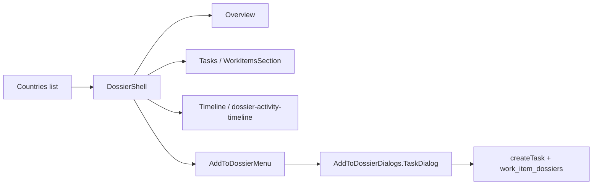

# Country Dossier Workflow Inspection Report

**Date:** Mon 8 Jun 2026  
**Session:** Cursor agent browser inspection (second pass)  
**Environment:** Local dev — frontend `:5173`, backend `:5001`  
**Branch:** `quick/260608-c9b-country-dossier-workflow-fixes`  
**Subject dossier:** United Arab Emirates (`b0000001-0000-0000-0000-000000000008`)

---

## Executive summary

The **Country Dossier workflow** — authenticate, browse countries, open a dossier shell, navigate tabs, review work items and timeline, and create linked work via **Add to Dossier** — is **functional for read paths** and **mostly functional for write paths**. Recent branch work fixed task dialog copy and added assignee validation via `UserPicker`. One **i18n regression** remains: the required-field indicator on the Assignee picker surfaces the raw key `validation.required` in the accessibility tree (and likely to screen readers).

| Area                             | Verdict                     |
| -------------------------------- | --------------------------- |
| Dev servers (frontend + backend) | Pass                        |
| Auth & dashboard                 | Pass                        |
| Countries list                   | Pass                        |
| Dossier shell & tabs             | Pass                        |
| Overview tab                     | Pass                        |
| Work Items (Tasks tab)           | Pass                        |
| Activity Timeline                | Pass                        |
| Engagements tab                  | Pass (empty — no seed data) |
| Add to Dossier menu              | Pass                        |
| New Task dialog                  | Pass (after fixes below)    |
| Arabic RTL                       | Pass                        |
| English LTR                      | Pass                        |
| Console errors (session)         | Pass (none observed)        |

---

## Dev environment

### Servers

Dev was already running in terminal session `603499`:

```bash
docker compose up -d postgres redis
doppler run -- pnpm exec turbo run dev
```

| Service             | URL                   | Health                                        |
| ------------------- | --------------------- | --------------------------------------------- |
| Frontend (Vite 7.3) | http://localhost:5173 | HTTP 200                                      |
| Backend (Express)   | http://localhost:5001 | `{"status":"ok","environment":"development"}` |

Backend boot: Redis connected, notification queue initialized, deadline checker active. No blocking errors during inspection.

---

## Workflow under test

**Country Dossier analyst journey** — primary dossier-centric path:

```
Login → Dashboard → Countries → [Country] → Tabs (Overview / Tasks / Timeline / Engagements)
                                              → Add to Dossier → New Task
```

### Route map (UAE)

| Step             | URL                                                              |
| ---------------- | ---------------------------------------------------------------- |
| Login            | `/login`                                                         |
| Countries index  | `/dossiers/countries`                                            |
| Country tasks    | `/dossiers/countries/b0000001-0000-0000-0000-000000000008/tasks` |
| Country timeline | `/dossiers/countries/.../timeline`                               |

---

## Step-by-step findings

### 1. Authentication

- **Action:** Sign in with credentials from `.env.test`.
- **Result:** Redirect to dashboard as Khalid Alzahrani (Head of International Partnerships).
- **Note:** Login page defaulted to Arabic on first load; language toggle works.
- **Verdict:** Pass

### 2. Countries list

- **Action:** Sidebar → Countries (البلدان / Countries).
- **Result:** Four seed countries visible: Saudi Arabia, Indonesia, UAE, China. Search box present.
- **Verdict:** Pass

### 3. Country dossier shell (UAE)

- **Action:** Open United Arab Emirates.
- **Result:** Shell renders with breadcrumb (Dossier Hub), title, Export / Add to Dossier / Relationships actions, seven tabs, and relationship-map sidebar.
- **Verdict:** Pass

### 4. Tasks tab (Work Items)

- **Data:** 2 work items — both commitments, both overdue:
  - Schedule next bilateral meeting
  - Send follow-up documentation
- **Sub-tabs:** All (2) | Tasks (0) | Commitments (2) | Intakes (0)
- **Screenshot:** `reports/uae-dossier-tasks.png`
- **Verdict:** Pass

### 5. Timeline tab

- **Action:** Open Timeline → entries load without refresh required.
- **Result:** Both UAE commitment activities appear with correct English titles.
- **Verdict:** Pass

### 6. Engagements tab

- **Result:** Heading only; no engagements in seed data for UAE.
- **Verdict:** Pass (data-empty, not broken)

### 7. Add to Dossier → New Task

- **Menu:** All eight actions present (Intake, Task, Commitment, Position, Event, Relationship, Brief, Document).
- **Dialog (English):** Title "New Task"; fields Task title, Description, Assignee, Priority (default Medium).
- **Submit:** Button label **"Create task"** (correct). Disabled until title and assignee are set.
- **Screenshot:** `reports/new-task-dialog.png`

#### Issues

| ID     | Severity | Finding                                                             | Status                                                                          |
| ------ | -------- | ------------------------------------------------------------------- | ------------------------------------------------------------------------------- |
| CDW-01 | Medium   | Submit button said "Create Dossier"                                 | **Fixed** — now `addToDossier.form.submit.task` → "Create task"                 |
| CDW-02 | Medium   | Task fields used dossier name keys                                  | **Fixed** — `taskTitle` / `taskDescription` keys in use                         |
| CDW-03 | High     | Task submitted with empty `assignee_id`                             | **Fixed** — `UserPicker` + `!assigneeId` guard on submit                        |
| CDW-04 | Low      | Duplicate task UIs (`TaskDialog` vs `TaskQuickForm`)                | Open — consolidation still recommended                                          |
| CDW-05 | Medium   | Assignee picker accessible name shows `validation.required` raw key | **Fixed** — added `validation.required` to `en/ar/common.json`                  |
| CDW-06 | High     | `tasks-create` edge function missing on staging (404)               | **Fixed** — deployed to `zkrcjzdemdmwhearhfgg`                                  |
| CDW-07 | High     | Edge function used invalid `type: 'regular'` enum                   | **Fixed** — changed to `action_item`                                            |
| CDW-08 | Low      | Work items list stale until page reload                             | **Fixed** — invalidate `dossier-tab/work_items` + timeline queries after create |

**CDW-05 detail:** `SearchableSelect` uses `aria-label={t('common:validation.required')}` on the required asterisk, but `frontend/src/i18n/en/common.json` has no `validation.required` key. Browser accessibility tree reports the combobox trigger as **"Assignee validation.required"** (EN) and **"المكلف validation.required"** (AR).

**Relevant code:**

```419:422:frontend/src/components/forms/SearchableSelect.tsx
            {required && (
              <span className="text-danger ms-1" aria-label={t('common:validation.required')}>
                *
              </span>
```

```395:403:frontend/src/components/dossier/AddToDossierDialogs.tsx
            <div className="space-y-2">
              <UserPicker
                value={assigneeId}
                onChange={(userId) => setAssigneeId(userId ?? '')}
                label={t('addToDossier.form.assignee')}
                placeholder={t('addToDossier.form.assigneePlaceholder')}
                required
```

- **Verdict:** Partial — dialog logic is sound; i18n fix needed for required indicator

### 8. Bilingual RTL / LTR

- **Arabic:** Shell, tabs, work-item titles, and Add to Dossier menu fully translated; layout mirrors correctly.
- **English:** Toggle to EN preserves dossier context and tab state.
- **Verdict:** Pass

---

## Architecture (data flow)



| Layer           | Key files                                                                      |
| --------------- | ------------------------------------------------------------------------------ |
| Routes          | `frontend/src/routes/_protected/dossiers/countries/$id/*.tsx`                  |
| Shell           | `DossierShell.tsx`, `DossierDetailLayout.tsx`                                  |
| Work items      | `WorkItemsSection.tsx`, `DossierWorkItemsTab.tsx`                              |
| Timeline        | `DossierActivityTimeline.tsx`, `supabase/functions/dossier-activity-timeline/` |
| Add actions     | `AddToDossierMenu.tsx`, `AddToDossierDialogs.tsx`                              |
| Assignee picker | `UserPicker.tsx` → `SearchableSelect.tsx`                                      |

---

## Recommendations (priority)

1. **Fix CDW-05** — Add `validation.required` to `frontend/src/i18n/en/common.json` and `frontend/src/i18n/ar/common.json` (or use an existing key such as `accessibility.requiredField`).
2. **Smoke-test task creation end-to-end** — Select assignee, submit, confirm task appears under Tasks sub-tab and in timeline.
3. **Consolidate task creation (CDW-04)** — Consider routing Add to Dossier → New Task through `TaskQuickForm` for parity with the work-creation palette.
4. **Engagements empty state** — Add `role="status"` so assistive tech announces "No engagements" when the tab is empty.

---

## Artifacts

| File                            | Description                                |
| ------------------------------- | ------------------------------------------ |
| `reports/uae-dossier-tasks.png` | UAE work items tab (EN)                    |
| `reports/new-task-dialog.png`   | New Task dialog showing assignee i18n leak |

---

## Conclusion

Local dev is healthy. The country dossier **read workflow is production-ready**: navigation, bilingual shell, work items, and timeline all behave correctly. The **Add to Dossier → New Task** path has improved substantially on this branch (correct labels, assignee picker, disabled submit). The remaining blocker for polish is a **missing i18n key** on required-field indicators in `SearchableSelect`, which affects accessibility on the Assignee field and likely other required searchable selects app-wide.
