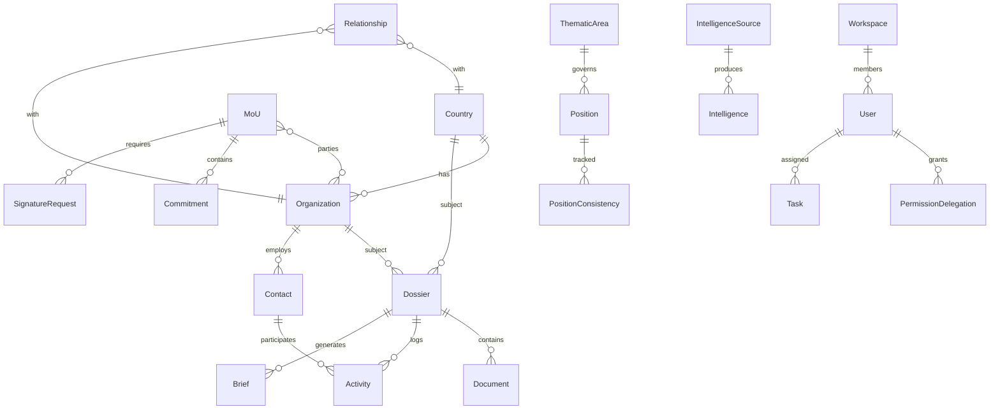

# Data Model: GASTAT International Dossier System

**Date**: 2025-09-26
**Feature**: International Dossier Management Platform

## Entity Relationship Diagram



## Core Entities

### 1. Country
```typescript
interface Country {
  id: UUID;
  code: string; // ISO 3166-1 alpha-2
  name_en: string;
  name_ar: string;
  region: 'GCC' | 'MENA' | 'Europe' | 'Americas' | 'Asia' | 'Africa' | 'Oceania';
  statistical_system: {
    nso_name: string;
    established_year: number;
    staff_count: number;
    website: string;
  };
  cooperation_areas: string[];
  expertise_domains: string[];
  created_at: timestamp;
  updated_at: timestamp;
  metadata: JSONB;
}
```

### 2. Organization
```typescript
interface Organization {
  id: UUID;
  code: string; // e.g., 'UN-SD', 'OECD', 'IMF'
  name_en: string;
  name_ar: string;
  type: 'UN' | 'Regional' | 'Specialized' | 'Development' | 'Research';
  parent_org_id?: UUID; // Hierarchical relationships
  headquarters_country_id: UUID;
  membership_status: 'Member' | 'Observer' | 'Partner' | 'None';
  committees: {
    name: string;
    participation_level: 'Chair' | 'Member' | 'Observer';
    joined_date: date;
  }[];
  obligations: string[];
  programs: string[];
  created_at: timestamp;
  updated_at: timestamp;
}
```

### 3. MoU (Memorandum of Understanding)
```typescript
interface MoU {
  id: UUID;
  reference_number: string;
  title_en: string;
  title_ar: string;
  type: 'data-exchange' | 'capacity-building' | 'strategic-partnership' | 'technical-cooperation';
  status: 'draft' | 'negotiation' | 'signed' | 'active' | 'expired' | 'terminated';
  parties: UUID[]; // References to Organization/Country
  signed_date?: date;
  effective_date?: date;
  expiry_date?: date;
  auto_renewal: boolean;
  deliverables: {
    id: UUID;
    description: string;
    due_date: date;
    status: 'not-started' | 'in-progress' | 'completed' | 'delayed' | 'at-risk';
    responsible_party: UUID;
    completion_percentage: number;
  }[];
  financial_commitment?: {
    amount: decimal;
    currency: string;
    payment_schedule: string;
  };
  alert_settings: {
    milestone_alerts: number[]; // Days before milestone
    expiry_alerts: number[]; // Days before expiry
  };
  performance_metrics: {
    completion_rate: number;
    average_delay_days: number;
    impact_score: number;
  };
  created_at: timestamp;
  updated_at: timestamp;
}
```

### 4. Contact
```typescript
interface Contact {
  id: UUID;
  first_name: string;
  last_name: string;
  name_ar?: string;
  organization_id: UUID;
  country_id: UUID;
  position: string;
  department: string;
  email: string;
  phone?: string;
  mobile?: string;
  preferred_language: 'ar' | 'en';
  expertise_areas: string[];
  influence_score: number; // 0-100
  communication_preferences: {
    email: boolean;
    whatsapp: boolean;
    sms: boolean;
  };
  interaction_history: {
    date: timestamp;
    type: 'email' | 'meeting' | 'call' | 'event';
    summary: string;
    sentiment: 'positive' | 'neutral' | 'negative';
  }[];
  active: boolean;
  created_at: timestamp;
  updated_at: timestamp;
}
```

### 5. Document
```typescript
interface Document {
  id: UUID;
  dossier_id: UUID;
  title: string;
  type: 'agreement' | 'report' | 'correspondence' | 'position' | 'brief' | 'minutes';
  classification: 'public' | 'internal' | 'confidential' | 'secret';
  file_path: string;
  file_size: number;
  mime_type: string;
  language: 'ar' | 'en' | 'both';
  version: number;
  previous_version_id?: UUID;
  tags: string[];
  access_log: {
    user_id: UUID;
    accessed_at: timestamp;
    action: 'view' | 'download' | 'edit';
  }[];
  retention_period: string; // Based on type
  disposal_date?: date;
  created_by: UUID;
  created_at: timestamp;
  updated_at: timestamp;
}
```

### 6. Brief
```typescript
interface Brief {
  id: UUID;
  dossier_id: UUID;
  type: 'meeting' | 'event' | 'executive' | 'policy';
  context: {
    meeting_date?: date;
    participants?: UUID[]; // Contact IDs
    agenda_items?: string[];
    previous_meeting_id?: UUID;
  };
  content: {
    executive_summary: string;
    key_points: string[];
    talking_points: string[];
    background: string;
    recommendations: string[];
    risks: string[];
  };
  language: 'ar' | 'en';
  generation_method: 'ai' | 'template' | 'manual';
  generation_time_ms: number;
  personalization: {
    target_role: string;
    detail_level: 'executive' | 'detailed' | 'technical';
    focus_areas: string[];
  };
  approved: boolean;
  approved_by?: UUID;
  created_at: timestamp;
  expires_at?: timestamp;
}
```

### 7. Position
```typescript
interface Position {
  id: UUID;
  thematic_area_id: UUID;
  title: string;
  content: text;
  status: 'draft' | 'review' | 'approved' | 'superseded';
  version: number;
  effective_date: date;
  expiry_date?: date;
  approval_chain: {
    user_id: UUID;
    role: string;
    approved_at?: timestamp;
    comments?: string;
  }[];
  alignment_score: number; // With national strategy
  related_positions: UUID[];
  created_by: UUID;
  created_at: timestamp;
  updated_at: timestamp;
}
```

### 8. Task
```typescript
interface Task {
  id: UUID;
  title: string;
  description: text;
  type: 'action' | 'review' | 'approval' | 'follow-up';
  priority: 'low' | 'medium' | 'high' | 'critical';
  status: 'pending' | 'in-progress' | 'completed' | 'cancelled';
  assigned_to: UUID;
  assigned_by: UUID;
  related_entity: {
    type: 'mou' | 'activity' | 'commitment' | 'document';
    id: UUID;
  };
  due_date: date;
  completed_at?: timestamp;
  dependencies: UUID[]; // Other task IDs
  escalation_rules: {
    days_before_due: number;
    escalate_to: UUID;
  }[];
  comments: {
    user_id: UUID;
    text: string;
    created_at: timestamp;
  }[];
  created_at: timestamp;
  updated_at: timestamp;
}
```

### 9. Relationship
```typescript
interface Relationship {
  id: UUID;
  gastat_entity_id: UUID; // Always GASTAT
  partner_entity: {
    type: 'country' | 'organization';
    id: UUID;
  };
  status: 'active' | 'dormant' | 'strategic' | 'emerging';
  health_score: number; // 0-100
  health_metrics: {
    engagement_frequency: number; // Interactions per month
    commitment_fulfillment: number; // Percentage
    response_time: number; // Average days
    last_interaction: date;
  };
  risk_level: 'healthy' | 'monitor' | 'at-risk' | 'critical';
  next_actions: string[];
  strategic_importance: 'low' | 'medium' | 'high' | 'critical';
  created_at: timestamp;
  updated_at: timestamp;
}
```

### 10. Intelligence
```typescript
interface Intelligence {
  id: UUID;
  source_id: UUID; // IntelligenceSource
  type: 'trend' | 'opportunity' | 'risk' | 'update' | 'benchmark';
  category: 'statistical-methods' | 'technology' | 'governance' | 'partnerships' | 'events';
  title: string;
  content: text;
  relevance_score: number; // 0-100
  entities_mentioned: {
    type: 'country' | 'organization' | 'person';
    id?: UUID;
    name: string;
  }[];
  recommended_actions: string[];
  priority: 'low' | 'medium' | 'high';
  processed: boolean;
  processed_by?: UUID;
  created_at: timestamp;
  expires_at?: timestamp;
}
```

### 11. Activity
```typescript
interface Activity {
  id: UUID;
  dossier_id: UUID;
  type: 'meeting' | 'mission' | 'event' | 'call' | 'correspondence';
  title: string;
  date: timestamp;
  location?: string;
  participants: UUID[]; // Contact IDs
  agenda?: string[];
  minutes?: text;
  action_items: UUID[]; // Task IDs
  outcomes: string[];
  documents: UUID[]; // Document IDs
  cost?: {
    amount: decimal;
    currency: string;
    category: string;
  };
  roi_metrics?: {
    objectives_met: number; // Percentage
    relationships_strengthened: UUID[];
    follow_up_opportunities: string[];
  };
  created_by: UUID;
  created_at: timestamp;
  updated_at: timestamp;
}
```

### 12. PermissionDelegation
```typescript
interface PermissionDelegation {
  id: UUID;
  grantor_id: UUID; // User delegating permissions
  grantee_id: UUID; // User receiving permissions
  resource_type: 'dossier' | 'mou' | 'all';
  resource_id?: UUID; // Specific resource or null for all
  permissions: string[]; // ['read', 'write', 'delete', 'approve']
  reason: text;
  valid_from: timestamp;
  valid_until: timestamp;
  revoked: boolean;
  revoked_at?: timestamp;
  revoked_by?: UUID;
  created_at: timestamp;
}
```

### 13. SignatureRequest
```typescript
interface SignatureRequest {
  id: UUID;
  mou_id: UUID;
  document_id: UUID;
  provider: 'docusign' | 'pki';
  status: 'draft' | 'sent' | 'viewed' | 'signed' | 'completed' | 'declined' | 'expired';
  signatories: {
    contact_id: UUID;
    order: number; // For sequential signing
    status: 'pending' | 'signed' | 'declined';
    signed_at?: timestamp;
    ip_address?: string;
    signature_data?: string; // Encrypted
  }[];
  workflow: 'parallel' | 'sequential';
  envelope_id?: string; // External provider reference
  certificate?: string; // PKI certificate
  audit_trail: {
    event: string;
    timestamp: timestamp;
    user_id?: UUID;
    details: JSONB;
  }[];
  expires_at: timestamp;
  created_at: timestamp;
  completed_at?: timestamp;
}
```

### 14. IntelligenceSource
```typescript
interface IntelligenceSource {
  id: UUID;
  name: string;
  type: 'rss' | 'api' | 'web' | 'email';
  url?: string;
  api_config?: {
    endpoint: string;
    headers: JSONB;
    auth_type: 'none' | 'bearer' | 'api-key';
  };
  scanning_frequency: 'hourly' | 'daily' | 'weekly';
  keywords: string[];
  categories: string[];
  reliability_score: number; // 0-100
  last_scanned_at?: timestamp;
  next_scan_at: timestamp;
  active: boolean;
  error_count: number;
  created_at: timestamp;
  updated_at: timestamp;
}
```

### 15. PositionConsistency
```typescript
interface PositionConsistency {
  id: UUID;
  thematic_area_id: UUID;
  consistency_score: number; // 0-100
  positions_analyzed: UUID[]; // Position IDs
  conflicts: {
    position1_id: UUID;
    position2_id: UUID;
    conflict_type: 'contradiction' | 'ambiguity' | 'outdated';
    description: text;
    severity: 'low' | 'medium' | 'high';
  }[];
  reconciliation_status: 'pending' | 'in-progress' | 'resolved';
  reconciled_by?: UUID;
  reconciliation_notes?: text;
  calculated_at: timestamp;
}
```

### 16. Workspace
```typescript
interface Workspace {
  id: UUID;
  name: string;
  description: text;
  type: 'project' | 'initiative' | 'committee' | 'temporary';
  members: {
    user_id: UUID;
    role: 'owner' | 'admin' | 'contributor' | 'viewer';
    joined_at: timestamp;
  }[];
  resources: {
    type: 'dossier' | 'document' | 'mou' | 'task';
    id: UUID;
    added_by: UUID;
    added_at: timestamp;
  }[];
  activity_feed: {
    user_id: UUID;
    action: string;
    entity_type: string;
    entity_id: UUID;
    timestamp: timestamp;
  }[];
  settings: {
    visibility: 'private' | 'internal' | 'public';
    auto_archive_days: number;
  };
  active: boolean;
  created_at: timestamp;
  archived_at?: timestamp;
}
```

### 17. Dossier (Composite Entity)
```typescript
interface Dossier {
  id: UUID;
  type: 'country' | 'organization' | 'forum' | 'thematic';
  entity_id: UUID; // Reference to Country/Organization/Forum/ThematicArea
  title: string;
  executive_summary: text;
  status: 'active' | 'archived' | 'draft';
  classification: 'public' | 'internal' | 'confidential' | 'secret';
  tags: string[];
  sections: {
    overview: text;
    history: {
      date: date;
      event: string;
      significance: string;
    }[];
    current_status: text;
    contacts: UUID[]; // Contact IDs
    documents: UUID[]; // Document IDs
    activities: UUID[]; // Activity IDs
    commitments: UUID[]; // Commitment IDs
    insights: text; // AI-generated
  };
  statistics: {
    total_interactions: number;
    last_interaction: date;
    documents_count: number;
    active_commitments: number;
  };
  owner_id: UUID; // Primary responsible user
  contributors: UUID[]; // User IDs with edit access
  created_at: timestamp;
  updated_at: timestamp;
}
```

### 18. Commitment
```typescript
interface Commitment {
  id: UUID;
  mou_id?: UUID;
  activity_id?: UUID;
  type: 'deliverable' | 'payment' | 'report' | 'participation';
  title: string;
  description: text;
  responsible_party: UUID; // Organization/Country
  gastat_focal_point: UUID; // User
  due_date: date;
  status: 'pending' | 'in-progress' | 'completed' | 'overdue' | 'cancelled';
  completion_percentage: number;
  dependencies: UUID[]; // Other commitment IDs
  evidence_documents: UUID[]; // Document IDs
  alerts_sent: {
    type: string;
    sent_at: timestamp;
    recipients: UUID[];
  }[];
  created_at: timestamp;
  completed_at?: timestamp;
}
```

### 19. ThematicArea
```typescript
interface ThematicArea {
  id: UUID;
  code: string; // e.g., 'SDG-1', 'DIGITAL-TRANS'
  name_en: string;
  name_ar: string;
  category: 'sdg' | 'methodology' | 'technology' | 'governance' | 'capacity';
  parent_area_id?: UUID; // Hierarchical
  description: text;
  strategic_importance: 'low' | 'medium' | 'high' | 'critical';
  related_entities: {
    type: 'country' | 'organization';
    id: UUID;
    relationship: string;
  }[];
  resources: {
    type: 'document' | 'expert' | 'best-practice';
    id: UUID;
    title: string;
  }[];
  positions: UUID[]; // Position IDs
  created_at: timestamp;
  updated_at: timestamp;
}
```

## State Machines

### MoU Lifecycle
```
draft → negotiation → signed → active → [expired|terminated]
         ↓              ↓         ↓
      cancelled     cancelled  renewed
```

### Task Status
```
pending → in-progress → completed
    ↓          ↓
 cancelled  cancelled
```

### Signature Request Flow
```
draft → sent → viewed → signed → completed
         ↓        ↓        ↓
     expired  declined declined
```

### Relationship Health
```
healthy (80-100) ←→ monitor (60-79) ←→ at-risk (40-59) ←→ critical (<40)
```

## Indexes & Performance

### Required Indexes
```sql
-- Frequently searched fields
CREATE INDEX idx_dossier_type_entity ON dossiers(type, entity_id);
CREATE INDEX idx_mou_status_expiry ON mous(status, expiry_date);
CREATE INDEX idx_contact_org_active ON contacts(organization_id, active);
CREATE INDEX idx_document_classification ON documents(classification, dossier_id);
CREATE INDEX idx_task_assigned_status ON tasks(assigned_to, status, due_date);

-- Full-text search (Arabic/English)
CREATE INDEX idx_dossier_search ON dossiers USING gin(
  to_tsvector('arabic', title || ' ' || executive_summary) ||
  to_tsvector('english', title || ' ' || executive_summary)
);

-- JSONB indexes
CREATE INDEX idx_mou_deliverables ON mous USING gin(deliverables);
CREATE INDEX idx_contact_history ON contacts USING gin(interaction_history);

-- Temporal queries
CREATE INDEX idx_activity_date ON activities(date DESC);
CREATE INDEX idx_commitment_due ON commitments(due_date, status);
```

## Security Considerations

1. **Row-Level Security**: All tables must have RLS policies
2. **Data Classification**: Enforce classification levels at database
3. **Audit Trail**: Every modification logged with user and timestamp
4. **Encryption**: Sensitive fields (signatures, personal data) encrypted
5. **Soft Deletes**: Implement soft deletes with `deleted_at` field
6. **Retention Policies**: Automatic archival based on data type

## Migration Strategy

1. Create tables in dependency order (no foreign key violations)
2. Apply RLS policies before data insertion
3. Seed with test data for each entity type
4. Validate relationships and constraints
5. Create backup before production deployment

---

**Status**: Complete - Data model defined for all 19 entities
**Next Step**: Generate API contracts