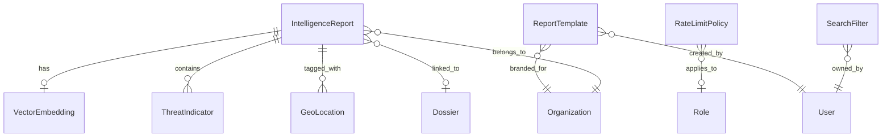

# Data Model: System Requirements Refinement and Clarification

**Feature**: 004-refine-specification-to
**Date**: 2025-09-27
**Status**: Complete

## Entity Definitions

### 1. IntelligenceReport
**Purpose**: Core document with analysis metadata and embeddings
```typescript
interface IntelligenceReport {
  id: string;                    // UUID primary key
  title: string;                 // Report title (bilingual)
  title_ar?: string;             // Arabic title
  content: string;               // Report content (markdown)
  content_ar?: string;           // Arabic content
  
  // Metadata (FR-041)
  confidence_score: number;       // 0-100 confidence rating
  data_sources: string[];        // Array of source identifiers
  analysis_timestamp: Date;      // When analysis was performed
  analyst_id: string;            // FK to users table
  review_status: 'draft' | 'pending' | 'approved' | 'archived';
  
  // Threat indicators (FR-042)
  threat_indicators: ThreatIndicator[];
  
  // Location data (FR-043)
  geospatial_tags: GeoLocation[];
  
  // Embedding status
  embedding_status: 'pending' | 'processing' | 'completed' | 'failed';
  embedding_error?: string;
  
  // Retention (FR-046)
  created_at: Date;
  archived_at?: Date;           // Set after 90 days
  retention_until: Date;         // 7 years from creation
  
  // Relationships
  vector_embedding_id?: string;  // FK to vector_embeddings
  organization_id: string;       // FK to organizations
  dossier_id?: string;          // FK to dossiers
}
```

### 2. VectorEmbedding
**Purpose**: 1536-dimensional embeddings for similarity search (FR-003)
```typescript
interface VectorEmbedding {
  id: string;                    // UUID primary key
  report_id: string;             // FK to intelligence_reports
  embedding: number[];           // 1536-dimensional vector
  
  // Indexing metadata (FR-005)
  index_method: 'hnsw';
  ef_construction: number;       // 200
  m_parameter: number;           // 16
  
  // Search metadata (FR-004)
  similarity_threshold: number;  // 0.8 for cosine similarity
  
  created_at: Date;
  updated_at: Date;
}
```

### 3. RateLimitPolicy
**Purpose**: Configurable rate limiting rules (FR-009 to FR-013)
```typescript
interface RateLimitPolicy {
  id: string;                    // UUID primary key
  name: string;                  // Policy name
  description?: string;
  
  // Limits (FR-009, FR-013a)
  requests_per_minute: number;   // 300 for auth, 50 for anon
  burst_capacity: number;        // 50 for token bucket (FR-010)
  
  // Targeting
  applies_to: 'authenticated' | 'anonymous' | 'role';
  role_id?: string;              // FK to roles if applies_to=role
  
  // Tracking (FR-012)
  endpoint_type: 'api' | 'upload' | 'report' | 'all';
  
  // Response (FR-011)
  retry_after_seconds: number;   // For 429 response header
  
  enabled: boolean;
  created_at: Date;
  updated_at: Date;
}
```

### 4. ScalingPolicy
**Purpose**: Auto-scaling configuration (FR-014 to FR-019)
```typescript
interface ScalingPolicy {
  id: string;                    // UUID primary key
  name: string;                  // Policy name
  
  // Capacity (FR-014, FR-015)
  min_concurrent_users: number;  // 1000
  max_requests_per_minute: number; // 10000
  
  // Instance limits (FR-018)
  min_instances: number;         // 2
  max_instances: number;         // 20
  
  // Triggers (FR-016, FR-017)
  cpu_threshold_percent: number; // 70
  memory_threshold_percent: number; // 80
  threshold_duration_minutes: number; // 5
  
  // Degradation (FR-019a)
  max_limit_action: 'alert' | 'degrade' | 'reject';
  degraded_features: string[];   // Features to disable
  
  // Session handling (FR-019)
  maintain_session_affinity: boolean; // true
  
  enabled: boolean;
  created_at: Date;
  updated_at: Date;
}
```

### 5. SearchFilter
**Purpose**: Saved search configurations (FR-020 to FR-025)
```typescript
interface SearchFilter {
  id: string;                    // UUID primary key
  user_id: string;               // FK to users (FR-023)
  name: string;                  // Filter name
  
  // Search criteria (FR-020, FR-021)
  search_entities: ('dossier' | 'organization' | 'country' | 'project')[];
  full_text_query?: string;
  
  // Filters (FR-021, FR-022)
  date_range?: { from: Date; to: Date };
  status_filter?: string[];
  priority_filter?: string[];
  custom_tags?: string[];
  filter_logic: 'AND' | 'OR';   // FR-022
  
  // Pagination (FR-025)
  page_size: 10 | 25 | 50 | 100;
  
  // Timeout handling (FR-025a)
  timeout_behavior: 'partial' | 'fail' | 'cached';
  max_timeout_ms: number;        // 2000 for 100k records
  
  is_default: boolean;
  created_at: Date;
  updated_at: Date;
}
```

### 6. ReportTemplate
**Purpose**: Report generation templates (FR-026 to FR-031)
```typescript
interface ReportTemplate {
  id: string;                    // UUID primary key
  name: string;                  // Template name
  name_ar?: string;              // Arabic name
  
  // Report types (FR-026, FR-027, FR-028)
  report_type: 'executive' | 'analytical' | 'compliance';
  
  // Content configuration
  include_metrics: boolean;      // Key metrics
  include_trends: boolean;       // Trend analysis
  include_charts: boolean;       // Visualizations (FR-027)
  include_audit_trail: boolean;  // For compliance (FR-028)
  
  // Export formats (FR-029)
  supported_formats: ('pdf' | 'excel' | 'csv' | 'json')[];
  
  // Scheduling (FR-030)
  schedule_enabled: boolean;
  schedule_frequency?: 'daily' | 'weekly' | 'monthly';
  schedule_time?: string;        // Cron expression
  
  // Branding (FR-031)
  organization_branding: {
    logo_url?: string;
    primary_color?: string;
    secondary_color?: string;
    font_family?: string;
  };
  
  template_content: string;      // Template markup
  template_content_ar?: string;  // Arabic template
  
  created_by: string;            // FK to users
  created_at: Date;
  updated_at: Date;
}
```

### 7. ThreatIndicator (Nested)
**Purpose**: Threat assessment data (FR-042)
```typescript
interface ThreatIndicator {
  indicator_type: string;        // Type of threat
  severity: 'low' | 'medium' | 'high' | 'critical';
  description: string;
  description_ar?: string;
  confidence: number;            // 0-100
  source_reference?: string;
}
```

### 8. GeoLocation (Nested)
**Purpose**: Geographic tagging (FR-043)
```typescript
interface GeoLocation {
  latitude: number;
  longitude: number;
  location_name: string;
  location_name_ar?: string;
  location_type: 'city' | 'region' | 'country' | 'coordinate';
  radius_km?: number;            // For area coverage
}
```

## Relationships



## State Transitions

### IntelligenceReport States
```
draft → pending → approved → archived
         ↓           ↓
       draft     archived
```

### Embedding Status States
```
pending → processing → completed
            ↓             ↓
          failed      pending (retry)
```

## Validation Rules

### IntelligenceReport
- `confidence_score`: Must be between 0 and 100
- `data_sources`: Minimum 1 source required
- `threat_indicators`: At least one indicator for approved reports
- `title` and `content`: Required in at least one language

### VectorEmbedding
- `embedding`: Must be exactly 1536 dimensions
- `similarity_threshold`: Must be between 0 and 1
- `ef_construction`: Must be ≥ 100
- `m_parameter`: Must be between 5 and 48

### RateLimitPolicy
- `requests_per_minute`: Must be > 0
- `burst_capacity`: Must be ≤ requests_per_minute
- `retry_after_seconds`: Must be between 1 and 3600

### ScalingPolicy
- `min_instances`: Must be ≥ 1
- `max_instances`: Must be ≤ 50 and > min_instances
- `cpu_threshold_percent`: Must be between 10 and 95
- `memory_threshold_percent`: Must be between 10 and 95

### SearchFilter
- `page_size`: Must be one of [10, 25, 50, 100]
- `max_timeout_ms`: Must be ≤ 30000
- `date_range.from`: Must be before date_range.to

### ReportTemplate
- `template_content`: Required, must be valid template syntax
- `schedule_time`: Must be valid cron expression if schedule_enabled
- At least one supported_format required

## Indexes

### Performance Indexes
```sql
-- Vector similarity search
CREATE INDEX idx_vector_embedding_hnsw ON vector_embeddings 
USING hnsw (embedding vector_cosine_ops);

-- Report retrieval
CREATE INDEX idx_reports_status_date ON intelligence_reports(review_status, created_at DESC);
CREATE INDEX idx_reports_archived ON intelligence_reports(archived_at) 
WHERE archived_at IS NOT NULL;

-- Rate limiting lookup
CREATE INDEX idx_rate_limit_applies ON rate_limit_policies(applies_to, endpoint_type);

-- Search performance
CREATE INDEX idx_reports_fulltext ON intelligence_reports 
USING gin(to_tsvector('english', title || ' ' || content));
CREATE INDEX idx_reports_fulltext_ar ON intelligence_reports 
USING gin(to_tsvector('arabic', coalesce(title_ar, '') || ' ' || coalesce(content_ar, '')));
```

## Migration Considerations

1. **Partitioning Strategy**:
   - Partition intelligence_reports by created_at (monthly)
   - Separate partition for archived data (>90 days)

2. **Compression**:
   - Enable ZSTD compression on archived partitions
   - Compress vector_embeddings table after initial load

3. **Bilingual Fields**:
   - All user-facing text fields have optional _ar variants
   - Default to primary language if translation missing

4. **Audit Trail**:
   - All tables include created_at, updated_at
   - Consider adding created_by, updated_by for compliance

---
*Data model designed for PostgreSQL 15 with pgvector extension*