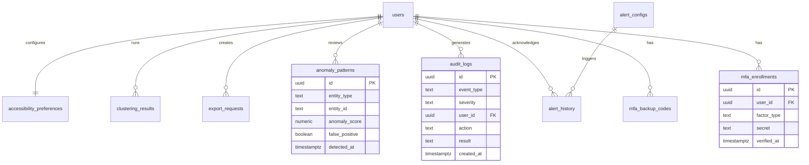

# Data Model: Security Enhancement and System Hardening

## Entity Definitions

### 1. MFA Configuration
**Table**: `auth.mfa_enrollments`
**Purpose**: Stores user MFA settings and enrollment status

| Field | Type | Constraints | Description |
|-------|------|------------|-------------|
| id | uuid | PK, DEFAULT gen_random_uuid() | Unique enrollment ID |
| user_id | uuid | FK auth.users(id), NOT NULL, UNIQUE | User reference |
| factor_type | text | NOT NULL, CHECK(factor_type IN ('totp')) | MFA factor type |
| factor_id | text | NOT NULL | Factor identifier |
| secret | text | ENCRYPTED | TOTP secret (encrypted) |
| qr_code | text | NULL | QR code data URL |
| verified_at | timestamptz | NULL | Verification timestamp |
| last_used_at | timestamptz | NULL | Last successful use |
| created_at | timestamptz | DEFAULT now() | Creation timestamp |
| updated_at | timestamptz | DEFAULT now() | Last update timestamp |

**Indexes**:
- `idx_mfa_user_id` ON (user_id)
- `idx_mfa_factor_type` ON (factor_type)
- `idx_mfa_verified` ON (verified_at) WHERE verified_at IS NOT NULL

### 2. MFA Backup Codes
**Table**: `auth.mfa_backup_codes`
**Purpose**: Stores recovery codes for MFA

| Field | Type | Constraints | Description |
|-------|------|------------|-------------|
| id | uuid | PK, DEFAULT gen_random_uuid() | Unique code ID |
| user_id | uuid | FK auth.users(id), NOT NULL | User reference |
| code_hash | text | NOT NULL | Hashed backup code |
| used_at | timestamptz | NULL | Usage timestamp |
| created_at | timestamptz | DEFAULT now() | Creation timestamp |

**Indexes**:
- `idx_backup_codes_user` ON (user_id)
- `idx_backup_codes_unused` ON (user_id) WHERE used_at IS NULL

### 3. Security Audit Log
**Table**: `security.audit_logs`
**Purpose**: Comprehensive security event logging

| Field | Type | Constraints | Description |
|-------|------|------------|-------------|
| id | uuid | PK, DEFAULT gen_random_uuid() | Log entry ID |
| event_type | text | NOT NULL | Event type (login, mfa, access_denied, etc.) |
| severity | text | NOT NULL, CHECK(severity IN ('info', 'warning', 'critical')) | Event severity |
| user_id | uuid | FK auth.users(id), NULL | User involved (if applicable) |
| ip_address | inet | NULL | Client IP address |
| user_agent | text | NULL | Client user agent |
| resource | text | NULL | Resource accessed |
| action | text | NOT NULL | Action attempted |
| result | text | NOT NULL, CHECK(result IN ('success', 'failure', 'blocked')) | Action result |
| metadata | jsonb | DEFAULT '{}' | Additional event data |
| created_at | timestamptz | DEFAULT now() | Event timestamp |

**Indexes**:
- `idx_audit_event_type` ON (event_type)
- `idx_audit_user_id` ON (user_id)
- `idx_audit_created_at` ON (created_at DESC)
- `idx_audit_severity` ON (severity, created_at DESC)

### 4. Alert Configuration
**Table**: `monitoring.alert_configs`
**Purpose**: Alert rules and notification settings

| Field | Type | Constraints | Description |
|-------|------|------------|-------------|
| id | uuid | PK, DEFAULT gen_random_uuid() | Configuration ID |
| name | text | NOT NULL, UNIQUE | Alert rule name |
| name_ar | text | NOT NULL | Arabic name |
| condition | text | NOT NULL | Alert condition (Prometheus expression) |
| threshold | numeric | NOT NULL | Threshold value |
| duration | interval | NOT NULL, DEFAULT '5 minutes' | Duration before triggering |
| severity | text | NOT NULL, CHECK(severity IN ('low', 'medium', 'high', 'critical')) | Alert severity |
| channels | text[] | NOT NULL, DEFAULT '{"email"}' | Notification channels |
| metadata | jsonb | DEFAULT '{}' | Additional configuration |
| is_active | boolean | DEFAULT true | Enable/disable flag |
| created_at | timestamptz | DEFAULT now() | Creation timestamp |
| updated_at | timestamptz | DEFAULT now() | Last update timestamp |

**Indexes**:
- `idx_alert_active` ON (is_active)
- `idx_alert_severity` ON (severity)

### 5. Alert History
**Table**: `monitoring.alert_history`
**Purpose**: Triggered alert records

| Field | Type | Constraints | Description |
|-------|------|------------|-------------|
| id | uuid | PK, DEFAULT gen_random_uuid() | Alert instance ID |
| config_id | uuid | FK monitoring.alert_configs(id), NOT NULL | Alert configuration |
| triggered_at | timestamptz | DEFAULT now() | Trigger timestamp |
| resolved_at | timestamptz | NULL | Resolution timestamp |
| value | numeric | NOT NULL | Metric value at trigger |
| message | text | NOT NULL | Alert message (English) |
| message_ar | text | NOT NULL | Alert message (Arabic) |
| notifications_sent | jsonb | DEFAULT '{}' | Sent notification details |
| acknowledged_by | uuid | FK auth.users(id), NULL | User who acknowledged |
| acknowledged_at | timestamptz | NULL | Acknowledgment timestamp |

**Indexes**:
- `idx_alert_history_config` ON (config_id)
- `idx_alert_history_triggered` ON (triggered_at DESC)
- `idx_alert_history_unresolved` ON (triggered_at) WHERE resolved_at IS NULL

### 6. Anomaly Patterns
**Table**: `monitoring.anomaly_patterns`
**Purpose**: Detected anomalous behaviors

| Field | Type | Constraints | Description |
|-------|------|------------|-------------|
| id | uuid | PK, DEFAULT gen_random_uuid() | Anomaly ID |
| detection_type | text | NOT NULL | Detection algorithm used |
| entity_type | text | NOT NULL | Entity type (user, system, api) |
| entity_id | text | NOT NULL | Entity identifier |
| anomaly_score | numeric | NOT NULL, CHECK(anomaly_score >= 0 AND anomaly_score <= 1) | Anomaly score (0-1) |
| sensitivity_level | text | NOT NULL, CHECK(sensitivity_level IN ('low', 'medium', 'high', 'custom')) | Sensitivity level used |
| features | jsonb | NOT NULL | Feature values that triggered detection |
| classification | text | NULL | Manual classification if reviewed |
| false_positive | boolean | DEFAULT false | Marked as false positive |
| detected_at | timestamptz | DEFAULT now() | Detection timestamp |
| reviewed_at | timestamptz | NULL | Review timestamp |
| reviewed_by | uuid | FK auth.users(id), NULL | Reviewer |

**Indexes**:
- `idx_anomaly_entity` ON (entity_type, entity_id)
- `idx_anomaly_score` ON (anomaly_score DESC)
- `idx_anomaly_detected` ON (detected_at DESC)
- `idx_anomaly_unreviewed` ON (detected_at) WHERE reviewed_at IS NULL

### 7. Export Requests
**Table**: `features.export_requests`
**Purpose**: Track export operations

| Field | Type | Constraints | Description |
|-------|------|------------|-------------|
| id | uuid | PK, DEFAULT gen_random_uuid() | Export request ID |
| user_id | uuid | FK auth.users(id), NOT NULL | Requesting user |
| resource_type | text | NOT NULL | Resource being exported |
| filters | jsonb | DEFAULT '{}' | Applied filters |
| format | text | NOT NULL, CHECK(format IN ('csv', 'json', 'excel')) | Export format |
| row_count | integer | NULL | Total rows to export |
| status | text | NOT NULL, DEFAULT 'pending' | Export status |
| file_path | text | NULL | Generated file location |
| started_at | timestamptz | DEFAULT now() | Start timestamp |
| completed_at | timestamptz | NULL | Completion timestamp |
| error_message | text | NULL | Error if failed |

**Indexes**:
- `idx_export_user` ON (user_id)
- `idx_export_status` ON (status)
- `idx_export_started` ON (started_at DESC)

### 8. Clustering Results
**Table**: `analytics.clustering_results`
**Purpose**: Store K-means clustering outputs

| Field | Type | Constraints | Description |
|-------|------|------------|-------------|
| id | uuid | PK, DEFAULT gen_random_uuid() | Clustering run ID |
| dataset_id | text | NOT NULL | Dataset identifier |
| cluster_count | integer | NOT NULL, CHECK(cluster_count >= 3 AND cluster_count <= 10) | Number of clusters |
| silhouette_score | numeric | NOT NULL | Silhouette coefficient |
| inertia | numeric | NOT NULL | Sum of squared distances |
| centroids | jsonb | NOT NULL | Cluster centroids |
| labels | integer[] | NOT NULL | Cluster assignments |
| parameters | jsonb | DEFAULT '{}' | Algorithm parameters |
| is_optimal | boolean | DEFAULT false | Marked as optimal configuration |
| created_at | timestamptz | DEFAULT now() | Run timestamp |
| created_by | uuid | FK auth.users(id), NOT NULL | User who ran clustering |

**Indexes**:
- `idx_clustering_dataset` ON (dataset_id)
- `idx_clustering_score` ON (silhouette_score DESC)
- `idx_clustering_optimal` ON (dataset_id, is_optimal) WHERE is_optimal = true

### 9. Accessibility Preferences
**Table**: `users.accessibility_preferences`
**Purpose**: User-specific accessibility settings

| Field | Type | Constraints | Description |
|-------|------|------------|-------------|
| id | uuid | PK, DEFAULT gen_random_uuid() | Preference ID |
| user_id | uuid | FK auth.users(id), NOT NULL, UNIQUE | User reference |
| high_contrast | boolean | DEFAULT false | High contrast mode |
| large_text | boolean | DEFAULT false | Increased font size |
| reduce_motion | boolean | DEFAULT false | Disable animations |
| screen_reader | boolean | DEFAULT false | Screen reader optimizations |
| keyboard_only | boolean | DEFAULT false | Keyboard-only navigation |
| focus_indicators | text | DEFAULT 'default' | Focus indicator style |
| color_blind_mode | text | NULL | Color blind assistance mode |
| custom_css | text | NULL | Custom CSS overrides |
| updated_at | timestamptz | DEFAULT now() | Last update timestamp |

**Indexes**:
- `idx_accessibility_user` ON (user_id)

### 10. System Health Metrics
**Table**: `monitoring.health_metrics`
**Purpose**: Container and service health tracking

| Field | Type | Constraints | Description |
|-------|------|------------|-------------|
| id | uuid | PK, DEFAULT gen_random_uuid() | Metric ID |
| service_name | text | NOT NULL | Service/container name |
| metric_type | text | NOT NULL | Metric type (cpu, memory, latency) |
| value | numeric | NOT NULL | Metric value |
| unit | text | NOT NULL | Measurement unit |
| threshold_exceeded | boolean | DEFAULT false | Threshold violation flag |
| instance_id | text | NOT NULL | Instance identifier |
| recorded_at | timestamptz | DEFAULT now() | Measurement timestamp |

**Indexes**:
- `idx_health_service` ON (service_name, recorded_at DESC)
- `idx_health_exceeded` ON (threshold_exceeded, recorded_at DESC) WHERE threshold_exceeded = true

## Relationships



## Row Level Security Policies

### MFA Tables
```sql
-- mfa_enrollments: Users can only see their own enrollments
CREATE POLICY "users_own_mfa" ON auth.mfa_enrollments
  FOR ALL USING (user_id = auth.uid());

-- mfa_backup_codes: Users can only see their own codes
CREATE POLICY "users_own_backup_codes" ON auth.mfa_backup_codes
  FOR ALL USING (user_id = auth.uid());
```

### Audit Logs
```sql
-- Read-only access for admins only
CREATE POLICY "admin_read_audit" ON security.audit_logs
  FOR SELECT USING (
    EXISTS (
      SELECT 1 FROM auth.users
      WHERE id = auth.uid() AND role = 'admin'
    )
  );
```

### Export Requests
```sql
-- Users see their own exports, admins see all
CREATE POLICY "export_access" ON features.export_requests
  FOR SELECT USING (
    user_id = auth.uid() OR
    EXISTS (
      SELECT 1 FROM auth.users
      WHERE id = auth.uid() AND role = 'admin'
    )
  );
```

### Accessibility Preferences
```sql
-- Users manage their own preferences
CREATE POLICY "own_accessibility" ON users.accessibility_preferences
  FOR ALL USING (user_id = auth.uid());
```

## State Machines

### MFA Enrollment Flow
```
UNENROLLED → PENDING_VERIFICATION → VERIFIED → ACTIVE
                    ↓                    ↓
                 FAILED             DEACTIVATED
```

### Export Request States
```
PENDING → PROCESSING → COMPLETED
            ↓             ↓
         FAILED      EXPIRED (after 24h)
```

### Alert States
```
TRIGGERED → ACKNOWLEDGED → INVESTIGATING → RESOLVED
     ↓           ↓              ↓
  ESCALATED   AUTO_RESOLVED   FALSE_POSITIVE
```

## Data Retention Policies

| Entity | Active Retention | Archive Policy |
|--------|-----------------|----------------|
| audit_logs | 90 days | 7 years (compliance) |
| alert_history | 30 days | 1 year |
| anomaly_patterns | 90 days | 1 year (for ML training) |
| export_requests | 7 days | 30 days |
| health_metrics | 7 days | 30 days |
| clustering_results | Permanent | - |

## Encryption Requirements

### At Rest
- MFA secrets: AES-256-GCM encryption
- Backup codes: Hashed with bcrypt (cost factor 12)
- Audit logs metadata: Encrypted if contains PII
- Export file paths: Encrypted to prevent direct access

### In Transit
- All API calls: TLS 1.3 minimum
- Database connections: SSL required
- Inter-service communication: mTLS

## Performance Considerations

### Indexing Strategy
- All foreign keys indexed for join performance
- Composite indexes for common query patterns
- Partial indexes for filtered queries
- BRIN indexes for time-series data (health_metrics)

### Partitioning
- audit_logs: Monthly partitions by created_at
- health_metrics: Daily partitions by recorded_at
- alert_history: Monthly partitions by triggered_at

### Optimization Targets
- RLS policy evaluation: <5ms per query
- Audit log insertion: <10ms
- Alert trigger evaluation: <100ms
- Export query generation: <500ms for 100k rows