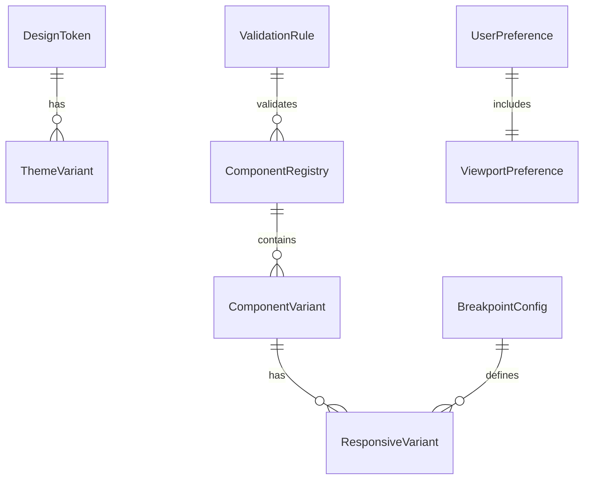
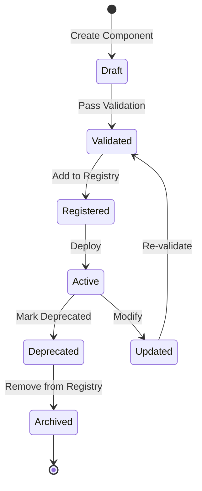

# Data Model: Responsive Design Compliance

**Feature Branch**: `007-responsive-design-compliance`
**Version**: 1.0.0
**Last Updated**: 2025-09-29

## Entity Overview



## Core Entities

### 1. DesignToken
Represents a design system token (color, spacing, typography, etc.)

```typescript
interface DesignToken {
  id: string;                    // Unique identifier (e.g., "color-primary-500")
  category: TokenCategory;       // 'color' | 'spacing' | 'typography' | 'border' | 'shadow'
  name: string;                   // Human-readable name
  value: string;                  // CSS value (e.g., "#3B82F6", "1rem")
  cssVariable: string;            // CSS custom property name (e.g., "--color-primary-500")
  fallback?: string;              // Fallback value for older browsers
  description?: string;           // Documentation
  deprecated?: boolean;           // Deprecation flag
  createdAt: Date;
  updatedAt: Date;
}

enum TokenCategory {
  COLOR = 'color',
  SPACING = 'spacing',
  TYPOGRAPHY = 'typography',
  BORDER = 'border',
  SHADOW = 'shadow',
  ANIMATION = 'animation',
  BREAKPOINT = 'breakpoint'
}
```

### 2. ComponentRegistry
Central registry of approved shadcn components

```typescript
interface ComponentRegistry {
  name: string;                   // Component name (e.g., "button", "card")
  version: string;                // Semver version
  source: 'shadcn' | 'custom';   // Component source
  category: ComponentCategory;    // Component type
  path: string;                   // Import path
  dependencies: string[];         // Required dependencies
  variants: ComponentVariant[];   // Available variants
  validation: ValidationRule[];   // Compliance rules
  documentation?: string;         // Link to docs
  examples?: CodeExample[];       // Usage examples
  createdAt: Date;
  updatedAt: Date;
}

enum ComponentCategory {
  LAYOUT = 'layout',
  FORM = 'form',
  DISPLAY = 'display',
  FEEDBACK = 'feedback',
  NAVIGATION = 'navigation',
  OVERLAY = 'overlay'
}
```

### 3. ComponentVariant
Specific variant of a component

```typescript
interface ComponentVariant {
  id: string;                     // Unique identifier
  componentName: string;          // Parent component reference
  variant: string;                // Variant name (e.g., "primary", "ghost")
  size?: 'xs' | 'sm' | 'md' | 'lg' | 'xl';
  props: Record<string, any>;     // Default props
  className?: string;              // Default Tailwind classes
  responsiveVariants?: ResponsiveVariant[];
  rtlSupport: boolean;            // RTL compatibility flag
  accessibility: AccessibilityInfo;
}

interface AccessibilityInfo {
  ariaLabel?: string;
  ariaLabelAr?: string;           // Arabic ARIA label
  role?: string;
  keyboardShortcuts?: string[];
  focusable: boolean;
  announcements?: Record<string, string>;
}
```

### 4. ResponsiveVariant
Breakpoint-specific component configuration

```typescript
interface ResponsiveVariant {
  id: string;
  componentVariantId: string;      // Parent variant reference
  breakpointId: string;            // Breakpoint reference
  overrides: {
    className?: string;             // Breakpoint-specific classes
    props?: Record<string, any>;   // Breakpoint-specific props
    hidden?: boolean;               // Hide at this breakpoint
    collapsed?: boolean;            // Progressive disclosure state
  };
  minWidth: number;                // Minimum viewport width
  maxWidth?: number;               // Maximum viewport width
}
```

### 5. BreakpointConfig
System-wide breakpoint definitions

```typescript
interface BreakpointConfig {
  id: string;                      // Unique identifier
  name: string;                    // Breakpoint name (e.g., "mobile", "tablet")
  minWidth: number;                // Minimum width in pixels
  maxWidth?: number;               // Maximum width in pixels
  alias: string;                   // Tailwind alias (e.g., "sm", "md", "lg")
  deviceType: DeviceType;
  orientation?: 'portrait' | 'landscape' | 'any';
  containerQueries?: boolean;      // Support container queries
  priority: number;                // Order for cascade
}

enum DeviceType {
  MOBILE = 'mobile',
  TABLET = 'tablet',
  DESKTOP = 'desktop',
  WIDE = 'wide'
}
```

### 6. ThemeVariant
Theme-specific token overrides

```typescript
interface ThemeVariant {
  id: string;
  name: string;                    // Theme name (e.g., "light", "dark", "gastat")
  tokens: Map<string, string>;     // Token overrides
  direction: 'ltr' | 'rtl';       // Text direction
  contrast: 'normal' | 'high';    // Contrast mode
  motion: 'normal' | 'reduced';   // Motion preference
  isDefault: boolean;
  metadata: {
    author?: string;
    description?: string;
    preview?: string;              // Preview image URL
  };
}
```

### 7. ValidationRule
Component compliance validation rules

```typescript
interface ValidationRule {
  id: string;
  componentName?: string;          // Specific component or null for global
  ruleType: RuleType;
  severity: 'error' | 'warning' | 'info';
  message: string;
  messageAr: string;               // Arabic error message
  validator: string;               // Validation function name
  autoFix?: boolean;               // Can be auto-fixed
  documentation?: string;          // Link to rule docs
}

enum RuleType {
  RESPONSIVE = 'responsive',       // Responsive compliance
  ACCESSIBILITY = 'accessibility', // A11y compliance
  RTL = 'rtl',                     // RTL support
  PERFORMANCE = 'performance',     // Performance rules
  REGISTRY = 'registry',           // Registry compliance
  TYPOGRAPHY = 'typography'        // Typography scale
}
```

### 8. UserPreference
User-specific responsive preferences

```typescript
interface UserPreference {
  userId: string;                  // User ID reference
  viewportPreference?: ViewportPreference;
  themeId?: string;                // Selected theme
  textSize: TextSize;
  reducedMotion: boolean;
  highContrast: boolean;
  language: 'ar' | 'en';
  direction: 'rtl' | 'ltr' | 'auto';
  componentDensity: 'compact' | 'normal' | 'comfortable';
  savedLayouts?: SavedLayout[];
  updatedAt: Date;
}

interface ViewportPreference {
  preferredView: 'mobile' | 'tablet' | 'desktop' | 'auto';
  forceViewport?: boolean;        // Override responsive behavior
  zoomLevel?: number;              // Zoom preference (100 = normal)
  scrollBehavior: 'smooth' | 'instant';
}

enum TextSize {
  SMALL = 'small',
  MEDIUM = 'medium',
  LARGE = 'large',
  EXTRA_LARGE = 'extra-large'
}
```

### 9. ValidationResult
Results from design compliance validation

```typescript
interface ValidationResult {
  id: string;
  timestamp: Date;
  componentName: string;
  ruleId: string;
  passed: boolean;
  severity: 'error' | 'warning' | 'info';
  message: string;
  context: {
    viewport?: number;
    theme?: string;
    language?: string;
    userAgent?: string;
  };
  suggestion?: string;             // Fix suggestion
  autoFixed?: boolean;
  stackTrace?: string;
}
```

### 10. PerformanceMetric
Performance measurements for responsive behavior

```typescript
interface PerformanceMetric {
  id: string;
  timestamp: Date;
  metricType: MetricType;
  value: number;
  unit: 'ms' | 'px' | 'count' | 'percentage';
  viewport: number;
  componentName?: string;
  pageUrl?: string;
  sessionId: string;
  metadata: Record<string, any>;
}

enum MetricType {
  VALIDATION_TIME = 'validation_time',
  LAYOUT_SHIFT = 'layout_shift',
  RESIZE_PERFORMANCE = 'resize_performance',
  THEME_SWITCH = 'theme_switch',
  COMPONENT_RENDER = 'component_render'
}
```

## Relationships

### Primary Relationships
1. **DesignToken → ThemeVariant**: One-to-many (tokens can be overridden per theme)
2. **ComponentRegistry → ComponentVariant**: One-to-many (components have multiple variants)
3. **ComponentVariant → ResponsiveVariant**: One-to-many (variants adapt per breakpoint)
4. **BreakpointConfig → ResponsiveVariant**: One-to-many (breakpoints define responsive behavior)
5. **ValidationRule → ComponentRegistry**: Many-to-one (multiple rules per component)

### State Transitions



## Validation Rules

### Component Registration
1. Must exist in components.json
2. Must have at least one responsive variant
3. Must support both RTL and LTR
4. Must pass accessibility checks
5. Must have TypeScript types

### Design Token Validation
1. Must follow naming convention
2. Must have CSS variable equivalent
3. Must have fallback for critical tokens
4. Must be documented
5. Must not duplicate existing tokens

### Breakpoint Validation
1. Must not overlap with existing breakpoints
2. Must have minimum width defined
3. Must follow mobile-first order
4. Must have Tailwind alias
5. Must be tested across browsers

## Database Schema

### Indexes
```sql
CREATE INDEX idx_component_name ON component_registry(name);
CREATE INDEX idx_token_category ON design_tokens(category);
CREATE INDEX idx_validation_severity ON validation_results(severity, timestamp);
CREATE INDEX idx_user_preferences ON user_preferences(user_id);
CREATE INDEX idx_performance_metrics ON performance_metrics(metric_type, timestamp);
```

### Constraints
```sql
ALTER TABLE component_registry ADD CONSTRAINT unique_component_name UNIQUE (name, version);
ALTER TABLE design_tokens ADD CONSTRAINT unique_token_id UNIQUE (id);
ALTER TABLE breakpoint_config ADD CONSTRAINT check_width CHECK (min_width >= 320);
ALTER TABLE user_preferences ADD CONSTRAINT check_zoom CHECK (zoom_level BETWEEN 50 AND 200);
```

## API Contracts Reference
See [contracts/](./contracts/) directory for:
- `POST /api/design/tokens` - Token management
- `GET /api/components/registry` - Component registry
- `POST /api/validation/check` - Validation endpoints
- `PUT /api/preferences/responsive` - User preferences

## Migration Considerations
1. Existing components need registry migration
2. Current styles need token extraction
3. User preferences need responsive fields
4. Performance baseline establishment
5. Validation rule initialization

---
*Data model defined. Ready for contract generation.*