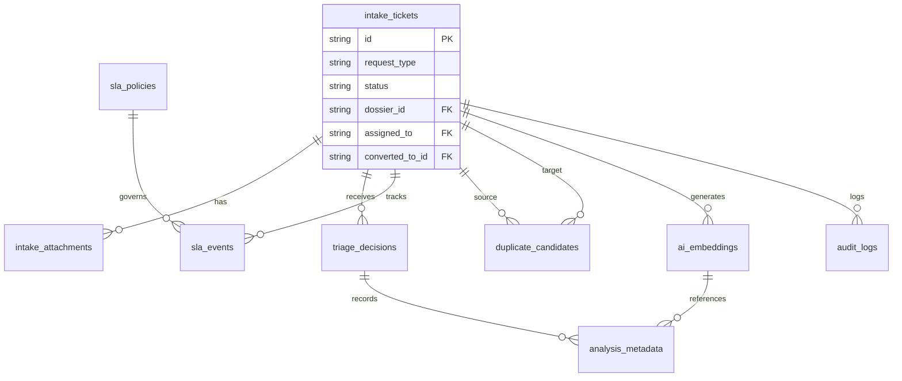

# Data Model: Front Door Intake

**Generated**: 2025-01-29 | **Feature**: 008-front-door-intake

## Core Entities

### intake_tickets
Primary entity representing support requests submitted through the Front Door.

```typescript
interface IntakeTicket {
  id: string;                    // UUID primary key
  ticket_number: string;          // Human-readable ticket ID (e.g., "TKT-2025-001234")
  
  // Request Details
  request_type: 'engagement' | 'position' | 'mou_action' | 'foresight';
  title: string;                  // Bilingual title
  title_ar: string;               // Arabic title
  description: string;            // Detailed description
  description_ar: string;         // Arabic description
  type_specific_fields: Record<string, any>; // JSON for 2-3 unique fields per type

  // Type-Specific Fields Schema
  // Each request_type requires 2-3 unique fields stored in this JSONB column:
  //
  // Engagement Support (request_type='engagement'):
  //   - engagement_type: 'technical_assistance' | 'capacity_building' | 'advisory'
  //   - target_countries: string[]  // ISO 3166-1 alpha-2 codes
  //   - duration_months: number     // 1-36
  //
  // Position Development (request_type='position'):
  //   - position_level: 'junior' | 'mid' | 'senior' | 'executive'
  //   - department: string          // 2-100 characters
  //   - headcount: number           // 1-50
  //
  // MoU/Action Items (request_type='mou_action'):
  //   - mou_reference: string       // Format: MOU-YYYY-NNN
  //   - action_type: 'deliverable' | 'milestone' | 'commitment'
  //   - deadline_date: string       // ISO 8601 date (YYYY-MM-DD)
  //
  // Foresight Requests (request_type='foresight'):
  //   - horizon: 'short_term' | 'medium_term' | 'long_term'  // 1yr, 3yr, 5yr+
  //   - focus_area: 'technology' | 'policy' | 'economic' | 'social'
  //   - stakeholders: string[]      // 1-10 organization names
  //
  // Validation: Frontend validates against schema before submission,
  // backend validates using JSON Schema in Edge Function (T031)

  // Classification (from AI or manual)
  sensitivity: 'public' | 'internal' | 'confidential' | 'secret';
  urgency: 'low' | 'medium' | 'high' | 'critical';
  priority: 'low' | 'medium' | 'high' | 'urgent'; // Computed from urgency + sensitivity
  
  // Relationships
  dossier_id?: string;            // FK to dossiers table (optional)
  parent_ticket_id?: string;      // FK to self for merged tickets
  converted_to_type?: 'engagement' | 'position' | 'mou_action' | 'foresight';
  converted_to_id?: string;       // ID of the created artifact
  
  // Assignment
  assigned_to?: string;           // User ID of current assignee
  assigned_unit?: string;         // Unit/queue identifier
  
  // Status
  status: 'draft' | 'submitted' | 'triaged' | 'assigned' | 'in_progress' | 'converted' | 'closed' | 'merged';
  resolution?: string;            // Resolution notes
  resolution_ar?: string;         // Arabic resolution notes
  
  // Timestamps
  created_at: Date;
  created_by: string;             // User ID
  updated_at: Date;
  updated_by: string;
  submitted_at?: Date;            // When moved from draft to submitted
  triaged_at?: Date;
  assigned_at?: Date;
  resolved_at?: Date;
  closed_at?: Date;
  
  // Metadata
  source: 'web' | 'api' | 'email' | 'import';
  client_metadata?: Record<string, any>; // Browser info, IP, etc.
}
```

### intake_attachments
Files attached to intake tickets.

```typescript
interface IntakeAttachment {
  id: string;                    // UUID primary key
  ticket_id: string;              // FK to intake_tickets
  
  // File Information
  file_name: string;
  file_size: number;              // Bytes
  mime_type: string;
  storage_path: string;           // Supabase Storage path
  
  // Security
  scan_status: 'pending' | 'clean' | 'infected' | 'error';
  scan_result?: Record<string, any>; // Virus scan details
  
  // Metadata
  uploaded_at: Date;
  uploaded_by: string;
  deleted_at?: Date;              // Soft delete
}
```

### triage_decisions
AI and manual triage history for tickets.

```typescript
interface TriageDecision {
  id: string;                    // UUID primary key
  ticket_id: string;              // FK to intake_tickets
  
  // Decision Details
  decision_type: 'ai_suggestion' | 'manual_override' | 'auto_assignment';
  
  // Suggested Values
  suggested_type?: string;
  suggested_sensitivity?: string;
  suggested_urgency?: string;
  suggested_assignee?: string;
  suggested_unit?: string;
  
  // Final Values (after override if applicable)
  final_type?: string;
  final_sensitivity?: string;
  final_urgency?: string;
  final_assignee?: string;
  final_unit?: string;
  
  // AI Metadata
  model_name?: string;            // e.g., "gpt-4", "llama-3"
  model_version?: string;
  confidence_score?: number;      // 0-1
  
  // Override Details
  override_reason?: string;
  override_reason_ar?: string;
  
  // Timestamps
  created_at: Date;
  created_by: string;             // User or 'system'
  accepted_at?: Date;
  accepted_by?: string;
}
```

### sla_policies
Configuration for SLA targets based on ticket attributes.

```typescript
interface SLAPolicy {
  id: string;                    // UUID primary key
  
  // Matching Criteria
  request_type?: string;          // Optional filter
  sensitivity?: string;           // Optional filter
  urgency?: string;               // Optional filter
  priority?: string;              // Optional filter
  
  // SLA Targets (in minutes)
  acknowledgment_target: number;  // e.g., 30 for high priority
  resolution_target: number;      // e.g., 480 (8 hours)
  
  // Business Hours
  business_hours_only: boolean;
  timezone: string;               // e.g., "Asia/Riyadh"
  
  // Metadata
  is_active: boolean;
  created_at: Date;
  updated_at: Date;
}
```

### sla_events
Tracking SLA lifecycle events for reporting.

```typescript
interface SLAEvent {
  id: string;                    // UUID primary key
  ticket_id: string;              // FK to intake_tickets
  policy_id: string;              // FK to sla_policies
  
  // Event Details
  event_type: 'started' | 'paused' | 'resumed' | 'met' | 'breached' | 'cancelled';
  event_timestamp: Date;
  
  // State at Event
  elapsed_minutes: number;        // Time elapsed so far
  remaining_minutes: number;      // Time remaining
  is_breached: boolean;
  
  // Metadata
  created_by: string;             // User or 'system'
  reason?: string;                // For pause/cancel events
}
```

### duplicate_candidates
Potential duplicate relationships between tickets.

```typescript
interface DuplicateCandidate {
  id: string;                    // UUID primary key
  source_ticket_id: string;      // FK to intake_tickets
  target_ticket_id: string;      // FK to intake_tickets
  
  // Similarity Scores
  overall_score: number;          // 0-1 composite score
  title_similarity: number;       // 0-1
  content_similarity: number;     // 0-1 from embeddings
  metadata_similarity: number;    // 0-1 from structured fields
  
  // Decision
  status: 'pending' | 'confirmed_duplicate' | 'not_duplicate' | 'merged';
  decision_reason?: string;
  
  // Metadata
  detected_at: Date;
  detected_by: string;           // 'ai' or user ID
  resolved_at?: Date;
  resolved_by?: string;
}
```

### ai_embeddings
Vector embeddings for semantic search and duplicate detection.

```typescript
interface AIEmbedding {
  id: string;                    // UUID primary key
  owner_type: 'ticket' | 'artifact';
  owner_id: string;               // ID of the parent entity
  
  // Embedding Data
  content_hash: Buffer;           // SHA-256 of original content
  embedding: number[];            // Vector (1024 dimensions)
  
  // Model Information
  model: string;                  // e.g., "bge-m3"
  model_version: string;
  embedding_dim: number;          // Must be 1024
  
  // Metadata
  created_at: Date;
  expires_at?: Date;              // For cache management
}
```

### analysis_metadata
Metadata for all AI analysis operations.

```typescript
interface AnalysisMetadata {
  id: string;                    // UUID primary key
  analysis_id: string;            // Correlation ID
  
  // Model Details
  model_name: string;
  model_version: string;
  embedding_model?: string;
  embedding_dim?: number;
  
  // Prompt Information
  prompt_template_id?: string;
  prompt_hash?: string;
  
  // Parameters
  temperature?: number;
  top_p?: number;
  seed?: number;
  
  // Performance
  input_tokens?: number;
  output_tokens?: number;
  latency_ms: number;
  
  // Results
  confidence_score?: number;
  source_refs?: string[];         // Related document IDs
  heuristics?: Record<string, any>; // Fallback logic used
  
  // Relationships
  embedding_id?: string;          // FK to ai_embeddings
  
  // Metadata
  created_by: string;
  created_at: Date;
}
```

### audit_logs
Security and compliance audit trail.

```typescript
interface AuditLog {
  id: string;                    // UUID primary key
  
  // Event Context
  entity_type: string;            // e.g., 'intake_ticket'
  entity_id: string;
  action: string;                 // e.g., 'create', 'update', 'delete', 'view'
  
  // Changes
  old_values?: Record<string, any>;
  new_values?: Record<string, any>;
  
  // Security Context
  user_id: string;
  user_role: string;
  ip_address?: string;
  user_agent?: string;
  
  // MFA Context
  required_mfa: boolean;
  mfa_verified: boolean;
  mfa_method?: string;
  
  // Correlation
  correlation_id?: string;        // For tracking related events
  session_id?: string;
  
  // Metadata
  created_at: Date;
}
```

## Relationships



## Indexes

```sql
-- Primary indexes for performance
CREATE INDEX idx_tickets_status ON intake_tickets(status) WHERE status != 'closed';
CREATE INDEX idx_tickets_assigned ON intake_tickets(assigned_to, assigned_unit);
CREATE INDEX idx_tickets_priority ON intake_tickets(priority, created_at DESC);
CREATE INDEX idx_tickets_sla ON intake_tickets(status, priority) WHERE status IN ('submitted', 'triaged', 'assigned');

-- Composite indexes for queue filtering
CREATE INDEX idx_queue_filter ON intake_tickets(status, request_type, sensitivity, assigned_unit);
CREATE INDEX idx_tickets_date_range ON intake_tickets(created_at DESC, status);

-- Foreign key indexes
CREATE INDEX idx_attachments_ticket ON intake_attachments(ticket_id);
CREATE INDEX idx_triage_ticket ON triage_decisions(ticket_id, created_at DESC);
CREATE INDEX idx_sla_events_ticket ON sla_events(ticket_id, event_type);
CREATE INDEX idx_duplicates_source ON duplicate_candidates(source_ticket_id, overall_score DESC);

-- Vector search index (pgvector)
CREATE INDEX idx_embeddings_vector ON ai_embeddings USING ivfflat (embedding vector_cosine_ops) WITH (lists = 200);
```

## Row Level Security Policies

```sql
-- Tickets visibility based on unit and sensitivity
CREATE POLICY ticket_view ON intake_tickets
  FOR SELECT
  USING (
    assigned_unit IN (SELECT unit FROM user_units WHERE user_id = auth.uid())
    AND sensitivity <= (SELECT max_sensitivity FROM user_clearance WHERE user_id = auth.uid())
  );

-- Attachment access tied to ticket access
CREATE POLICY attachment_view ON intake_attachments
  FOR SELECT
  USING (
    ticket_id IN (SELECT id FROM intake_tickets WHERE /* ticket view policy */)
  );

-- Audit logs - write only, read restricted
CREATE POLICY audit_write ON audit_logs
  FOR INSERT
  WITH CHECK (true);

CREATE POLICY audit_read ON audit_logs
  FOR SELECT
  USING (
    auth.uid() IN (SELECT user_id FROM user_roles WHERE role = 'auditor')
  );
```

## Migration Sequence

1. Create base tables (no foreign keys)
2. Create relationship tables
3. Add foreign key constraints
4. Create indexes
5. Enable RLS
6. Create policies
7. Insert seed data (SLA policies, etc.)

## Data Retention

- **Active Storage**: 90 days for intake_tickets and related data
- **Archive Storage**: 3 years post-closure
- **Audit Logs**: 7 years (regulatory requirement)
- **AI Embeddings**: 30 days cache, regenerate as needed
- **Attachments**: Follow parent ticket retention