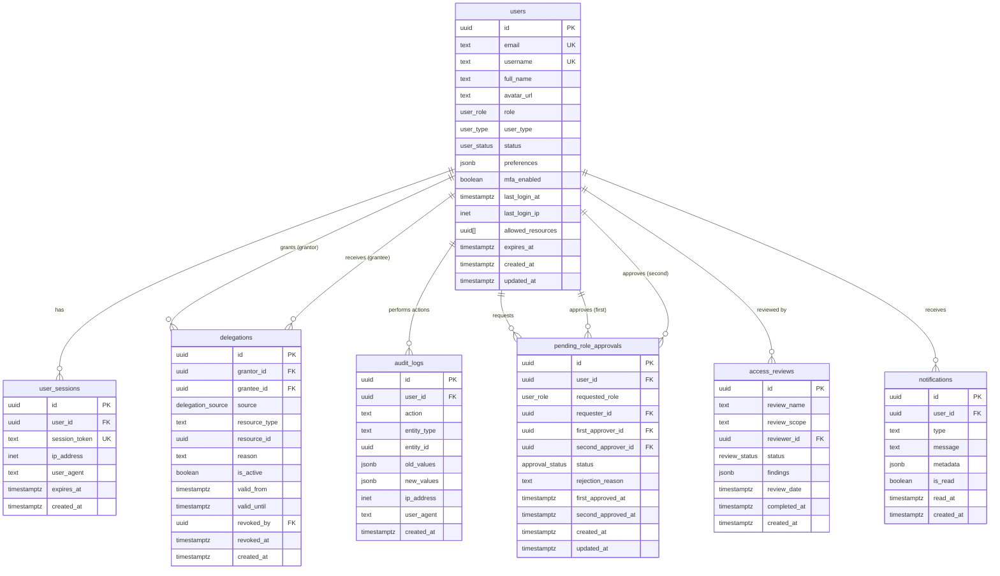

# Data Model: User Management & Access Control

**Feature**: 019-user-management-access
**Date**: 2025-10-11
**Database**: PostgreSQL 15+ (Supabase)

## Entity Relationship Diagram



## Entities

### 1. users (extends Supabase auth.users)

**Purpose**: Core identity entity representing system users with authentication credentials and profile information

**Fields**:
- `id` (UUID, PK): User identifier (matches auth.users.id)
- `email` (TEXT, UNIQUE, NOT NULL): User email address for login
- `username` (TEXT, UNIQUE, NOT NULL): Unique username for display
- `full_name` (TEXT, NOT NULL): User's full name
- `avatar_url` (TEXT, NULLABLE): URL to user profile picture
- `role` (user_role ENUM, NOT NULL, DEFAULT 'viewer'): Primary role (admin, editor, viewer)
- `user_type` (user_type ENUM, NOT NULL, DEFAULT 'employee'): Account type (employee, guest)
- `status` (user_status ENUM, NOT NULL, DEFAULT 'active'): Account status (active, inactive, deactivated)
- `preferences` (JSONB, DEFAULT '{}'): User preferences (language, timezone, theme)
- `mfa_enabled` (BOOLEAN, DEFAULT false): Whether MFA is enabled
- `last_login_at` (TIMESTAMPTZ, NULLABLE): Timestamp of last login
- `last_login_ip` (INET, NULLABLE): IP address of last login
- `allowed_resources` (UUID[], NULLABLE): Array of resource IDs guest can access
- `expires_at` (TIMESTAMPTZ, NULLABLE): Expiration date for guest accounts
- `created_at` (TIMESTAMPTZ, DEFAULT now()): Account creation timestamp
- `updated_at` (TIMESTAMPTZ, DEFAULT now()): Last update timestamp

**Relationships**:
- Has many `user_sessions` (1:N)
- Grants many `delegations` as grantor (1:N)
- Receives many `delegations` as grantee (1:N)
- Performs many `audit_logs` actions (1:N)
- Requests many `pending_role_approvals` (1:N)
- Approves many `pending_role_approvals` (1:N)
- Reviews many `access_reviews` (1:N)

**Indexes**:
- `idx_users_email` on `email` (unique)
- `idx_users_username` on `username` (unique)
- `idx_users_role` on `role`
- `idx_users_status` on `status`
- `idx_users_type` on `user_type`
- `idx_users_last_login` on `last_login_at`

**Constraints**:
- Email must be valid format (CHECK constraint)
- Guest accounts must have expires_at set (CHECK constraint)
- Employee accounts cannot have allowed_resources (CHECK constraint)

**State Transitions**:
```
active → inactive (user deactivation)
inactive → active (user reactivation with approval)
active → deactivated (permanent account closure)
```

---

### 2. user_sessions

**Purpose**: Track active authentication sessions for session management and security monitoring

**Fields**:
- `id` (UUID, PK, DEFAULT gen_random_uuid()): Session identifier
- `user_id` (UUID, FK → users.id, NOT NULL): User this session belongs to
- `session_token` (TEXT, UNIQUE, NOT NULL): JWT or session token
- `ip_address` (INET, NOT NULL): Client IP address
- `user_agent` (TEXT, NOT NULL): Client user agent string
- `expires_at` (TIMESTAMPTZ, NOT NULL): Session expiration time
- `created_at` (TIMESTAMPTZ, DEFAULT now()): Session creation timestamp

**Relationships**:
- Belongs to `users` (N:1)

**Indexes**:
- `idx_sessions_user` on `user_id`
- `idx_sessions_token` on `session_token` (unique)
- `idx_sessions_expires` on `expires_at`

**Constraints**:
- Session token must be unique (UNIQUE constraint)
- expires_at must be in future at creation (CHECK constraint)

**Cleanup Strategy**:
- Expired sessions deleted via pg_cron daily cleanup job
- All user sessions deleted on role change
- All user sessions deleted on account deactivation

---

### 3. delegations

**Purpose**: Time-bound permission grants from one user to another with delegation tracking

**Fields**:
- `id` (UUID, PK, DEFAULT gen_random_uuid()): Delegation identifier
- `grantor_id` (UUID, FK → users.id, NOT NULL): User granting permissions
- `grantee_id` (UUID, FK → users.id, NOT NULL): User receiving permissions
- `source` (delegation_source ENUM, NOT NULL, DEFAULT 'direct'): Origin of permissions (direct, delegated)
- `resource_type` (TEXT, NULLABLE): Type of resource (dossier, forum, NULL for all)
- `resource_id` (UUID, NULLABLE): Specific resource ID (NULL for all resources)
- `reason` (TEXT, NOT NULL): Business justification for delegation
- `is_active` (BOOLEAN, DEFAULT true): Whether delegation is currently active
- `valid_from` (TIMESTAMPTZ, DEFAULT now()): Delegation start time
- `valid_until` (TIMESTAMPTZ, NOT NULL): Delegation end time
- `revoked_by` (UUID, FK → users.id, NULLABLE): User who manually revoked (NULL if auto-expired)
- `revoked_at` (TIMESTAMPTZ, NULLABLE): Revocation timestamp
- `created_at` (TIMESTAMPTZ, DEFAULT now()): Delegation creation timestamp

**Relationships**:
- Granted by `users` as grantor (N:1)
- Received by `users` as grantee (N:1)
- Revoked by `users` (N:1, optional)

**Indexes**:
- `idx_delegations_grantor` on `grantor_id`
- `idx_delegations_grantee` on `grantee_id`
- `idx_delegations_active` on `is_active WHERE is_active = true`
- `idx_delegations_expiry` on `valid_until WHERE is_active = true`
- `idx_delegations_resource` on `(resource_type, resource_id)`

**Constraints**:
- Grantor cannot delegate to themselves (CHECK grantor_id != grantee_id)
- valid_until must be after valid_from (CHECK constraint)
- Only direct permissions can be delegated (CHECK source = 'direct')
- Circular delegation prevention (TRIGGER check_circular_delegation)
- No duplicate active delegations (UNIQUE INDEX on grantor_id, grantee_id, resource_type, resource_id WHERE is_active = true)

**State Transitions**:
```
is_active = true → is_active = false (expiration or manual revocation)
```

**Automated Processing**:
- pg_cron job runs every minute to expire delegations where `valid_until < now()`
- Trigger sends notifications to grantor and grantee on expiration

---

### 4. pending_role_approvals

**Purpose**: Manage dual-approval workflow for admin role assignments

**Fields**:
- `id` (UUID, PK, DEFAULT gen_random_uuid()): Approval request identifier
- `user_id` (UUID, FK → users.id, NOT NULL): User who will receive role
- `requested_role` (user_role ENUM, NOT NULL): Role being requested (admin, editor, viewer)
- `requester_id` (UUID, FK → users.id, NOT NULL): Administrator who initiated request
- `first_approver_id` (UUID, FK → users.id, NULLABLE): First administrator approver
- `second_approver_id` (UUID, FK → users.id, NULLABLE): Second administrator approver
- `status` (approval_status ENUM, DEFAULT 'pending'): Approval status (pending, first_approved, approved, rejected)
- `rejection_reason` (TEXT, NULLABLE): Reason for rejection (if rejected)
- `first_approved_at` (TIMESTAMPTZ, NULLABLE): Timestamp of first approval
- `second_approved_at` (TIMESTAMPTZ, NULLABLE): Timestamp of second approval
- `created_at` (TIMESTAMPTZ, DEFAULT now()): Request creation timestamp
- `updated_at` (TIMESTAMPTZ, DEFAULT now()): Last update timestamp

**Relationships**:
- Applies to `users` (N:1)
- Requested by `users` (N:1)
- First approved by `users` (N:1, optional)
- Second approved by `users` (N:1, optional)

**Indexes**:
- `idx_approvals_user` on `user_id`
- `idx_approvals_status` on `status`
- `idx_approvals_requester` on `requester_id`

**Constraints**:
- First and second approvers must be different (CHECK first_approver_id != second_approver_id)
- Requester cannot be first approver (CHECK requester_id != first_approver_id)
- Requester cannot be second approver (CHECK requester_id != second_approver_id)
- Only admin role requests require dual approval (business logic in API)

**State Transitions**:
```
pending → first_approved (first admin approval)
first_approved → approved (second admin approval)
pending → rejected (any admin rejection)
first_approved → rejected (any admin rejection)
```

**Workflow Logic**:
1. Admin role request creates record with status='pending'
2. First admin approves → status='first_approved', first_approver_id set
3. Second admin approves → status='approved', second_approver_id set, trigger updates users.role
4. Any admin rejects → status='rejected', rejection_reason required

---

### 5. access_reviews

**Purpose**: Periodic certification of user access rights for compliance and security

**Fields**:
- `id` (UUID, PK, DEFAULT gen_random_uuid()): Review identifier
- `review_name` (TEXT, NOT NULL): Descriptive name (e.g., "Q1 2025 Access Review")
- `review_scope` (TEXT, NOT NULL): Scope definition (department, role, all users)
- `reviewer_id` (UUID, FK → users.id, NOT NULL): Administrator conducting review
- `status` (review_status ENUM, DEFAULT 'in_progress'): Review status (in_progress, completed)
- `findings` (JSONB, DEFAULT '[]'): Array of findings objects
- `review_date` (TIMESTAMPTZ, DEFAULT now()): Review initiation date
- `completed_at` (TIMESTAMPTZ, NULLABLE): Review completion timestamp
- `created_at` (TIMESTAMPTZ, DEFAULT now()): Record creation timestamp

**Relationships**:
- Conducted by `users` (N:1)

**Indexes**:
- `idx_reviews_status` on `status`
- `idx_reviews_reviewer` on `reviewer_id`
- `idx_reviews_date` on `review_date`

**Findings JSONB Structure**:
```json
[
  {
    "user_id": "uuid",
    "email": "user@example.com",
    "issues": ["inactive_90_days", "excessive_permissions"],
    "recommendations": ["deactivate", "reduce_role"],
    "certified_by": "admin_uuid",
    "certified_at": "2025-10-11T10:00:00Z"
  }
]
```

**Constraints**:
- completed_at must be after review_date (CHECK constraint)
- Status must be 'completed' if completed_at is set (CHECK constraint)

**Automation**:
- Quarterly automatic review creation via pg_cron
- Manual override capability for administrators

---

### 6. audit_logs (partitioned)

**Purpose**: Immutable record of all user management actions for compliance and forensics

**Fields**:
- `id` (UUID, DEFAULT gen_random_uuid()): Log entry identifier
- `user_id` (UUID, FK → users.id, NOT NULL): User who performed action
- `action` (TEXT, NOT NULL): Action performed (create_user, assign_role, delegate_permission, etc.)
- `entity_type` (TEXT, NOT NULL): Type of entity affected (user, role, delegation, etc.)
- `entity_id` (UUID, NULLABLE): ID of affected entity
- `old_values` (JSONB, NULLABLE): State before action (for updates)
- `new_values` (JSONB, NULLABLE): State after action (for creates/updates)
- `ip_address` (INET, NOT NULL): Client IP address
- `user_agent` (TEXT, NOT NULL): Client user agent
- `created_at` (TIMESTAMPTZ, DEFAULT now(), NOT NULL): Action timestamp (partition key)

**Partitioning Strategy**:
- Partitioned by RANGE on `created_at` (yearly partitions)
- Partitions: audit_logs_2025, audit_logs_2026, ..., audit_logs_2031
- Old partitions (>2 years) archived to cold storage (S3)

**Relationships**:
- Performed by `users` (N:1)

**Indexes** (on each partition):
- `idx_audit_logs_user` on `user_id`
- `idx_audit_logs_entity` on `(entity_type, entity_id)`
- `idx_audit_logs_action` on `action`
- `idx_audit_logs_created` on `created_at`

**Constraints**:
- Immutability enforced via RLS policies (INSERT only, no UPDATE/DELETE)
- created_at cannot be in the future (CHECK constraint)

**RLS Policies**:
```sql
-- Allow INSERT for all authenticated users
CREATE POLICY audit_insert_only ON audit_logs
  FOR INSERT TO authenticated
  WITH CHECK (true);

-- Allow SELECT only for admins
CREATE POLICY audit_select_admin ON audit_logs
  FOR SELECT TO authenticated
  USING (
    EXISTS (
      SELECT 1 FROM users
      WHERE id = auth.uid() AND role = 'admin'
    )
  );

-- Prevent UPDATE/DELETE entirely
CREATE POLICY audit_no_update ON audit_logs
  FOR UPDATE TO authenticated
  USING (false);

CREATE POLICY audit_no_delete ON audit_logs
  FOR DELETE TO authenticated
  USING (false);
```

**Retention Policy**:
- Keep 7 years of logs (government compliance requirement)
- Partition pruning for efficient historical queries
- Archive partitions older than 2 years to S3 with lifecycle policy

---

### 7. notifications

**Purpose**: User notifications for delegation expiry, role changes, access reviews

**Fields**:
- `id` (UUID, PK, DEFAULT gen_random_uuid()): Notification identifier
- `user_id` (UUID, FK → users.id, NOT NULL): User receiving notification
- `type` (TEXT, NOT NULL): Notification type (delegation_expired, role_changed, access_review, etc.)
- `message` (TEXT, NOT NULL): Human-readable notification message
- `metadata` (JSONB, DEFAULT '{}'): Additional context data
- `is_read` (BOOLEAN, DEFAULT false): Read status
- `read_at` (TIMESTAMPTZ, NULLABLE): Timestamp when marked as read
- `created_at` (TIMESTAMPTZ, DEFAULT now()): Notification creation timestamp

**Relationships**:
- Belongs to `users` (N:1)

**Indexes**:
- `idx_notifications_user` on `user_id`
- `idx_notifications_unread` on `user_id WHERE is_read = false`
- `idx_notifications_type` on `type`

**Constraints**:
- read_at must be set if is_read = true (CHECK constraint)
- read_at must be after created_at (CHECK constraint)

**Cleanup Strategy**:
- Delete read notifications older than 30 days via pg_cron

---

## ENUMs

### user_role
```sql
CREATE TYPE user_role AS ENUM ('admin', 'editor', 'viewer');
```

**Values**:
- `admin`: Full system access, user management, configuration
- `editor`: Create/edit dossiers, assignments, cannot manage users
- `viewer`: Read-only access to permitted resources

**Hierarchy**: admin > editor > viewer

---

### user_type
```sql
CREATE TYPE user_type AS ENUM ('employee', 'guest');
```

**Values**:
- `employee`: Internal staff member with permanent access
- `guest`: External stakeholder with temporary, restricted access

---

### user_status
```sql
CREATE TYPE user_status AS ENUM ('active', 'inactive', 'deactivated');
```

**Values**:
- `active`: User can log in and access system
- `inactive`: Temporary suspension (can be reactivated)
- `deactivated`: Permanent account closure (cannot be reactivated)

---

### delegation_source
```sql
CREATE TYPE delegation_source AS ENUM ('direct', 'delegated');
```

**Values**:
- `direct`: User has permission directly from their role
- `delegated`: User received permission via delegation (cannot re-delegate)

---

### approval_status
```sql
CREATE TYPE approval_status AS ENUM ('pending', 'first_approved', 'approved', 'rejected');
```

**Values**:
- `pending`: Awaiting first approval
- `first_approved`: First admin approved, awaiting second approval
- `approved`: Both admins approved, role assigned
- `rejected`: Request denied by any admin

---

### review_status
```sql
CREATE TYPE review_status AS ENUM ('in_progress', 'completed');
```

**Values**:
- `in_progress`: Review active, findings being collected
- `completed`: Review finished, findings finalized

---

## Materialized Views

### access_review_summary

**Purpose**: Pre-computed aggregation for fast access review report generation

**Definition**:
```sql
CREATE MATERIALIZED VIEW access_review_summary AS
SELECT
  u.id AS user_id,
  u.email,
  u.full_name,
  u.role AS primary_role,
  u.user_type,
  u.status,
  u.last_login_at,
  EXTRACT(DAYS FROM (now() - u.last_login_at)) AS days_since_login,
  COALESCE(
    json_agg(
      json_build_object(
        'id', d.id,
        'grantor_email', g.email,
        'resource_type', d.resource_type,
        'valid_until', d.valid_until
      )
    ) FILTER (WHERE d.id IS NOT NULL),
    '[]'
  ) AS active_delegations,
  COUNT(d.id) AS delegation_count
FROM users u
LEFT JOIN delegations d ON d.grantee_id = u.id AND d.is_active = true
LEFT JOIN users g ON g.id = d.grantor_id
GROUP BY u.id;
```

**Indexes**:
- `idx_review_summary_role` on `primary_role`
- `idx_review_summary_status` on `status`
- `idx_review_summary_last_login` on `last_login_at`
- `idx_review_summary_days_since_login` on `days_since_login`

**Refresh Strategy**:
- CONCURRENTLY refresh every 6 hours via pg_cron
- Manual refresh on-demand for immediate access reviews

**Performance**:
- <10s query time for 1000+ users with full delegation details

---

## Database Functions

### check_circular_delegation()

**Purpose**: Prevent circular delegation chains (A → B → A)

```sql
CREATE OR REPLACE FUNCTION check_circular_delegation()
RETURNS TRIGGER AS $$
BEGIN
  -- Use recursive CTE to detect if grantee has delegation path back to grantor
  IF EXISTS (
    WITH RECURSIVE delegation_chain AS (
      SELECT grantee_id, grantor_id
      FROM delegations
      WHERE grantor_id = NEW.grantee_id AND is_active = true

      UNION ALL

      SELECT d.grantee_id, d.grantor_id
      FROM delegations d
      INNER JOIN delegation_chain dc ON d.grantor_id = dc.grantee_id
      WHERE d.is_active = true
    )
    SELECT 1 FROM delegation_chain WHERE grantee_id = NEW.grantor_id
  ) THEN
    RAISE EXCEPTION 'Circular delegation detected: % cannot delegate to %', NEW.grantor_id, NEW.grantee_id;
  END IF;

  RETURN NEW;
END;
$$ LANGUAGE plpgsql;

CREATE TRIGGER prevent_circular_delegation
BEFORE INSERT ON delegations
FOR EACH ROW
EXECUTE FUNCTION check_circular_delegation();
```

---

### notify_delegation_expired()

**Purpose**: Send notifications when delegations expire

```sql
CREATE OR REPLACE FUNCTION notify_delegation_expired()
RETURNS TRIGGER AS $$
BEGIN
  -- Only trigger on system expiration (revoked_by IS NULL)
  IF OLD.is_active = true AND NEW.is_active = false AND NEW.revoked_by IS NULL THEN
    -- Notify grantor
    INSERT INTO notifications (user_id, type, message, metadata)
    VALUES (
      OLD.grantor_id,
      'delegation_expired',
      'Delegation to ' || (SELECT email FROM users WHERE id = OLD.grantee_id) || ' has expired',
      json_build_object('delegation_id', OLD.id, 'grantee_id', OLD.grantee_id)
    );

    -- Notify grantee
    INSERT INTO notifications (user_id, type, message, metadata)
    VALUES (
      OLD.grantee_id,
      'delegation_expired',
      'Delegation from ' || (SELECT email FROM users WHERE id = OLD.grantor_id) || ' has expired',
      json_build_object('delegation_id', OLD.id, 'grantor_id', OLD.grantor_id)
    );
  END IF;

  RETURN NEW;
END;
$$ LANGUAGE plpgsql;

CREATE TRIGGER delegation_expired_notification
AFTER UPDATE OF is_active ON delegations
FOR EACH ROW
EXECUTE FUNCTION notify_delegation_expired();
```

---

### apply_admin_role_approval()

**Purpose**: Automatically apply role change when dual approval completes

```sql
CREATE OR REPLACE FUNCTION apply_admin_role_approval()
RETURNS TRIGGER AS $$
BEGIN
  -- Only trigger when status changes to 'approved'
  IF NEW.status = 'approved' AND OLD.status != 'approved' THEN
    -- Update user role
    UPDATE users
    SET role = NEW.requested_role,
        updated_at = now()
    WHERE id = NEW.user_id;

    -- Invalidate all user sessions (force re-login)
    DELETE FROM user_sessions WHERE user_id = NEW.user_id;

    -- Create audit log entry
    INSERT INTO audit_logs (user_id, action, entity_type, entity_id, old_values, new_values, ip_address, user_agent)
    VALUES (
      NEW.second_approver_id, -- The admin who completed approval
      'assign_role',
      'user',
      NEW.user_id,
      json_build_object('role', (SELECT role FROM users WHERE id = NEW.user_id)),
      json_build_object('role', NEW.requested_role, 'approval_id', NEW.id),
      '0.0.0.0', -- System action
      'system/dual-approval'
    );

    -- Notify user of role change
    INSERT INTO notifications (user_id, type, message, metadata)
    VALUES (
      NEW.user_id,
      'role_changed',
      'Your role has been changed to ' || NEW.requested_role || ' by dual approval',
      json_build_object('new_role', NEW.requested_role, 'approval_id', NEW.id)
    );
  END IF;

  RETURN NEW;
END;
$$ LANGUAGE plpgsql;

CREATE TRIGGER admin_role_approval_complete
AFTER UPDATE OF status ON pending_role_approvals
FOR EACH ROW
WHEN (NEW.status = 'approved')
EXECUTE FUNCTION apply_admin_role_approval();
```

---

## pg_cron Jobs

### Process Expired Delegations
```sql
SELECT cron.schedule(
  'process-expired-delegations',
  '* * * * *', -- Every minute
  $$
    UPDATE delegations
    SET is_active = false,
        revoked_at = now(),
        revoked_by = NULL
    WHERE valid_until < now()
      AND is_active = true
  $$
);
```

### Deactivate Expired Guest Accounts
```sql
SELECT cron.schedule(
  'deactivate-expired-guests',
  '*/5 * * * *', -- Every 5 minutes
  $$
    UPDATE users
    SET status = 'inactive',
        updated_at = now()
    WHERE user_type = 'guest'
      AND expires_at < now()
      AND status = 'active'
  $$
);
```

### Refresh Access Review Summary
```sql
SELECT cron.schedule(
  'refresh-access-review-summary',
  '0 */6 * * *', -- Every 6 hours
  $$REFRESH MATERIALIZED VIEW CONCURRENTLY access_review_summary$$
);
```

### Cleanup Old Notifications
```sql
SELECT cron.schedule(
  'cleanup-old-notifications',
  '0 2 * * *', -- Daily at 2 AM
  $$
    DELETE FROM notifications
    WHERE is_read = true
      AND read_at < now() - INTERVAL '30 days'
  $$
);
```

### Cleanup Expired Sessions
```sql
SELECT cron.schedule(
  'cleanup-expired-sessions',
  '0 3 * * *', -- Daily at 3 AM
  $$
    DELETE FROM user_sessions
    WHERE expires_at < now()
  $$
);
```

### Automatic Quarterly Access Review
```sql
SELECT cron.schedule(
  'quarterly-access-review',
  '0 9 1 1,4,7,10 *', -- 9 AM on 1st of Jan, Apr, Jul, Oct
  $$
    INSERT INTO access_reviews (review_name, review_scope, reviewer_id, status)
    VALUES (
      'Q' || EXTRACT(QUARTER FROM now()) || ' ' || EXTRACT(YEAR FROM now()) || ' Access Review',
      'all_users',
      (SELECT id FROM users WHERE role = 'admin' ORDER BY created_at LIMIT 1), -- Assign to oldest admin
      'in_progress'
    )
  $$
);
```

---

## Validation Rules

### User Entity
- Email must be valid format: `CHECK (email ~* '^[A-Za-z0-9._%+-]+@[A-Za-z0-9.-]+\.[A-Z|a-z]{2,}$')`
- Guest accounts must have expiration: `CHECK (user_type != 'guest' OR expires_at IS NOT NULL)`
- Guest accounts cannot have allowed_resources if employee: `CHECK (user_type = 'guest' OR allowed_resources IS NULL)`
- Password must meet complexity requirements (handled by Supabase Auth)

### Delegation Entity
- Grantor cannot delegate to self: `CHECK (grantor_id != grantee_id)`
- Valid period: `CHECK (valid_until > valid_from)`
- Only direct permissions delegatable: `CHECK (source = 'direct')`
- No duplicate active delegations: `UNIQUE INDEX ON (grantor_id, grantee_id, resource_type, resource_id) WHERE is_active = true`

### Pending Role Approval Entity
- Different approvers: `CHECK (first_approver_id != second_approver_id)`
- No self-approval: `CHECK (requester_id != first_approver_id AND requester_id != second_approver_id)`
- Rejection reason required if rejected: `CHECK (status != 'rejected' OR rejection_reason IS NOT NULL)`

### Access Review Entity
- Completion timestamp valid: `CHECK (completed_at IS NULL OR completed_at > review_date)`
- Status consistency: `CHECK (status != 'completed' OR completed_at IS NOT NULL)`

### Audit Log Entity
- Created timestamp not in future: `CHECK (created_at <= now())`
- Action must be non-empty: `CHECK (length(action) > 0)`

---

## Migration Order

1. **ENUMs**: Create all ENUM types first
2. **users table**: Extend auth.users with additional columns
3. **user_sessions**: Create sessions table
4. **delegations**: Create delegations table with triggers
5. **pending_role_approvals**: Create approval workflow table with triggers
6. **access_reviews**: Create access review table
7. **audit_logs**: Create partitioned audit log table with RLS policies
8. **notifications**: Create notifications table
9. **Materialized Views**: Create access_review_summary view
10. **pg_cron Jobs**: Schedule all automated jobs
11. **Indexes**: Create all indexes for performance
12. **RLS Policies**: Enable RLS and create policies for all tables

---

## Data Retention & Archival

### Active Data
- **user_sessions**: Auto-delete expired sessions daily
- **notifications**: Auto-delete read notifications >30 days old
- **delegations**: Keep all records (is_active flag for filtering)
- **pending_role_approvals**: Keep all records for audit trail

### Audit Data (7-year retention)
- **audit_logs**: Partitioned by year, archive partitions >2 years to S3
- **Archival Process**:
  1. Export partition to Parquet format
  2. Upload to S3 with lifecycle policy
  3. Detach partition from main table
  4. Drop detached partition after successful S3 upload verification

### Access Review Data
- **access_reviews**: Keep all records indefinitely for compliance
- **Materialized view**: Refresh every 6 hours, manual refresh on-demand
