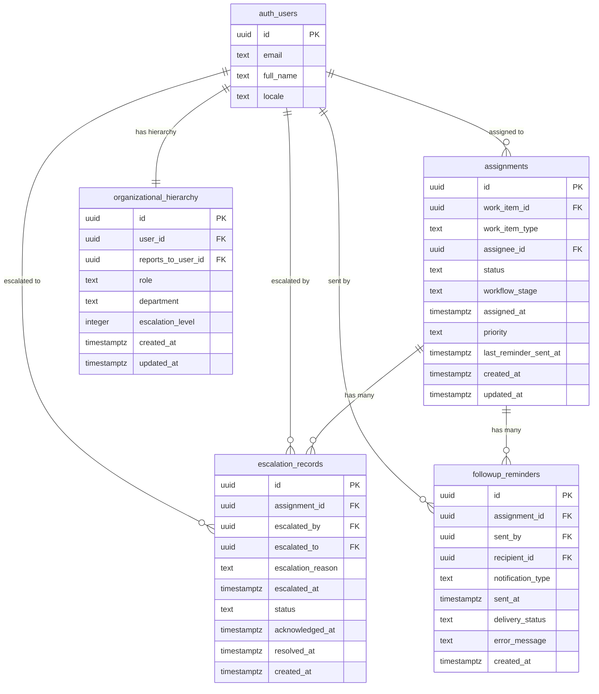
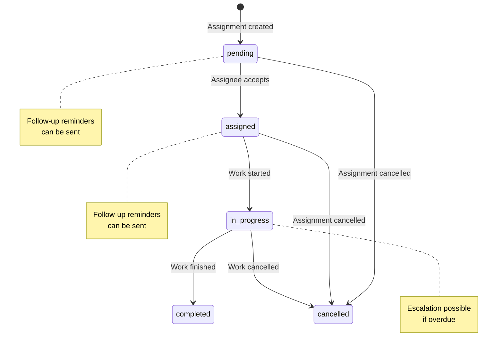
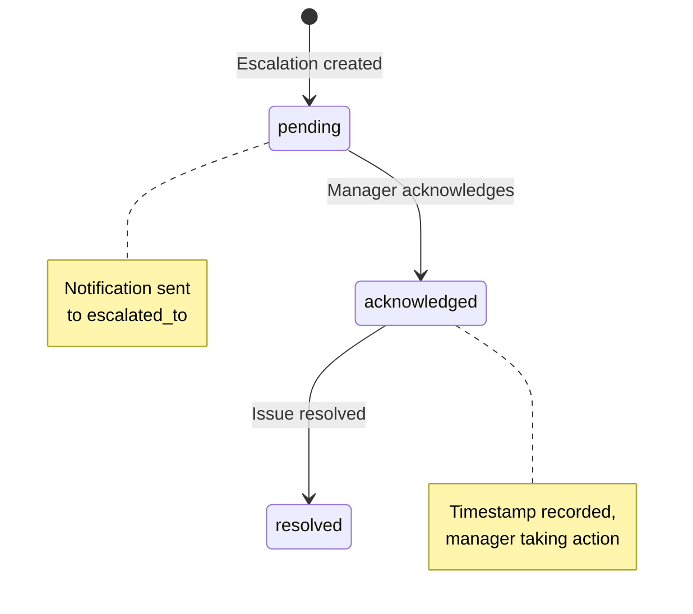
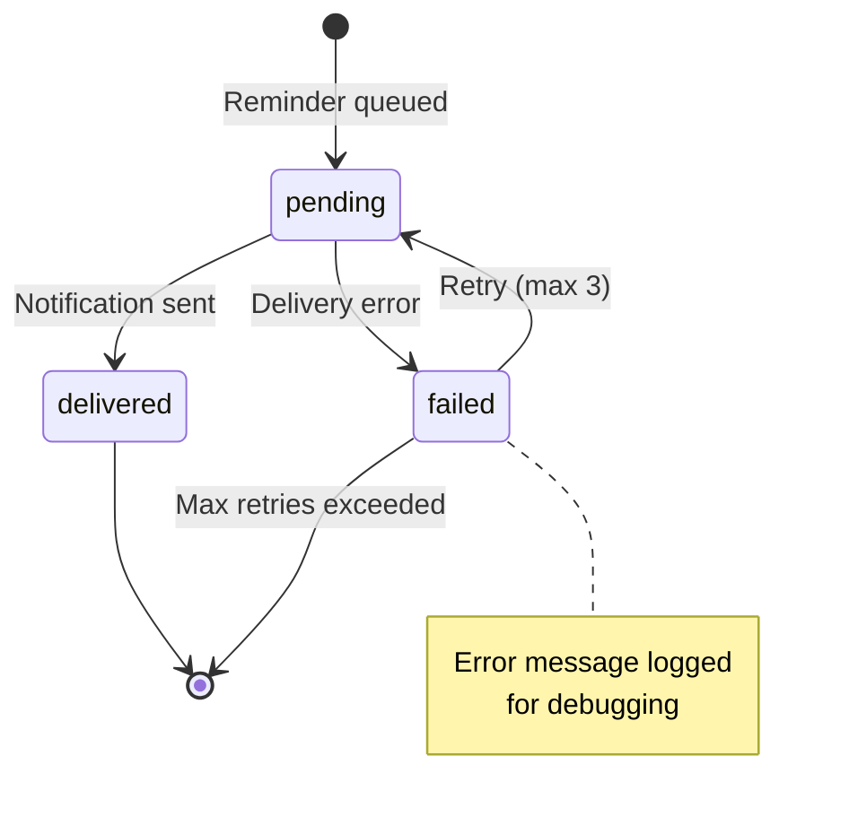

# Data Model: Waiting Queue Actions

**Feature**: Waiting Queue Actions
**Branch**: 023-specs-waiting-queue
**Date**: 2025-01-14
**Status**: Complete

## Overview

This data model defines the database schema for managing waiting queue actions including escalation records, follow-up reminders, and enhanced assignment tracking. The model extends the existing `assignments` table and introduces new audit trail tables for compliance and operational tracking.

## Entity Relationship Diagram



## Entities

### 1. assignments (MODIFIED)

**Purpose**: Represents work items assigned to users. Enhanced with reminder tracking.

**Modification**: Add `last_reminder_sent_at` column to track reminder cooldown period.

| Column | Type | Constraints | Description |
|--------|------|-------------|-------------|
| id | UUID | PRIMARY KEY, DEFAULT gen_random_uuid() | Unique identifier |
| work_item_id | UUID | NOT NULL | ID of the work item (dossier, ticket, position, task) |
| work_item_type | TEXT | NOT NULL, CHECK IN ('dossier', 'ticket', 'position', 'task') | Type of work item |
| assignee_id | UUID | REFERENCES auth.users(id) ON DELETE SET NULL | User assigned to work on this item |
| status | TEXT | NOT NULL, DEFAULT 'pending', CHECK IN ('pending', 'assigned', 'in_progress', 'completed', 'cancelled') | Current assignment status |
| workflow_stage | TEXT | NOT NULL, DEFAULT 'todo', CHECK IN ('todo', 'in_progress', 'done') | Workflow stage |
| assigned_at | TIMESTAMPTZ | NOT NULL, DEFAULT NOW() | Timestamp when assignment was created |
| priority | TEXT | NOT NULL, DEFAULT 'medium', CHECK IN ('low', 'medium', 'high', 'urgent') | Assignment priority |
| **last_reminder_sent_at** | **TIMESTAMPTZ** | **NULL** | **Timestamp of last follow-up reminder sent (NEW)** |
| created_at | TIMESTAMPTZ | DEFAULT NOW() | Record creation timestamp |
| updated_at | TIMESTAMPTZ | DEFAULT NOW() | Record last update timestamp |

**Indexes**:
- `idx_assignments_queue_filters` ON (status, workflow_stage, assigned_at DESC) WHERE status IN ('pending', 'assigned')
- `idx_assignments_aging` ON ((EXTRACT(EPOCH FROM (NOW() - assigned_at)) / 86400)) WHERE status = 'pending'
- `idx_assignments_assignee` ON (assignee_id) WHERE status IN ('pending', 'assigned')

**RLS Policies** (existing):
- Read: Users can view assignments where they are assignee OR have 'view_all_assignments' permission
- Update: Users can update assignments where they are assignee OR have 'manage_assignments' permission

**Triggers**:
- `update_assignments_updated_at` BEFORE UPDATE: Set updated_at = NOW()

---

### 2. escalation_records (NEW)

**Purpose**: Tracks escalation events when assignments are escalated to higher management.

| Column | Type | Constraints | Description |
|--------|------|-------------|-------------|
| id | UUID | PRIMARY KEY, DEFAULT gen_random_uuid() | Unique identifier |
| assignment_id | UUID | NOT NULL, REFERENCES assignments(id) ON DELETE CASCADE | Assignment being escalated |
| escalated_by | UUID | NOT NULL, REFERENCES auth.users(id) ON DELETE SET NULL | User who initiated escalation |
| escalated_to | UUID | NOT NULL, REFERENCES auth.users(id) ON DELETE SET NULL | Recipient of escalation (manager) |
| escalation_reason | TEXT | NULL | Optional reason for escalation |
| escalated_at | TIMESTAMPTZ | NOT NULL, DEFAULT NOW() | Timestamp when escalation occurred |
| status | TEXT | NOT NULL, DEFAULT 'pending', CHECK IN ('pending', 'acknowledged', 'resolved') | Escalation status |
| acknowledged_at | TIMESTAMPTZ | NULL | Timestamp when recipient acknowledged escalation |
| resolved_at | TIMESTAMPTZ | NULL | Timestamp when escalated issue was resolved |
| created_at | TIMESTAMPTZ | DEFAULT NOW() | Record creation timestamp |

**Indexes**:
- `idx_escalation_records_assignment` ON (assignment_id, escalated_at DESC)
- `idx_escalation_records_recipient` ON (escalated_to, status) WHERE status = 'pending'

**RLS Policies**:
- Read: Users can view escalations where they are escalated_by OR escalated_to OR have 'view_all_escalations' permission
- Insert: Users with 'escalate_assignments' permission can create escalation records
- Update: Users can update escalations where they are escalated_to (for acknowledging/resolving) OR have 'manage_escalations' permission
- Delete: No delete allowed (immutable audit trail)

**Business Rules**:
- Cannot escalate assignments with status 'completed' or 'cancelled' (enforced by backend validation)
- Each assignment can have multiple escalation records (escalation chain)
- Status transitions: pending → acknowledged → resolved (enforced by backend)

---

### 3. followup_reminders (NEW)

**Purpose**: Audit trail of all follow-up reminders sent for assignments.

| Column | Type | Constraints | Description |
|--------|------|-------------|-------------|
| id | UUID | PRIMARY KEY, DEFAULT gen_random_uuid() | Unique identifier |
| assignment_id | UUID | NOT NULL, REFERENCES assignments(id) ON DELETE CASCADE | Assignment for which reminder was sent |
| sent_by | UUID | NOT NULL, REFERENCES auth.users(id) ON DELETE SET NULL | User who sent the reminder |
| recipient_id | UUID | NOT NULL, REFERENCES auth.users(id) ON DELETE SET NULL | Assignee who received reminder |
| notification_type | TEXT | NOT NULL, CHECK IN ('email', 'in_app', 'both') | Delivery channel(s) used |
| sent_at | TIMESTAMPTZ | NOT NULL, DEFAULT NOW() | Timestamp when reminder was sent |
| delivery_status | TEXT | NOT NULL, DEFAULT 'pending', CHECK IN ('pending', 'delivered', 'failed') | Notification delivery status |
| error_message | TEXT | NULL | Error details if delivery failed |
| created_at | TIMESTAMPTZ | DEFAULT NOW() | Record creation timestamp |

**Indexes**:
- `idx_followup_reminders_assignment` ON (assignment_id, sent_at DESC)
- `idx_followup_reminders_recipient` ON (recipient_id, sent_at DESC)

**RLS Policies**:
- Read: Users can view reminders for assignments they are assigned to OR sent OR have 'view_all_reminders' permission
- Insert: Users with 'send_reminders' permission can create reminder records
- Update: Only delivery_status and error_message can be updated by notification service (system role)
- Delete: No delete allowed (immutable audit trail)

**Business Rules**:
- Reminder cooldown enforced by checking assignments.last_reminder_sent_at (24-hour default)
- Each successful reminder updates assignments.last_reminder_sent_at
- Failed deliveries trigger retry mechanism (max 3 retries, enforced by notification service)

---

### 4. organizational_hierarchy (NEW)

**Purpose**: Defines organizational reporting structure for escalation path resolution.

| Column | Type | Constraints | Description |
|--------|------|-------------|-------------|
| id | UUID | PRIMARY KEY, DEFAULT gen_random_uuid() | Unique identifier |
| user_id | UUID | NOT NULL, UNIQUE, REFERENCES auth.users(id) ON DELETE CASCADE | User in the hierarchy |
| reports_to_user_id | UUID | REFERENCES auth.users(id) ON DELETE SET NULL | Manager this user reports to |
| role | TEXT | NOT NULL | Job role/title (e.g., "Team Lead", "Department Manager") |
| department | TEXT | NULL | Department or division |
| escalation_level | INTEGER | NOT NULL, DEFAULT 1 | Numeric escalation level (1 = lowest, higher = more senior) |
| created_at | TIMESTAMPTZ | DEFAULT NOW() | Record creation timestamp |
| updated_at | TIMESTAMPTZ | DEFAULT NOW() | Record last update timestamp |

**Indexes**:
- `idx_org_hierarchy_user` ON (user_id)
- `idx_org_hierarchy_manager` ON (reports_to_user_id)
- `idx_org_hierarchy_level` ON (escalation_level)

**RLS Policies**:
- Read: All authenticated users can view organizational hierarchy
- Insert: Only users with 'manage_hierarchy' permission can create hierarchy records
- Update: Only users with 'manage_hierarchy' permission can update hierarchy records
- Delete: Only users with 'manage_hierarchy' permission can delete hierarchy records

**Business Rules**:
- Each user can have only one hierarchy record (UNIQUE constraint on user_id)
- Circular reporting chains are prevented by backend validation (user cannot report to themselves transitively)
- Escalation path resolution walks up hierarchy (reports_to_user_id chain) until appropriate level found

---

## State Transitions

### Assignment Status Flow



### Escalation Status Flow



### Reminder Delivery Flow



## Validation Rules

### Assignment Validation
- `work_item_type` must be one of: 'dossier', 'ticket', 'position', 'task'
- `status` transitions must follow state diagram (enforced by backend)
- `priority` must be one of: 'low', 'medium', 'high', 'urgent'
- `last_reminder_sent_at` must be <= NOW() (cannot send reminders in future)

### Escalation Record Validation
- `assignment_id` must reference existing assignment with status NOT IN ('completed', 'cancelled')
- `escalated_to` must be different from assignment.assignee_id (cannot escalate to yourself)
- `escalated_to` must have higher escalation_level than escalated_by (enforced via organizational hierarchy)
- `acknowledged_at` must be >= escalated_at
- `resolved_at` must be >= acknowledged_at

### Follow-up Reminder Validation
- `assignment_id` must reference existing assignment with status IN ('pending', 'assigned')
- `recipient_id` must match assignment.assignee_id (reminders sent to assignee only)
- Cooldown period: sent_at must be >= (assignments.last_reminder_sent_at + 24 hours) OR last_reminder_sent_at IS NULL
- `notification_type` must be one of: 'email', 'in_app', 'both'

### Organizational Hierarchy Validation
- `reports_to_user_id` cannot equal `user_id` (direct circular reference prevented)
- Transitive circular references prevented by backend validation (walk chain, detect cycle)
- `escalation_level` must be > 0 and <= 10 (reasonable range)

## Audit & Compliance

### Audit Trail Tables
- **escalation_records**: Immutable audit trail of all escalations (no DELETE, minimal UPDATE)
- **followup_reminders**: Immutable audit trail of all reminders sent (no DELETE, minimal UPDATE)

### Retention Policies
- All audit records retained for minimum 7 years per government compliance (no automated deletion)
- Soft delete for assignments (set status = 'cancelled', do not hard delete)

### Privacy & Security
- RLS policies enforce data access based on user permissions
- Sensitive fields (escalation_reason, error_message) only visible to authorized users
- Notification content does not include confidential work item details, only links to secure views

## Migration Strategy

### Migration Order (Phase 1)

1. **20250114120000_add_reminder_cooldown.sql**
   - Add `last_reminder_sent_at` column to `assignments` table
   - Backfill with NULL for existing records
   - Add index on `last_reminder_sent_at` for cooldown checks

2. **20250114120100_create_organizational_hierarchy.sql**
   - Create `organizational_hierarchy` table
   - Add indexes
   - Create RLS policies
   - Insert seed data for demo/testing

3. **20250114120200_create_escalation_records.sql**
   - Create `escalation_records` table
   - Add foreign key constraints to `assignments` and `auth.users`
   - Add indexes
   - Create RLS policies

4. **20250114120300_create_followup_reminders.sql**
   - Create `followup_reminders` table
   - Add foreign key constraints to `assignments` and `auth.users`
   - Add indexes
   - Create RLS policies

5. **20250114120400_add_waiting_queue_indexes.sql**
   - Add composite index: `idx_assignments_queue_filters`
   - Add aging index: `idx_assignments_aging`
   - Add assignee index: `idx_assignments_assignee`

### Rollback Strategy
- Each migration has corresponding DOWN migration
- Test rollback in staging environment before production deployment
- Migrations are idempotent (safe to re-run)

## Performance Considerations

### Expected Load
- 10,000+ assignments in queue simultaneously
- 1,000 reminders/day (avg 40/hour, peak 200/hour)
- 50-100 escalations/week
- 500+ concurrent users querying waiting queue

### Optimization Strategies
1. **Indexes**: Composite indexes on frequently filtered columns reduce query time from seconds to milliseconds
2. **Partial Indexes**: Only index rows in active status (pending, assigned) to reduce index size
3. **Caching**: Redis cache for expensive filter queries (5-minute TTL)
4. **Pagination**: Limit query results to 50 items per page (default), max 100 items for bulk operations
5. **Archival**: Completed assignments older than 90 days moved to archive table (future enhancement)

### Query Performance Targets
- Assignment list with filters: <100ms (p95)
- Single assignment detail: <50ms (p95)
- Escalation record creation: <200ms (p95)
- Reminder sending (single): <500ms (p95)
- Bulk operations (100 items): <60s total (includes background queue)

## Example Queries

### Get waiting queue with filters
```sql
-- Filtered waiting queue (high priority, 7+ days aging)
SELECT
  a.id,
  a.work_item_id,
  a.work_item_type,
  a.assignee_id,
  u.full_name AS assignee_name,
  a.status,
  a.priority,
  a.assigned_at,
  EXTRACT(EPOCH FROM (NOW() - a.assigned_at)) / 86400 AS days_waiting,
  a.last_reminder_sent_at
FROM assignments a
LEFT JOIN auth.users u ON a.assignee_id = u.id
WHERE a.status IN ('pending', 'assigned')
  AND a.priority = 'high'
  AND a.assigned_at < NOW() - INTERVAL '7 days'
ORDER BY a.assigned_at ASC
LIMIT 50;
```

### Get escalation path for user
```sql
-- Walk organizational hierarchy to find escalation recipient
WITH RECURSIVE escalation_chain AS (
  -- Start with current user
  SELECT
    user_id,
    reports_to_user_id,
    role,
    escalation_level,
    1 AS depth
  FROM organizational_hierarchy
  WHERE user_id = $1  -- assignee_id

  UNION ALL

  -- Walk up the chain
  SELECT
    oh.user_id,
    oh.reports_to_user_id,
    oh.role,
    oh.escalation_level,
    ec.depth + 1
  FROM organizational_hierarchy oh
  INNER JOIN escalation_chain ec ON oh.user_id = ec.reports_to_user_id
  WHERE ec.depth < 5  -- Prevent infinite loop
)
SELECT
  user_id,
  role,
  escalation_level
FROM escalation_chain
WHERE depth = 2  -- Next level up (immediate manager)
LIMIT 1;
```

### Check reminder cooldown
```sql
-- Can send reminder? (24-hour cooldown)
SELECT
  CASE
    WHEN last_reminder_sent_at IS NULL THEN TRUE
    WHEN last_reminder_sent_at < NOW() - INTERVAL '24 hours' THEN TRUE
    ELSE FALSE
  END AS can_send_reminder,
  last_reminder_sent_at,
  NOW() - last_reminder_sent_at AS time_since_last_reminder
FROM assignments
WHERE id = $1;
```

---

**Data Model Version**: 1.0
**Last Updated**: 2025-01-14
**Status**: Ready for implementation
