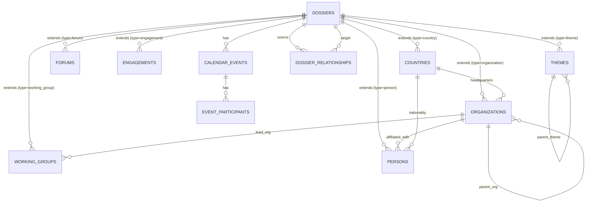

# Data Model: Unified Dossier Architecture

**Feature**: 026-unified-dossier-architecture
**Date**: 2025-01-22
**Status**: Complete

## Overview

This document defines the complete data model for the unified dossier architecture implementing Class Table Inheritance pattern. The model consists of:
- **1 universal base table**: `dossiers` (all entity types)
- **7 type-specific extension tables**: `countries`, `organizations`, `forums`, `engagements`, `themes`, `working_groups`, `persons`
- **1 relationship table**: `dossier_relationships` (polymorphic many-to-many)
- **2 calendar tables**: `calendar_events`, `event_participants`

---

## Entity Relationship Diagram



---

## 1. Dossiers (Universal Base Table)

**Purpose**: Universal base table for all diplomatic entities. Provides single ID namespace and common fields across all types.

**Table**: `dossiers`

### Schema

```sql
CREATE TABLE dossiers (
  -- Identity
  id UUID PRIMARY KEY DEFAULT gen_random_uuid(),
  type TEXT NOT NULL CHECK (type IN (
    'country',
    'organization',
    'forum',
    'engagement',
    'theme',
    'working_group',
    'person'
  )),

  -- Core Information (Bilingual)
  name_en TEXT NOT NULL,
  name_ar TEXT NOT NULL,
  description_en TEXT,
  description_ar TEXT,

  -- Status & Classification
  status TEXT NOT NULL DEFAULT 'active' CHECK (status IN (
    'active',
    'inactive',
    'archived',
    'deleted'
  )),
  sensitivity_level INTEGER NOT NULL DEFAULT 1 CHECK (sensitivity_level BETWEEN 1 AND 4),
  -- 1 = Public, 2 = Internal, 3 = Confidential, 4 = Secret

  -- Flexible Data
  tags TEXT[] DEFAULT '{}',
  metadata JSONB DEFAULT '{}',

  -- Full-Text Search
  search_vector TSVECTOR GENERATED ALWAYS AS (
    setweight(to_tsvector('simple', coalesce(name_en, '')), 'A') ||
    setweight(to_tsvector('simple', coalesce(name_ar, '')), 'A') ||
    setweight(to_tsvector('simple', coalesce(description_en, '')), 'B') ||
    setweight(to_tsvector('simple', coalesce(description_ar, '')), 'B')
  ) STORED,

  -- Audit Trail
  created_at TIMESTAMPTZ NOT NULL DEFAULT now(),
  updated_at TIMESTAMPTZ NOT NULL DEFAULT now(),
  created_by UUID REFERENCES auth.users(id),
  updated_by UUID REFERENCES auth.users(id)
);
```

### Indexes

```sql
-- Primary key (automatic)
-- CREATE UNIQUE INDEX dossiers_pkey ON dossiers(id);

-- Type and status filtering (most common query pattern)
CREATE INDEX idx_dossiers_type_status ON dossiers(type, status);

-- Full-text search
CREATE INDEX idx_dossiers_search_vector ON dossiers USING GiST(search_vector);

-- Clearance filtering
CREATE INDEX idx_dossiers_sensitivity ON dossiers(sensitivity_level);

-- Composite index for filtered queries
CREATE INDEX idx_dossiers_type_status_sensitivity
  ON dossiers(type, status, sensitivity_level);

-- Timestamps for temporal queries
CREATE INDEX idx_dossiers_created_at ON dossiers(created_at);
CREATE INDEX idx_dossiers_updated_at ON dossiers(updated_at);
```

### Constraints & Business Rules

1. **Type Immutability**: Type cannot be changed after creation (enforce in application)
2. **Name Required**: Both name_en and name_ar must be non-empty
3. **Status Transitions**: active ↔ inactive ↔ archived → deleted (soft delete)
4. **Sensitivity Level**: Must match user's clearance level for create/update operations
5. **Search Vector**: Automatically updated on name/description changes

### RLS Policies

```sql
ALTER TABLE dossiers ENABLE ROW LEVEL SECURITY;

-- Users can view dossiers within their clearance level
CREATE POLICY "Users can view dossiers within clearance"
ON dossiers FOR SELECT
USING (
  sensitivity_level <= (
    SELECT clearance_level FROM profiles WHERE id = auth.uid()
  )
);

-- Users can create dossiers up to their clearance level
CREATE POLICY "Users can create dossiers within clearance"
ON dossiers FOR INSERT
WITH CHECK (
  sensitivity_level <= (
    SELECT clearance_level FROM profiles WHERE id = auth.uid()
  )
);

-- Users can update dossiers within their clearance
CREATE POLICY "Users can update dossiers within clearance"
ON dossiers FOR UPDATE
USING (
  sensitivity_level <= (
    SELECT clearance_level FROM profiles WHERE id = auth.uid()
  )
)
WITH CHECK (
  sensitivity_level <= (
    SELECT clearance_level FROM profiles WHERE id = auth.uid()
  )
);
```

---

## 2. Countries (Extension Table)

**Purpose**: Type-specific data for nation states.

**Table**: `countries`

### Schema

```sql
CREATE TABLE countries (
  -- Identity (same as dossiers.id)
  id UUID PRIMARY KEY REFERENCES dossiers(id) ON DELETE CASCADE,

  -- ISO Codes
  iso_code_2 CHAR(2) UNIQUE NOT NULL,
  iso_code_3 CHAR(3) UNIQUE NOT NULL,

  -- Geographic Information (Bilingual)
  capital_en TEXT,
  capital_ar TEXT,
  region TEXT, -- e.g., "Asia", "Europe"
  subregion TEXT, -- e.g., "Western Asia", "Southern Europe"

  -- Statistics
  population BIGINT,
  area_sq_km NUMERIC(15,2),

  -- Media
  flag_url TEXT
);
```

### Indexes

```sql
-- Primary key (automatic FK to dossiers)
-- CREATE UNIQUE INDEX countries_pkey ON countries(id);

-- ISO code lookups
CREATE UNIQUE INDEX idx_countries_iso2 ON countries(iso_code_2);
CREATE UNIQUE INDEX idx_countries_iso3 ON countries(iso_code_3);

-- Region filtering
CREATE INDEX idx_countries_region ON countries(region);
```

### Constraints & Business Rules

1. **Dossier Type Match**: countries.id must reference dossier with type='country' (trigger enforced)
2. **ISO Code Format**: iso_code_2 must be uppercase 2-letter code, iso_code_3 must be uppercase 3-letter code
3. **Population/Area**: Non-negative values only
4. **Unique ISO Codes**: No two countries can share same ISO code

### Trigger

```sql
CREATE TRIGGER validate_country_type
  BEFORE INSERT OR UPDATE ON countries
  FOR EACH ROW EXECUTE FUNCTION validate_dossier_type('country');
```

---

## 3. Organizations (Extension Table)

**Purpose**: Type-specific data for entities with legal structure (governments, NGOs, international bodies, private sector).

**Table**: `organizations`

### Schema

```sql
CREATE TABLE organizations (
  -- Identity (same as dossiers.id)
  id UUID PRIMARY KEY REFERENCES dossiers(id) ON DELETE CASCADE,

  -- Classification
  org_code TEXT UNIQUE, -- Internal identifier (e.g., "MOFA-SA")
  org_type TEXT NOT NULL CHECK (org_type IN (
    'government',
    'ngo',
    'private',
    'international',
    'academic'
  )),

  -- Structural Relationships
  headquarters_country_id UUID REFERENCES countries(id), -- Where org is based
  parent_org_id UUID REFERENCES organizations(id), -- Organizational hierarchy

  -- Contact Information
  website TEXT,
  email TEXT,
  phone TEXT,
  address_en TEXT,
  address_ar TEXT,

  -- Media
  logo_url TEXT,

  -- Dates
  established_date DATE
);
```

### Indexes

```sql
-- Primary key (automatic FK to dossiers)
-- CREATE UNIQUE INDEX organizations_pkey ON organizations(id);

-- Org code lookup
CREATE UNIQUE INDEX idx_organizations_code ON organizations(org_code) WHERE org_code IS NOT NULL;

-- Type filtering
CREATE INDEX idx_organizations_type ON organizations(org_type);

-- Hierarchy queries
CREATE INDEX idx_organizations_parent ON organizations(parent_org_id);

-- Country filtering
CREATE INDEX idx_organizations_country ON organizations(headquarters_country_id);
```

### Constraints & Business Rules

1. **Dossier Type Match**: organizations.id must reference dossier with type='organization' (trigger enforced)
2. **Hierarchy Validation**: Cannot set parent_org_id = id (no self-reference), prevent circular hierarchies (application validates)
3. **Email Format**: Must be valid email format if provided (application validates)
4. **Phone Format**: Recommended E.164 format (application validates)
5. **Website Format**: Must be valid URL if provided (application validates)

### Trigger

```sql
CREATE TRIGGER validate_organization_type
  BEFORE INSERT OR UPDATE ON organizations
  FOR EACH ROW EXECUTE FUNCTION validate_dossier_type('organization');
```

---

## 4. Forums (Extension Table)

**Purpose**: Type-specific data for multi-session conferences and summits.

**Table**: `forums`

### Schema

```sql
CREATE TABLE forums (
  -- Identity (same as dossiers.id)
  id UUID PRIMARY KEY REFERENCES dossiers(id) ON DELETE CASCADE,

  -- Forum Details
  number_of_sessions INTEGER,
  keynote_speakers JSONB DEFAULT '[]', -- Array of {name, title, org}
  sponsors JSONB DEFAULT '[]', -- Array of sponsor information

  -- Financial
  registration_fee NUMERIC(10,2),
  currency CHAR(3), -- ISO 4217 currency code (e.g., "SAR", "USD")

  -- Resources
  agenda_url TEXT,
  live_stream_url TEXT
);
```

### Indexes

```sql
-- Primary key (automatic FK to dossiers)
-- CREATE UNIQUE INDEX forums_pkey ON forums(id);

-- No additional indexes needed (forums queried by dossier properties)
```

### Constraints & Business Rules

1. **Dossier Type Match**: forums.id must reference dossier with type='forum' (trigger enforced)
2. **Session Count**: number_of_sessions must be positive if provided
3. **Registration Fee**: Non-negative, requires currency if provided
4. **Currency Code**: Must be valid ISO 4217 code if provided (application validates)
5. **Calendar Sessions**: Each session stored as separate calendar_event row

### Trigger

```sql
CREATE TRIGGER validate_forum_type
  BEFORE INSERT OR UPDATE ON forums
  FOR EACH ROW EXECUTE FUNCTION validate_dossier_type('forum');
```

---

## 5. Engagements (Extension Table)

**Purpose**: Type-specific data for diplomatic events and interactions. Engagements ARE dossiers (not references to dossiers).

**Table**: `engagements`

### Schema

```sql
CREATE TABLE engagements (
  -- Identity (same as dossiers.id)
  id UUID PRIMARY KEY REFERENCES dossiers(id) ON DELETE CASCADE,

  -- Engagement Classification
  engagement_type TEXT NOT NULL CHECK (engagement_type IN (
    'meeting',
    'consultation',
    'coordination',
    'workshop',
    'conference',
    'site_visit',
    'ceremony'
  )),
  engagement_category TEXT NOT NULL CHECK (engagement_category IN (
    'bilateral',
    'multilateral',
    'regional',
    'internal'
  )),

  -- Location (Bilingual)
  location_en TEXT,
  location_ar TEXT

  -- NOTE: Participants/entities involved stored in dossier_relationships table
  -- NOTE: Temporal information (date/time) stored in calendar_events table
);
```

### Indexes

```sql
-- Primary key (automatic FK to dossiers)
-- CREATE UNIQUE INDEX engagements_pkey ON engagements(id);

-- Type filtering
CREATE INDEX idx_engagements_type ON engagements(engagement_type);
CREATE INDEX idx_engagements_category ON engagements(engagement_category);
```

### Constraints & Business Rules

1. **Dossier Type Match**: engagements.id must reference dossier with type='engagement' (trigger enforced)
2. **Participants**: Linked via dossier_relationships (source=engagement, target=country/org/person, type='involves')
3. **Calendar Events**: Each meeting instance stored as calendar_event row
4. **Location Required**: At least one of location_en or location_ar should be provided (application validates)

### Trigger

```sql
CREATE TRIGGER validate_engagement_type
  BEFORE INSERT OR UPDATE ON engagements
  FOR EACH ROW EXECUTE FUNCTION validate_dossier_type('engagement');
```

### Migration Notes

**Critical**: Existing engagements with `dossier_id` FK must be converted:
```sql
-- Convert engagement.dossier_id FK to relationship entry
INSERT INTO dossier_relationships (source_dossier_id, target_dossier_id, relationship_type, status)
SELECT id, dossier_id, 'discusses', 'active'
FROM engagements_old
WHERE dossier_id IS NOT NULL;
```

---

## 6. Themes (Extension Table)

**Purpose**: Type-specific data for policy areas and strategic initiatives.

**Table**: `themes`

### Schema

```sql
CREATE TABLE themes (
  -- Identity (same as dossiers.id)
  id UUID PRIMARY KEY REFERENCES dossiers(id) ON DELETE CASCADE,

  -- Theme Classification
  theme_category TEXT NOT NULL CHECK (theme_category IN (
    'policy',
    'technical',
    'strategic',
    'operational'
  )),

  -- Hierarchy
  parent_theme_id UUID REFERENCES themes(id) -- Thematic hierarchy
);
```

### Indexes

```sql
-- Primary key (automatic FK to dossiers)
-- CREATE UNIQUE INDEX themes_pkey ON themes(id);

-- Category filtering
CREATE INDEX idx_themes_category ON themes(theme_category);

-- Hierarchy queries
CREATE INDEX idx_themes_parent ON themes(parent_theme_id);
```

### Constraints & Business Rules

1. **Dossier Type Match**: themes.id must reference dossier with type='theme' (trigger enforced)
2. **Hierarchy Validation**: Cannot set parent_theme_id = id (no self-reference), prevent circular hierarchies (application validates)
3. **Example Themes**: "Climate Policy", "Trade Agreements", "Digital Transformation", "Security Cooperation"

### Trigger

```sql
CREATE TRIGGER validate_theme_type
  BEFORE INSERT OR UPDATE ON themes
  FOR EACH ROW EXECUTE FUNCTION validate_dossier_type('theme');
```

---

## 7. Working Groups (Extension Table)

**Purpose**: Type-specific data for committees and task forces.

**Table**: `working_groups`

### Schema

```sql
CREATE TABLE working_groups (
  -- Identity (same as dossiers.id)
  id UUID PRIMARY KEY REFERENCES dossiers(id) ON DELETE CASCADE,

  -- Mandate (Bilingual)
  mandate_en TEXT,
  mandate_ar TEXT,

  -- Leadership
  lead_org_id UUID REFERENCES organizations(id), -- Organization leading the WG

  -- Status
  wg_status TEXT NOT NULL DEFAULT 'active' CHECK (wg_status IN (
    'active',
    'suspended',
    'disbanded'
  )),

  -- Dates
  established_date DATE,
  disbandment_date DATE
);
```

### Indexes

```sql
-- Primary key (automatic FK to dossiers)
-- CREATE UNIQUE INDEX working_groups_pkey ON working_groups(id);

-- Lead org queries
CREATE INDEX idx_wg_lead_org ON working_groups(lead_org_id);

-- Status filtering
CREATE INDEX idx_wg_status ON working_groups(wg_status);
```

### Constraints & Business Rules

1. **Dossier Type Match**: working_groups.id must reference dossier with type='working_group' (trigger enforced)
2. **Disbandment Logic**: If disbanded, disbandment_date must be >= established_date and wg_status must be 'disbanded'
3. **Members**: Linked via dossier_relationships (source=org/person, target=working_group, type='member_of')

### Trigger

```sql
CREATE TRIGGER validate_working_group_type
  BEFORE INSERT OR UPDATE ON working_groups
  FOR EACH ROW EXECUTE FUNCTION validate_dossier_type('working_group');
```

---

## 8. Persons (Extension Table)

**Purpose**: Type-specific data for VIP individuals requiring tracking (ambassadors, ministers, key officials).

**Table**: `persons`

### Schema

```sql
CREATE TABLE persons (
  -- Identity (same as dossiers.id)
  id UUID PRIMARY KEY REFERENCES dossiers(id) ON DELETE CASCADE,

  -- Title (Bilingual)
  title_en TEXT, -- e.g., "Ambassador", "Minister of Trade"
  title_ar TEXT,

  -- Affiliations
  organization_id UUID REFERENCES organizations(id), -- Current organization
  nationality_country_id UUID REFERENCES countries(id), -- Country of nationality

  -- Contact Information
  email TEXT,
  phone TEXT,

  -- Biography (Bilingual)
  biography_en TEXT,
  biography_ar TEXT,

  -- Media
  photo_url TEXT
);
```

### Indexes

```sql
-- Primary key (automatic FK to dossiers)
-- CREATE UNIQUE INDEX persons_pkey ON persons(id);

-- Organization filtering
CREATE INDEX idx_persons_org ON persons(organization_id);

-- Nationality filtering
CREATE INDEX idx_persons_country ON persons(nationality_country_id);
```

### Constraints & Business Rules

1. **Dossier Type Match**: persons.id must reference dossier with type='person' (trigger enforced)
2. **VIP Only**: Not for all staff (staff remain in users table) or all external contacts (external_contacts table)
3. **Email Format**: Must be valid email if provided (application validates)
4. **Relationships**: Can represent organizations (type='represents'), participate in events (via event_participants)

### Trigger

```sql
CREATE TRIGGER validate_person_type
  BEFORE INSERT OR UPDATE ON persons
  FOR EACH ROW EXECUTE FUNCTION validate_dossier_type('person');
```

---

## 9. Dossier Relationships (Universal Relationships Table)

**Purpose**: Represents connections between any two dossiers, enabling graph queries and bidirectional relationship exploration.

**Table**: `dossier_relationships`

### Schema

```sql
CREATE TABLE dossier_relationships (
  -- Identity
  id UUID PRIMARY KEY DEFAULT gen_random_uuid(),

  -- Relationship Endpoints
  source_dossier_id UUID NOT NULL REFERENCES dossiers(id) ON DELETE CASCADE,
  target_dossier_id UUID NOT NULL REFERENCES dossiers(id) ON DELETE CASCADE,

  -- Relationship Type (free text with validation)
  relationship_type TEXT NOT NULL,
  -- Examples: bilateral_relation, membership, partnership, parent_of, subsidiary_of,
  --           discusses, involves, participant_in, hosted_by, sponsored_by,
  --           related_to, represents, member_of

  -- Metadata
  relationship_metadata JSONB DEFAULT '{}', -- Additional context (e.g., role, percentage, etc.)
  notes_en TEXT,
  notes_ar TEXT,

  -- Temporal Validity
  effective_from TIMESTAMPTZ,
  effective_to TIMESTAMPTZ,

  -- Status
  status TEXT NOT NULL DEFAULT 'active' CHECK (status IN (
    'active',
    'historical',
    'terminated'
  )),

  -- Audit Trail
  created_at TIMESTAMPTZ NOT NULL DEFAULT now(),
  created_by UUID REFERENCES auth.users(id),

  -- Constraints
  CONSTRAINT no_self_reference CHECK (source_dossier_id != target_dossier_id),
  CONSTRAINT valid_temporal_range CHECK (effective_to IS NULL OR effective_to >= effective_from)
);
```

### Indexes

```sql
-- Primary key (automatic)
-- CREATE UNIQUE INDEX dossier_relationships_pkey ON dossier_relationships(id);

-- Bidirectional relationship queries (most common pattern)
CREATE INDEX idx_relationships_source ON dossier_relationships(source_dossier_id)
  WHERE status = 'active';
CREATE INDEX idx_relationships_target ON dossier_relationships(target_dossier_id)
  WHERE status = 'active';

-- Relationship type filtering
CREATE INDEX idx_relationships_type ON dossier_relationships(relationship_type);

-- Temporal queries (active relationships as of date)
CREATE INDEX idx_relationships_temporal ON dossier_relationships(effective_from, effective_to)
  WHERE status = 'active';

-- Composite index for source + type queries
CREATE INDEX idx_relationships_source_type ON dossier_relationships(source_dossier_id, relationship_type)
  WHERE status = 'active';
```

### Constraints & Business Rules

1. **No Self-Reference**: source_dossier_id cannot equal target_dossier_id
2. **Temporal Validity**: effective_to must be >= effective_from if both provided
3. **Status Transitions**: active → historical (after effective_to), active → terminated (manually ended)
4. **Bidirectional Queries**: Can query from source OR target to find related entities
5. **Cycle Prevention**: Application validates parent/child relationships to prevent circular hierarchies

### Relationship Types

| Type | Description | Example |
|------|-------------|---------|
| `bilateral_relation` | Formal relationship between two countries | Saudi Arabia ↔ China |
| `membership` | Entity is member of another entity | Country → G20 Forum |
| `partnership` | Collaborative relationship | Organization ↔ Organization |
| `parent_of` | Hierarchical relationship (parent) | Ministry → Department |
| `subsidiary_of` | Hierarchical relationship (child) | Department → Ministry |
| `discusses` | Engagement addresses this entity | Engagement → Country |
| `involves` | Entity participates in engagement | Country → Engagement |
| `participant_in` | Person participates in event | Person → Engagement |
| `hosted_by` | Event hosted by entity | Forum → Organization |
| `sponsored_by` | Event sponsored by entity | Conference → Organization |
| `related_to` | Generic relationship | Any → Any |
| `represents` | Person represents entity | Ambassador → Country |
| `member_of` | Person/org is member of group | Person → Working Group |

### RLS Policies

```sql
ALTER TABLE dossier_relationships ENABLE ROW LEVEL SECURITY;

-- Users can view relationships if both dossiers are accessible
CREATE POLICY "Users can view relationships within clearance"
ON dossier_relationships FOR SELECT
USING (
  EXISTS (
    SELECT 1 FROM dossiers
    WHERE id = source_dossier_id
      AND sensitivity_level <= (SELECT clearance_level FROM profiles WHERE id = auth.uid())
  )
  AND EXISTS (
    SELECT 1 FROM dossiers
    WHERE id = target_dossier_id
      AND sensitivity_level <= (SELECT clearance_level FROM profiles WHERE id = auth.uid())
  )
);

-- Users can create relationships if both dossiers are accessible
CREATE POLICY "Users can create relationships within clearance"
ON dossier_relationships FOR INSERT
WITH CHECK (
  EXISTS (
    SELECT 1 FROM dossiers
    WHERE id = source_dossier_id
      AND sensitivity_level <= (SELECT clearance_level FROM profiles WHERE id = auth.uid())
  )
  AND EXISTS (
    SELECT 1 FROM dossiers
    WHERE id = target_dossier_id
      AND sensitivity_level <= (SELECT clearance_level FROM profiles WHERE id = auth.uid())
  )
);
```

---

## 10. Calendar Events

**Purpose**: Temporal instances representing when dossiers occur in time. Separates "what" (dossier) from "when" (calendar event).

**Table**: `calendar_events`

### Schema

```sql
CREATE TABLE calendar_events (
  -- Identity
  id UUID PRIMARY KEY DEFAULT gen_random_uuid(),

  -- Link to Dossier
  dossier_id UUID NOT NULL REFERENCES dossiers(id) ON DELETE CASCADE,
  -- Points to engagement, forum, or any dossier with temporal aspect

  -- Event Classification
  event_type TEXT NOT NULL CHECK (event_type IN (
    'main_event',
    'session',
    'plenary',
    'working_session',
    'ceremony',
    'reception'
  )),

  -- Event Details (Bilingual)
  title_en TEXT,
  title_ar TEXT,
  description_en TEXT,
  description_ar TEXT,

  -- Temporal Information
  start_datetime TIMESTAMPTZ NOT NULL,
  end_datetime TIMESTAMPTZ NOT NULL,
  timezone TEXT NOT NULL DEFAULT 'Asia/Riyadh', -- IANA timezone

  -- Location (Bilingual)
  location_en TEXT,
  location_ar TEXT,
  is_virtual BOOLEAN NOT NULL DEFAULT false,
  virtual_link TEXT,
  room_en TEXT,
  room_ar TEXT,

  -- Status
  status TEXT NOT NULL DEFAULT 'planned' CHECK (status IN (
    'planned',
    'ongoing',
    'completed',
    'cancelled',
    'postponed'
  )),

  -- Audit Trail
  created_at TIMESTAMPTZ NOT NULL DEFAULT now(),
  updated_at TIMESTAMPTZ NOT NULL DEFAULT now(),

  -- Constraints
  CONSTRAINT valid_datetime_range CHECK (end_datetime > start_datetime)
);
```

### Indexes

```sql
-- Primary key (automatic)
-- CREATE UNIQUE INDEX calendar_events_pkey ON calendar_events(id);

-- Dossier lookup (find all events for engagement/forum)
CREATE INDEX idx_calendar_dossier ON calendar_events(dossier_id);

-- Datetime range queries (most common pattern for calendar views)
CREATE INDEX idx_calendar_datetime ON calendar_events(start_datetime, end_datetime);

-- Status filtering
CREATE INDEX idx_calendar_status ON calendar_events(status);

-- Composite index for dossier + datetime queries
CREATE INDEX idx_calendar_dossier_datetime ON calendar_events(dossier_id, start_datetime);
```

### Constraints & Business Rules

1. **Datetime Validity**: end_datetime must be > start_datetime
2. **Timezone**: IANA timezone identifier (e.g., "Asia/Riyadh", "UTC", "America/New_York")
3. **Virtual Events**: If is_virtual = true, virtual_link should be provided (application validates)
4. **Multi-Day Events**: Can span multiple days (difference between start and end)
5. **Recurring Events**: Each instance stored as separate row (no recurrence logic in MVP)

---

## 11. Event Participants

**Purpose**: Links participants to calendar events with role and attendance tracking.

**Table**: `event_participants`

### Schema

```sql
CREATE TABLE event_participants (
  -- Identity
  id UUID PRIMARY KEY DEFAULT gen_random_uuid(),

  -- Link to Event
  event_id UUID NOT NULL REFERENCES calendar_events(id) ON DELETE CASCADE,

  -- Participant Reference (polymorphic)
  participant_type TEXT NOT NULL CHECK (participant_type IN (
    'user',              -- Internal staff (auth.users)
    'external_contact',  -- External contacts table
    'person_dossier'     -- VIP person dossiers
  )),
  participant_id UUID NOT NULL, -- FK to appropriate table based on type

  -- Role in Event
  role TEXT NOT NULL CHECK (role IN (
    'organizer',
    'speaker',
    'moderator',
    'panelist',
    'attendee',
    'observer',
    'vip',
    'support_staff'
  )),

  -- Attendance Tracking
  attendance_status TEXT NOT NULL DEFAULT 'invited' CHECK (attendance_status IN (
    'invited',
    'confirmed',
    'tentative',
    'declined',
    'attended',
    'no_show'
  )),

  -- Audit Trail
  created_at TIMESTAMPTZ NOT NULL DEFAULT now(),

  -- Unique constraint: one participant per event with specific role
  CONSTRAINT unique_participant_role UNIQUE (event_id, participant_id, role)
);
```

### Indexes

```sql
-- Primary key (automatic)
-- CREATE UNIQUE INDEX event_participants_pkey ON event_participants(id);

-- Event lookup (find all participants for event)
CREATE INDEX idx_participants_event ON event_participants(event_id);

-- Participant lookup (find all events for participant)
CREATE INDEX idx_participants_participant ON event_participants(participant_id, participant_type);

-- Role filtering
CREATE INDEX idx_participants_role ON event_participants(role);

-- Attendance status filtering
CREATE INDEX idx_participants_status ON event_participants(attendance_status);
```

### Constraints & Business Rules

1. **Participant Type Validation**: Application validates participant_id exists in appropriate table (users, external_contacts, persons)
2. **Role Assignment**: One participant can have multiple roles in same event (organizer + speaker) via separate rows
3. **Attendance Workflow**: invited → confirmed/tentative/declined (pre-event), attended/no_show (post-event)
4. **VIP Tracking**: Use participant_type='person_dossier' for ambassadors, ministers tracked in persons table

---

## Polymorphic Reference Updates

### Entities That Reference Dossiers

The following tables must be updated to consistently use `dossiers.id` with `entity_type='dossier'`:

#### 1. intake_entity_links

```sql
-- Before: entity_type IN ('country', 'organization', 'forum', 'engagement', 'theme')
-- After: entity_type = 'dossier' (for all dossier subtypes)

UPDATE intake_entity_links
SET entity_type = 'dossier'
WHERE entity_type IN ('country', 'organization', 'forum', 'engagement', 'theme', 'working_group');
```

#### 2. tasks

```sql
-- Before: work_item_type IN ('country', 'organization', 'forum', etc.)
-- After: work_item_type = 'dossier'

UPDATE tasks
SET work_item_type = 'dossier'
WHERE work_item_type IN ('country', 'organization', 'forum', 'engagement', 'theme', 'working_group');
```

#### 3. position_dossier_links

```sql
-- Already uses dossiers.id, verify only
-- position_dossier_links.dossier_id REFERENCES dossiers(id)
```

#### 4. mous

```sql
-- Signatories reference dossiers (countries or organizations)
-- signatory_1_id REFERENCES dossiers(id)
-- signatory_2_id REFERENCES dossiers(id)
-- Verify both reference valid dossiers
```

---

## Migration Summary

### Data Preservation Checklist

- [ ] All countries migrated to dossiers + countries extension (count match)
- [ ] All organizations migrated to dossiers + organizations extension (count match)
- [ ] All forums migrated to dossiers + forums extension (count match)
- [ ] All engagements migrated to dossiers + engagements extension (count match)
- [ ] All themes migrated to dossiers + themes extension (count match)
- [ ] All working_groups migrated to dossiers + working_groups extension (count match)
- [ ] All engagement.dossier_id FKs converted to dossier_relationships entries
- [ ] All polymorphic entity_type references updated to 'dossier'
- [ ] Zero orphaned extension rows (all countries.id exist in dossiers)
- [ ] Zero invalid relationships (all source/target_dossier_id exist in dossiers)
- [ ] All foreign key constraints intact (no broken references)
- [ ] RLS policies applied to all tables
- [ ] All indexes created
- [ ] TypeScript types regenerated with zero errors

---

## Performance Considerations

### Query Patterns

1. **List all dossiers of a type**:
   ```sql
   SELECT * FROM dossiers WHERE type = 'country' AND status = 'active';
   ```
   Uses index: `idx_dossiers_type_status`

2. **Get dossier with extension data**:
   ```sql
   SELECT d.*, c.iso_code_2, c.capital_en
   FROM dossiers d
   JOIN countries c ON c.id = d.id
   WHERE d.id = $1;
   ```
   Uses index: Primary key lookup (very fast)

3. **Find all relationships for dossier (bidirectional)**:
   ```sql
   SELECT * FROM dossier_relationships
   WHERE (source_dossier_id = $1 OR target_dossier_id = $1)
     AND status = 'active';
   ```
   Uses indexes: `idx_relationships_source`, `idx_relationships_target`

4. **Full-text search across all types**:
   ```sql
   SELECT * FROM dossiers
   WHERE search_vector @@ to_tsquery('simple', $1)
     AND status != 'deleted'
   ORDER BY ts_rank(search_vector, to_tsquery('simple', $1)) DESC;
   ```
   Uses index: `idx_dossiers_search_vector`

5. **Calendar events in date range**:
   ```sql
   SELECT * FROM calendar_events
   WHERE start_datetime >= $1 AND end_datetime <= $2
     AND status IN ('planned', 'ongoing')
   ORDER BY start_datetime;
   ```
   Uses index: `idx_calendar_datetime`

### Index Maintenance

- **VACUUM ANALYZE**: Run weekly on dossiers, dossier_relationships, calendar_events
- **REINDEX**: Run monthly on GiST indexes (search_vector)
- **Statistics Update**: Automatic via autovacuum, but manual ANALYZE recommended after bulk migrations

---

## Appendix: Complete Entity Counts

| Entity Type | Extension Table | Expected Count (Example) |
|-------------|----------------|--------------------------|
| Countries | countries | ~200 (all UN member states) |
| Organizations | organizations | ~500 (govt ministries, NGOs, international bodies) |
| Forums | forums | ~50 (G20, UN conferences, regional summits) |
| Engagements | engagements | ~1000/year (meetings, consultations, visits) |
| Themes | themes | ~100 (policy areas, strategic initiatives) |
| Working Groups | working_groups | ~50 (committees, task forces) |
| Persons | persons | ~200 (VIPs: ambassadors, ministers, key officials) |
| **Total Dossiers** | **dossiers** | **~2100 active + historical** |
| Relationships | dossier_relationships | ~5000 (avg 2-3 relationships per dossier) |
| Calendar Events | calendar_events | ~2000/year (multiple events per engagement/forum) |
| Event Participants | event_participants | ~10000/year (avg 5 participants per event) |

---

**Data Model Complete**: All entities defined with schemas, indexes, constraints, and relationships. Ready for implementation via database migrations.
