# Dynamic Country Intelligence System - Schema Diagram

**Feature**: 029-dynamic-country-intelligence
**Date**: 2025-01-30

## Entity Relationship Diagram

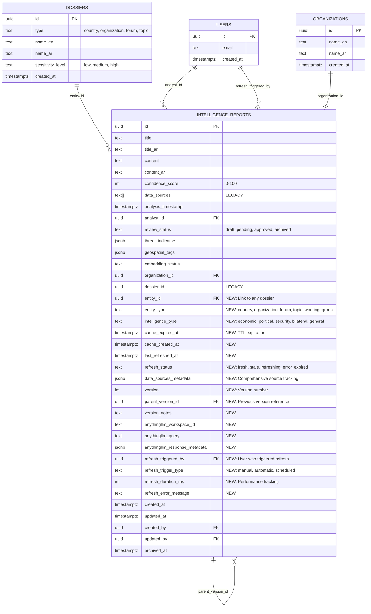

## Intelligence Type Classification

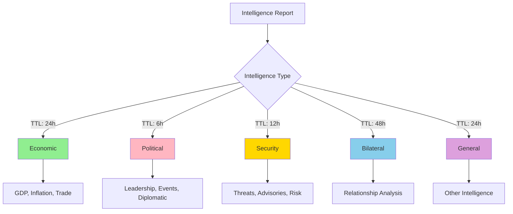

## Cache Refresh State Machine

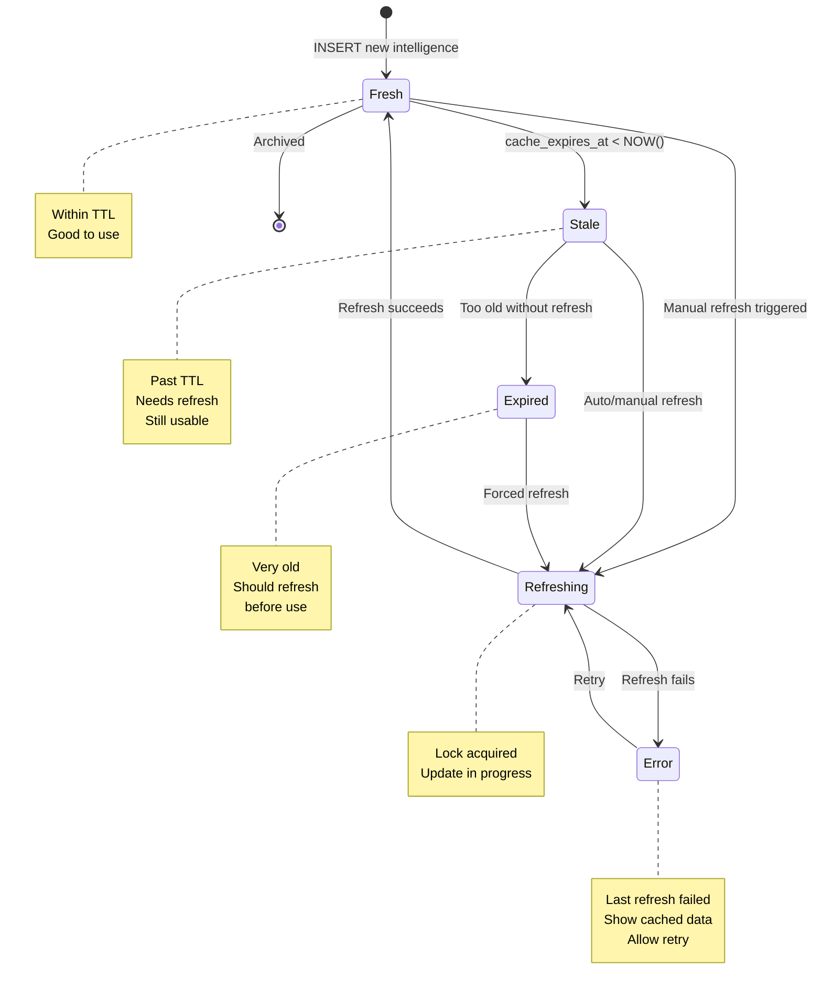

## Data Flow - Intelligence Refresh

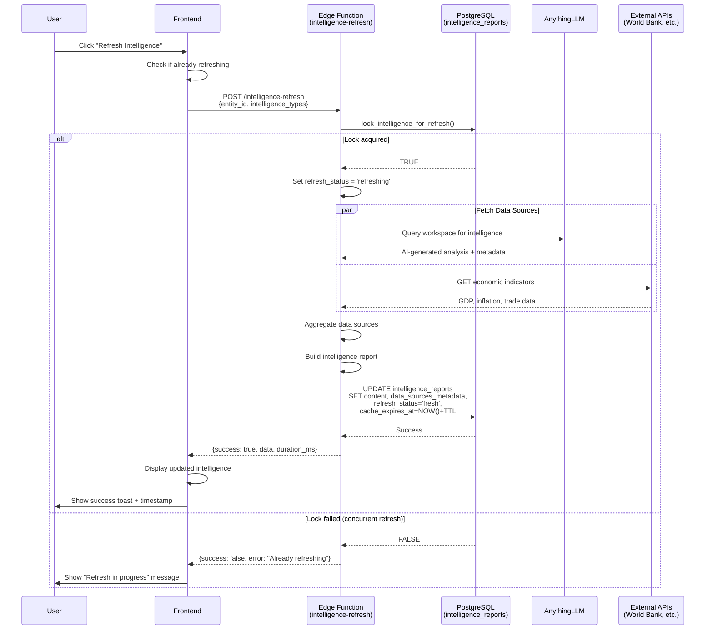

## Query Performance - Index Usage

```mermaid
graph LR
    A[Query: Get latest<br/>intelligence for entity] --> B{Index Selection}
    B --> C[idx_intelligence_reports_<br/>entity_type_fresh]
    C --> D[Covers: entity_id,<br/>intelligence_type,<br/>refresh_status,<br/>last_refreshed_at]
    D --> E[Response Time:<br/>&lt;10ms]

    F[Query: Find<br/>expired cache] --> G{Index Selection}
    G --> H[idx_intelligence_reports_<br/>cache_expires]
    H --> I[Partial index:<br/>WHERE cache_expires_at &lt; NOW()]
    I --> J[Response Time:<br/>&lt;50ms]

    K[Query: Search by<br/>data source] --> L{Index Selection}
    L --> M[idx_intelligence_reports_<br/>data_sources_metadata]
    M --> N[GIN index on JSONB<br/>Supports @&gt; operator]
    N --> O[Response Time:<br/>&lt;100ms]

    style E fill:#90EE90
    style J fill:#90EE90
    style O fill:#FFD700
```

## Version History Chain

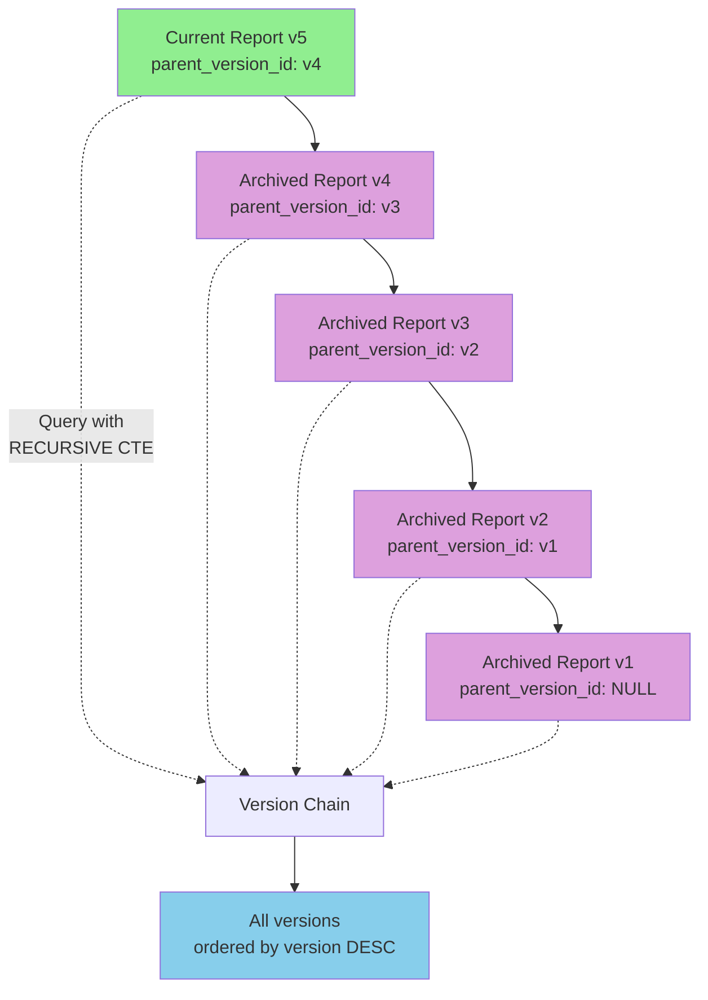

## RLS Security Flow

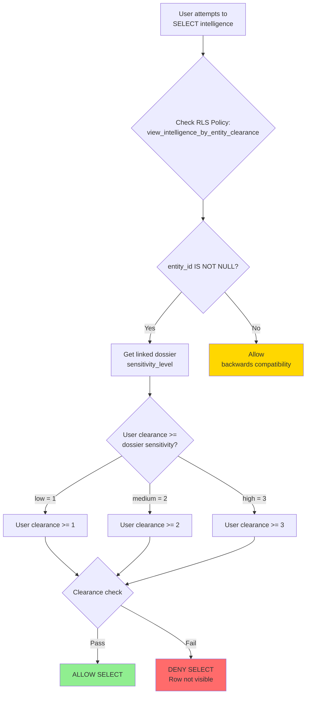

## Data Source Metadata Structure

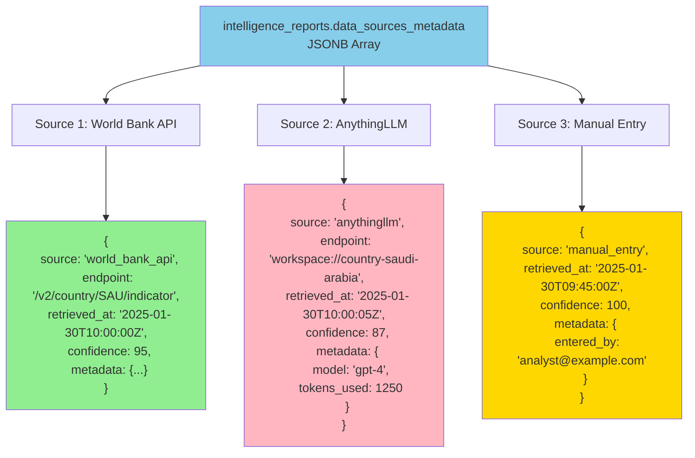

## Intelligence Dashboard Architecture

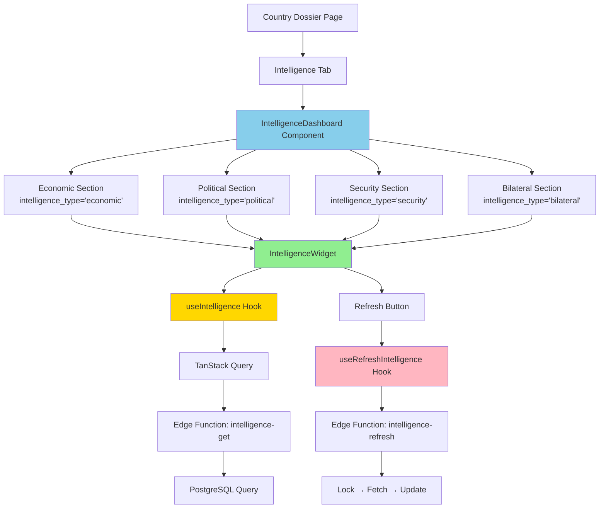

## Monitoring Dashboard

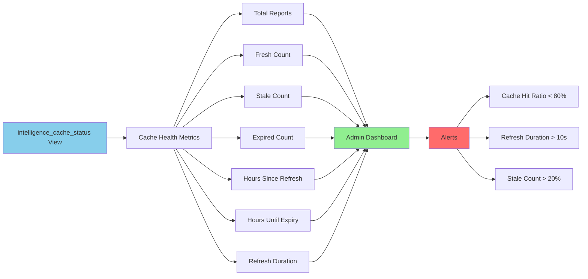

## Schema Extension Timeline

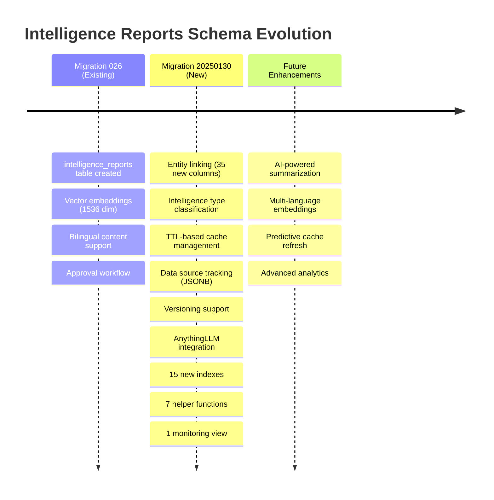

## Comparison: Before vs After

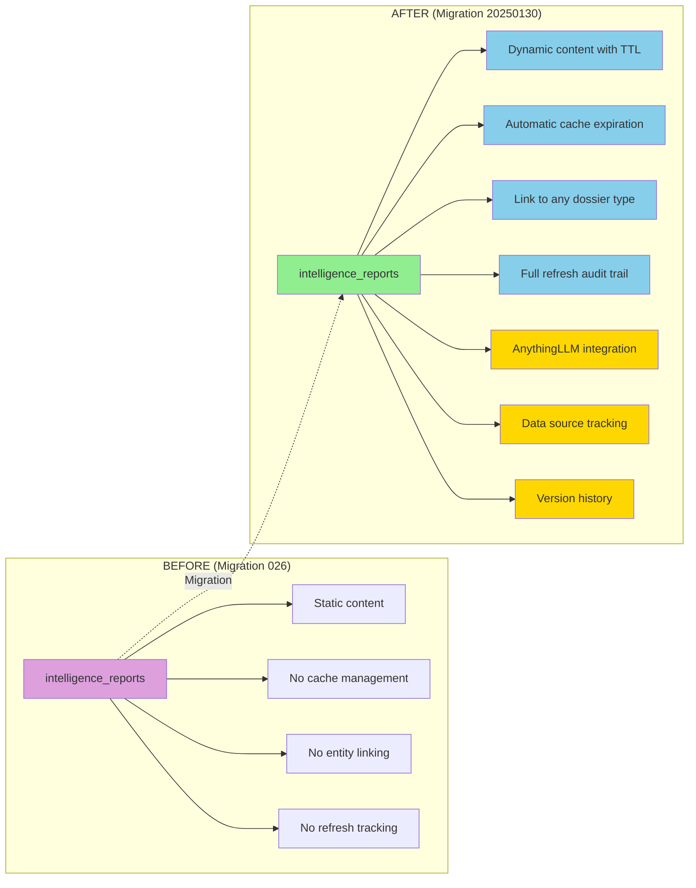

## Index Coverage Map

```mermaid
graph TD
    A[Common Queries] --> B[Entity Lookup<br/>WHERE entity_id = ?]
    A --> C[Entity + Type<br/>WHERE entity_id = ? AND intelligence_type = ?]
    A --> D[Find Expired<br/>WHERE cache_expires_at < NOW()]
    A --> E[Find Stale<br/>WHERE refresh_status = 'stale']
    A --> F[Version History<br/>WHERE parent_version_id = ?]
    A --> G[Data Source Search<br/>WHERE data_sources_metadata @> {...}]

    B --> B1[✅ idx_intelligence_reports_entity]
    C --> C1[✅ idx_intelligence_reports_entity_type_fresh<br/>Composite: entity_id + intelligence_type + refresh_status + last_refreshed_at]
    D --> D1[✅ idx_intelligence_reports_cache_expires<br/>Partial: WHERE cache_expires_at IS NOT NULL]
    E --> E1[✅ idx_intelligence_reports_refresh_status]
    F --> F1[✅ idx_intelligence_reports_version<br/>Partial: WHERE parent_version_id IS NOT NULL]
    G --> G1[✅ idx_intelligence_reports_data_sources_metadata<br/>GIN index for JSONB queries]

    style B1 fill:#90EE90
    style C1 fill:#90EE90
    style D1 fill:#90EE90
    style E1 fill:#90EE90
    style F1 fill:#90EE90
    style G1 fill:#90EE90
```

---

## Diagram Legend

| Color | Meaning |
|-------|---------|
| 🟢 Green | Active/Current/Success |
| 🔵 Blue | New Features/Information |
| 🟡 Yellow | Warning/Attention |
| 🔴 Red | Error/Denied |
| 🟣 Purple | Legacy/Archived |

## How to Use These Diagrams

1. **Entity Relationship Diagram**: Understand table relationships and foreign keys
2. **Intelligence Type Classification**: See the five intelligence categories and their TTLs
3. **Cache Refresh State Machine**: Understand the refresh lifecycle
4. **Data Flow - Intelligence Refresh**: See the complete refresh workflow
5. **Query Performance - Index Usage**: Understand which indexes optimize which queries
6. **Version History Chain**: See how versioning works with parent_version_id
7. **RLS Security Flow**: Understand access control logic
8. **Data Source Metadata Structure**: See JSONB structure examples
9. **Intelligence Dashboard Architecture**: Understand frontend component hierarchy
10. **Monitoring Dashboard**: See monitoring and alerting architecture
11. **Schema Extension Timeline**: See evolution of intelligence_reports table
12. **Comparison: Before vs After**: See what's new in this migration
13. **Index Coverage Map**: Verify all common queries are optimized

---

**Last Updated**: 2025-01-30
**Version**: 1.0
**Format**: Mermaid Diagrams (render with Mermaid.js)
