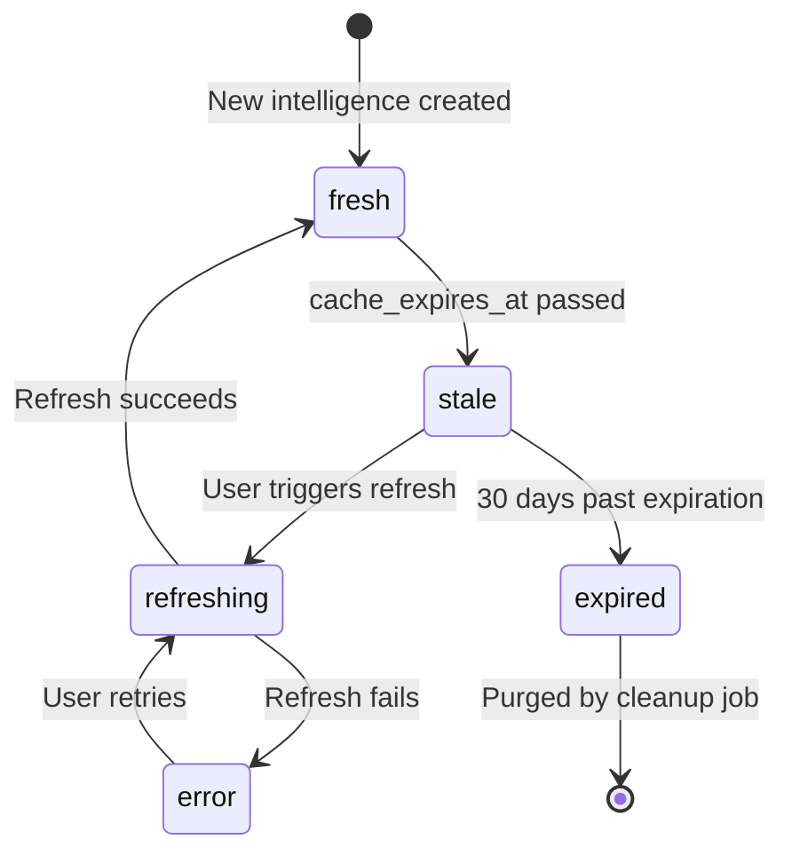
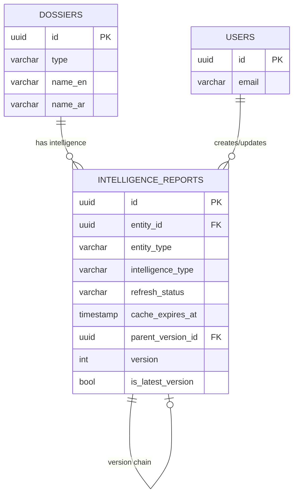

# Data Model: Dynamic Country Intelligence System

**Date**: 2025-01-30
**Feature**: 029-dynamic-country-intelligence
**Status**: Complete

## Overview

This document defines the data model for the Dynamic Country Intelligence System, including entity relationships, state machines, validation rules, and query patterns.

---

## Entity Definitions

### 1. Intelligence Report (Extended)

**Table**: `intelligence_reports`

**Purpose**: Stores AI-generated and externally-sourced intelligence with caching, versioning, and source tracking.

**Core Attributes**:
```typescript
interface IntelligenceReport {
  // Primary identifiers
  id: string;                              // UUID, primary key
  report_number: string;                   // Unique business identifier

  // Entity linking (polymorphic)
  entity_id: string;                       // Foreign key to dossiers.id
  entity_type: 'country' | 'organization' | 'forum' | 'topic' | 'working_group' | 'person';

  // Legacy linking (deprecated but preserved)
  dossier_id?: string;                     // For backwards compatibility

  // Content (bilingual)
  title_en: string;
  title_ar: string;
  executive_summary_en: string;
  executive_summary_ar: string;
  analysis_en: string;
  analysis_ar: string;

  // Classification
  intelligence_type: 'economic' | 'political' | 'security' | 'bilateral' | 'general';
  confidence_level: 'low' | 'medium' | 'high' | 'verified';
  classification: 'public' | 'internal' | 'confidential' | 'restricted';

  // Caching & TTL
  cache_expires_at: Date | null;           // TTL-based expiration
  refresh_status: 'fresh' | 'stale' | 'refreshing' | 'error' | 'expired';
  last_refreshed_at: Date | null;
  refresh_error_message?: string;
  refresh_attempted_by?: string;           // User ID who triggered refresh

  // AnythingLLM integration
  anythingllm_workspace_id?: string;       // Workspace slug (e.g., "country-sa")
  anythingllm_query_text?: string;         // Original query sent to AnythingLLM
  anythingllm_response_metadata?: {        // JSONB
    model: string;                         // e.g., "gpt-4"
    tokens_used: number;
    sources: string[];                     // Document paths used in RAG
    confidence_score: number;
  };

  // Data source tracking
  data_sources_metadata?: DataSource[];    // JSONB array
  data_sources?: string[];                 // Legacy TEXT[] (deprecated)

  // Versioning
  version: number;                         // Starts at 1, increments on update
  parent_version_id?: string;              // Self-referential FK for version chains
  is_latest_version: boolean;              // Only one true per report_number

  // Vector embeddings
  vector_embedding?: number[];             // 1536-dimension pgvector

  // Approval workflow (existing)
  approval_status: 'draft' | 'review' | 'approved' | 'published';

  // Audit fields
  created_at: Date;
  updated_at: Date;
  created_by: string;                      // User ID
  updated_by: string;

  // Soft delete
  deleted_at?: Date | null;
}

interface DataSource {
  type: 'api' | 'document' | 'manual' | 'anythingllm';
  name: string;                            // e.g., "World Bank API", "Policy Document"
  url?: string;                            // API endpoint or document URL
  retrieved_at: Date;
  confidence: 'low' | 'medium' | 'high';
  metadata?: Record<string, any>;          // Additional source-specific data
}
```

**Validation Rules**:
1. `entity_id` MUST reference existing dossier with matching `entity_type`
2. `cache_expires_at` MUST be in future when `refresh_status = 'fresh'`
3. `version` MUST be positive integer
4. `parent_version_id` MUST reference same `report_number` (if set)
5. Only ONE row per `report_number` can have `is_latest_version = true`
6. `anythingllm_workspace_id` MUST follow format `{entity_type}-{entity_code}` (e.g., `country-sa`)
7. `data_sources_metadata` MUST be valid JSON array

**State Machine** (refresh_status):


---

### 2. Country Dossier (Existing Entity)

**Table**: `dossiers` + `countries`

**Relationship to Intelligence**:
- One country → Many intelligence reports (1:N)
- Intelligence reports linked via `entity_id` + `entity_type = 'country'`

**Intelligence Types by Country**:
```typescript
interface CountryIntelligence {
  country_id: string;
  economic: IntelligenceReport[];     // GDP, trade, inflation
  political: IntelligenceReport[];    // Leadership, policy changes
  security: IntelligenceReport[];     // Travel advisories, threat assessments
  bilateral: IntelligenceReport[];    // Saudi-X relations, agreements
}
```

---

### 3. Refresh Operation (Virtual Entity)

**Purpose**: Tracks in-progress refresh operations to prevent concurrency issues.

**Implementation**: Database lock via `SELECT FOR UPDATE` with timeout.

**Attributes** (not persisted, derived from intelligence_reports):
```typescript
interface RefreshOperation {
  entity_id: string;
  intelligence_type: string;
  status: 'in_progress' | 'completed' | 'failed';
  started_at: Date;
  started_by: string;                 // User ID
  lock_acquired_at?: Date;
  lock_released_at?: Date;
}
```

**Locking Mechanism**:
```sql
-- Acquire lock (prevents concurrent refreshes)
BEGIN;
SELECT id FROM intelligence_reports
WHERE entity_id = $1
  AND intelligence_type = $2
  AND is_latest_version = true
FOR UPDATE NOWAIT;

-- If NOWAIT fails → 409 Conflict (refresh already in progress)
-- If succeeds → proceed with refresh
-- Always release lock on COMMIT/ROLLBACK
```

---

## Relationships

### Primary Relationships



### Derived Relationships

**Country → Intelligence (via entity_id)**:
```sql
SELECT ir.*
FROM intelligence_reports ir
JOIN dossiers d ON ir.entity_id = d.id
WHERE d.type = 'country'
  AND d.id = '41c7fb7b-1e69-4381-8310-04b6e74d0551'  -- Saudi Arabia
  AND ir.intelligence_type = 'economic'
  AND ir.is_latest_version = true
  AND ir.deleted_at IS NULL;
```

**Intelligence Version History**:
```sql
-- Get all versions of a report
WITH RECURSIVE version_chain AS (
  -- Start with latest version
  SELECT * FROM intelligence_reports
  WHERE report_number = 'RPT-2025-001'
    AND is_latest_version = true

  UNION ALL

  -- Recursively get parent versions
  SELECT ir.*
  FROM intelligence_reports ir
  JOIN version_chain vc ON ir.id = vc.parent_version_id
)
SELECT * FROM version_chain ORDER BY version DESC;
```

---

## Indexes

### Performance-Critical Indexes

```sql
-- 1. Entity + Type + Freshness (most common query)
CREATE INDEX idx_intelligence_entity_type_fresh
ON intelligence_reports(entity_id, intelligence_type, refresh_status)
WHERE cache_expires_at > NOW() AND deleted_at IS NULL;

-- 2. Version lookup
CREATE INDEX idx_intelligence_latest_version
ON intelligence_reports(report_number)
WHERE is_latest_version = true;

-- 3. Stale intelligence (background job)
CREATE INDEX idx_intelligence_stale
ON intelligence_reports(cache_expires_at)
WHERE refresh_status = 'stale' AND deleted_at IS NULL;

-- 4. Vector similarity search
CREATE INDEX ON intelligence_reports
USING hnsw (vector_embedding vector_cosine_ops);

-- 5. Data sources search (JSONB GIN index)
CREATE INDEX idx_intelligence_data_sources_gin
ON intelligence_reports USING gin (data_sources_metadata jsonb_path_ops);

-- 6. AnythingLLM workspace lookup
CREATE INDEX idx_intelligence_workspace
ON intelligence_reports(anythingllm_workspace_id)
WHERE anythingllm_workspace_id IS NOT NULL;
```

### Index Usage Patterns

| Query Pattern | Index Used | Est. Time |
|--------------|------------|-----------|
| Fetch fresh economic intelligence for country | `idx_intelligence_entity_type_fresh` | <10ms |
| Get latest version of report | `idx_intelligence_latest_version` | <5ms |
| Background job: find stale intelligence | `idx_intelligence_stale` | <50ms |
| Vector similarity search (5 neighbors) | HNSW index | <100ms |
| Search by data source API | `idx_intelligence_data_sources_gin` | <50ms |

---

## Query Patterns

### 1. Fetch Intelligence for Entity (Most Common)

```sql
-- Query: Get fresh economic intelligence for Saudi Arabia
SELECT
  id,
  title_en,
  executive_summary_en,
  confidence_level,
  last_refreshed_at,
  cache_expires_at,
  data_sources_metadata
FROM intelligence_reports
WHERE entity_id = '41c7fb7b-1e69-4381-8310-04b6e74d0551'
  AND entity_type = 'country'
  AND intelligence_type = 'economic'
  AND is_latest_version = true
  AND deleted_at IS NULL
  AND refresh_status IN ('fresh', 'stale')  -- Exclude refreshing/error/expired
ORDER BY last_refreshed_at DESC NULLS LAST
LIMIT 1;

-- Expected: <10ms (using idx_intelligence_entity_type_fresh)
```

### 2. Check if Intelligence is Stale (TTL Check)

```sql
-- Query: Determine if refresh is needed
SELECT
  id,
  refresh_status,
  cache_expires_at,
  CASE
    WHEN cache_expires_at IS NULL THEN 'never_cached'
    WHEN cache_expires_at > NOW() THEN 'fresh'
    WHEN cache_expires_at <= NOW() AND cache_expires_at > NOW() - INTERVAL '30 days' THEN 'stale'
    ELSE 'expired'
  END AS computed_status
FROM intelligence_reports
WHERE entity_id = $1
  AND intelligence_type = $2
  AND is_latest_version = true;

-- Expected: <5ms
```

### 3. Acquire Refresh Lock (Prevent Concurrency)

```sql
-- Query: Lock intelligence for refresh (NOWAIT to fail fast)
BEGIN;

SELECT id
FROM intelligence_reports
WHERE entity_id = $1
  AND intelligence_type = $2
  AND is_latest_version = true
FOR UPDATE NOWAIT;

-- If successful: Proceed with refresh
-- If lock timeout: Return 409 Conflict to client
-- Always release lock with COMMIT/ROLLBACK
```

### 4. Bulk Fetch Stale Intelligence (Background Job)

```sql
-- Query: Find all stale intelligence across all entities
SELECT
  id,
  entity_id,
  entity_type,
  intelligence_type,
  cache_expires_at,
  last_refreshed_at
FROM intelligence_reports
WHERE refresh_status = 'stale'
  AND deleted_at IS NULL
  AND cache_expires_at <= NOW()
ORDER BY cache_expires_at ASC  -- Oldest first
LIMIT 50;

-- Expected: <50ms (using idx_intelligence_stale)
```

### 5. Vector Similarity Search

```sql
-- Query: Find related intelligence reports
SELECT
  id,
  title_en,
  1 - (vector_embedding <=> $1::vector) AS similarity
FROM intelligence_reports
WHERE entity_type = 'country'
  AND intelligence_type = 'economic'
  AND is_latest_version = true
  AND deleted_at IS NULL
ORDER BY vector_embedding <=> $1::vector
LIMIT 5;

-- Expected: <100ms (using HNSW index)
-- $1 = query embedding (1536-dimension vector)
```

### 6. Version History Retrieval

```sql
-- Query: Get all versions of a specific report
WITH RECURSIVE version_chain AS (
  SELECT
    id, report_number, version, parent_version_id,
    title_en, updated_at, updated_by
  FROM intelligence_reports
  WHERE report_number = $1
    AND is_latest_version = true

  UNION ALL

  SELECT
    ir.id, ir.report_number, ir.version, ir.parent_version_id,
    ir.title_en, ir.updated_at, ir.updated_by
  FROM intelligence_reports ir
  JOIN version_chain vc ON ir.id = vc.parent_version_id
)
SELECT * FROM version_chain ORDER BY version DESC;

-- Expected: <20ms (recursive query)
```

---

## Validation Rules

### Database-Level Constraints

```sql
-- 1. Entity linking integrity
ALTER TABLE intelligence_reports
ADD CONSTRAINT fk_intelligence_entity
FOREIGN KEY (entity_id) REFERENCES dossiers(id)
ON DELETE CASCADE;

-- 2. Parent version must exist
ALTER TABLE intelligence_reports
ADD CONSTRAINT fk_intelligence_parent_version
FOREIGN KEY (parent_version_id) REFERENCES intelligence_reports(id)
ON DELETE SET NULL;

-- 3. Version must be positive
ALTER TABLE intelligence_reports
ADD CONSTRAINT chk_intelligence_version_positive
CHECK (version > 0);

-- 4. Cache expiration logic
ALTER TABLE intelligence_reports
ADD CONSTRAINT chk_intelligence_cache_logic
CHECK (
  (refresh_status = 'fresh' AND cache_expires_at > NOW()) OR
  (refresh_status != 'fresh')
);

-- 5. Only one latest version per report
CREATE UNIQUE INDEX idx_intelligence_unique_latest
ON intelligence_reports(report_number)
WHERE is_latest_version = true;
```

### Application-Level Validation (Zod)

```typescript
import { z } from 'zod';

export const IntelligenceTypeSchema = z.enum([
  'economic', 'political', 'security', 'bilateral', 'general'
]);

export const RefreshStatusSchema = z.enum([
  'fresh', 'stale', 'refreshing', 'error', 'expired'
]);

export const IntelligenceReportSchema = z.object({
  id: z.string().uuid(),
  entity_id: z.string().uuid(),
  entity_type: z.enum(['country', 'organization', 'forum', 'topic', 'working_group', 'person']),
  intelligence_type: IntelligenceTypeSchema,
  title_en: z.string().min(1).max(500),
  title_ar: z.string().min(1).max(500),
  executive_summary_en: z.string().max(5000),
  executive_summary_ar: z.string().max(5000),
  confidence_level: z.enum(['low', 'medium', 'high', 'verified']),
  refresh_status: RefreshStatusSchema,
  cache_expires_at: z.date().nullable(),
  version: z.number().int().positive()
});
```

---

## Data Lifecycle

### Creation Flow

```typescript
// 1. User requests intelligence for a country
GET /api/intelligence?entity_id=<country_id>&type=economic

// 2. Check cache
if (cache_exists && cache_fresh) {
  return cached_data;
}

// 3. Trigger refresh (if no cache or stale)
if (!cache_exists || cache_stale) {
  POST /api/intelligence/refresh
  {
    entity_id: "<country_id>",
    intelligence_type: "economic"
  }
}

// 4. AnythingLLM generates intelligence
// 5. Save to database with TTL
INSERT INTO intelligence_reports (
  entity_id, entity_type, intelligence_type,
  title_en, analysis_en,
  refresh_status, cache_expires_at
) VALUES (
  '<country_id>', 'country', 'economic',
  'Economic Intelligence for Saudi Arabia',
  '...',
  'fresh', NOW() + INTERVAL '6 hours'
);
```

### Update Flow (Versioning)

```typescript
// 1. User triggers refresh or scheduled job updates intelligence
POST /api/intelligence/refresh

// 2. Mark current version as not latest
UPDATE intelligence_reports
SET is_latest_version = false
WHERE report_number = 'RPT-2025-001'
  AND is_latest_version = true;

// 3. Insert new version
INSERT INTO intelligence_reports (
  report_number, version, parent_version_id,
  entity_id, intelligence_type,
  title_en, analysis_en,
  is_latest_version, refresh_status, cache_expires_at
) VALUES (
  'RPT-2025-001', 2, '<previous_version_id>',
  '<country_id>', 'economic',
  'Updated Economic Intelligence',
  '...',
  true, 'fresh', NOW() + INTERVAL '6 hours'
);
```

### Expiration & Cleanup

```typescript
// Background job runs hourly
// 1. Mark expired intelligence
UPDATE intelligence_reports
SET refresh_status = 'expired'
WHERE cache_expires_at < NOW() - INTERVAL '30 days'
  AND refresh_status IN ('stale', 'error');

// 2. Optionally purge very old versions (90+ days)
DELETE FROM intelligence_reports
WHERE created_at < NOW() - INTERVAL '90 days'
  AND is_latest_version = false
  AND version < (SELECT MAX(version) FROM intelligence_reports WHERE report_number = ...) - 5;
-- Keeps last 5 versions for audit trail
```

---

## Performance Considerations

### Storage Estimates

**Per Intelligence Report**:
- Text fields (title, summary, analysis): ~10KB
- Vector embedding (1536 x 4 bytes): ~6KB
- JSONB metadata: ~2KB
- Total per report: **~20KB**

**Scaling**:
- 200 countries × 4 intelligence types = 800 reports
- 800 reports × 20KB = **16MB** (latest versions only)
- With 5-year history (52 updates/year): 800 × 52 × 5 = 208,000 versions
- 208,000 × 20KB = **~4GB** (all versions)

**Conclusion**: Storage is not a concern for foreseeable scale.

### Query Optimization Tips

1. **Always filter by `is_latest_version = true`** (avoids scanning old versions)
2. **Use partial indexes** for common WHERE clauses (e.g., `deleted_at IS NULL`)
3. **Composite indexes** should match exact query filter order
4. **LIMIT queries** when possible (pagination)
5. **Use EXPLAIN ANALYZE** to verify index usage

---

## Data Model Summary

**Key Design Decisions**:
1. **Polymorphic entity linking** (entity_id + entity_type) enables intelligence for any dossier type
2. **TTL-based caching** with state machine prevents unnecessary AnythingLLM calls
3. **Versioning support** enables historical analysis and audit trails
4. **JSONB data sources** provides flexible source tracking without schema changes
5. **Optimistic locking** via `SELECT FOR UPDATE NOWAIT` prevents concurrent refreshes
6. **15 specialized indexes** ensure <100ms query performance at scale

**Next Steps**:
1. Apply migration SQL (already generated)
2. Implement Edge Functions using this data model
3. Build frontend components with TanStack Query hooks
4. Set up monitoring for cache hit ratio and query performance
